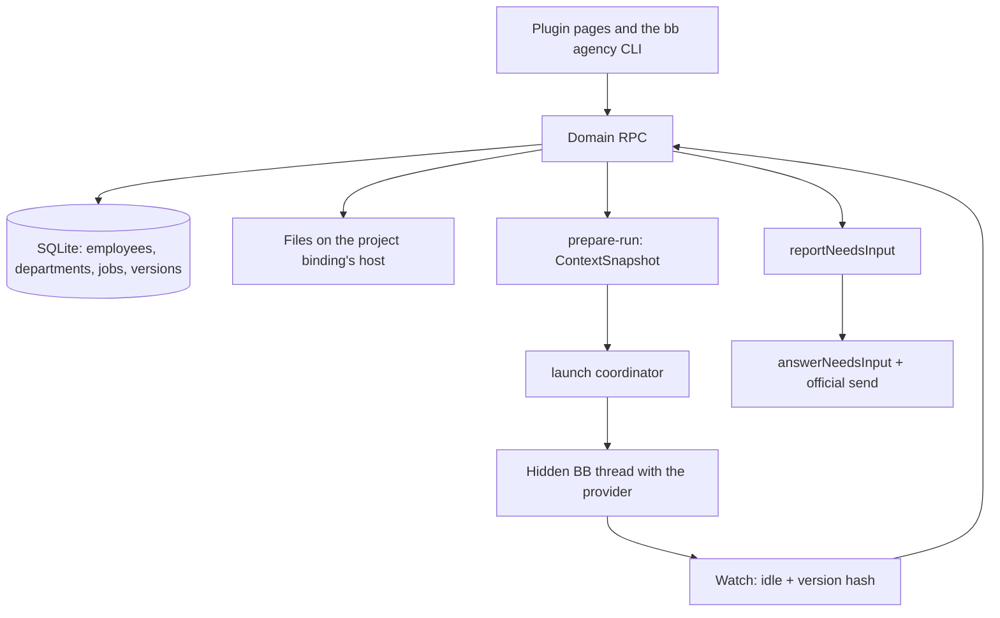

# Agency

**English** · [Русский](README.ru.md)

A BB plugin that turns scattered AI agent runs into an **organization**: standing
employees, departments, projects, jobs, result versions and explicit acceptance.

An agent here is not "a chat that did something" but an employee with a versioned
job description, a role, a department, a permission policy and a work history. A
job has a life of its own: it is assigned, launched, comes back with a question,
publishes a file version and goes through review.

> **Status:** `0.1.0-alpha.15`, a working alpha. Durable data, managed launches,
> work rules, limits and budgets, the launch queue, schedules and webhooks,
> knowledge, goals and backups work. Isolation is verified for Claude Code only;
> the limits are listed below and in
> [docs/implementation-readiness.md](docs/implementation-readiness.md) (Russian).

## Why

A usual workflow with coding agents keeps nothing between runs: instructions live
in someone's head and in CLAUDE.md, the result in a chat history, and "who reviewed
it" nowhere. The Agency adds the missing layer:

- **Employee** — a named entity with a versioned job description, a role, a
  provider and a permission policy. Editing the description creates a new version
  instead of overwriting the old one.
- **Department** — the process, result criteria and review policy of a group of
  employees; every department has a lead.
- **Project binding** — a verified link to a BB project, a machine and a root
  folder. The job's files belong to the client project.
- **Job** — a brief, acceptance criteria, dependencies, an assignee, launch
  attempts, discussion and artifact versions.
- **Acceptance** — of a specific `artifactId + version + hash`, never of the word
  "done" in a thread.

Verified on a live BB: a department lead splits a job into subtasks, an executor
hands in a version, a reviewer checks it and the owner accepts it; the Agency
creates and launches the next step for another department by itself; an employee
whose workplace is a Mac mini tests a site in a real browser.

## Architecture

### Boundaries

The Agency owns employees, departments, jobs, file versions and launches
**through its own RPC and CLI**. BB owns providers, machines, threads and the UI
shell. Notifications land in an inbox and do **not** start agents: a launch
happens only through `prepareLaunch` after a readiness check.



### Layers

| Layer | Contents | Rule |
| --- | --- | --- |
| `src/shared` | Zod schemas and the RPC contract | One contract for UI, RPC and CLI |
| `src/domain` | Job and attempt transitions, rules | Pure logic, no I/O |
| `src/server/db` | SQLite and append-only migrations | Roll code back only with a compatible schema |
| `src/server/runtime` | isolation, ContextSnapshot, run-store, launch, needs-input | Spawn only after the handshake |
| `src/server/dispatcher` | typed inbox → rule → outbox/claim | Event rules, schedules and webhooks |
| `src/app` | Working screens over RPC and a separate demo | Demo data never mixes with real data |

One business logic for everyone: `bb agency` calls the same handlers and the same
Zod schemas as the UI. The CLI has no SQL of its own, and arbitrary RPC is closed
by an allowlist; see [docs/cli.md](docs/cli.md) (Russian).

### Job lifecycle

```text
backlog → queued → running → review → done
                      ↓
                 waiting_input / blocked / canceled
```

1. **Durable CRUD.** A job gets a brief, acceptance criteria, an assignee and
   pinned input file versions (`attachJobInput`). It can wait for other jobs and
   name a next step for another department.
2. **Readiness.** `getIsolationReadiness` and the core `GET spawn-contract`. No
   contract, or a provider outside the proven set (`claude-code`), means no launch;
   the catalog keeps working.
3. **Context snapshot.** An immutable `ContextSnapshot`: versions of the rules, the
   department process, the role, the brief, the effective policy, CLI and host,
   inputs and handoffs. The job layer does not cancel the department layer; a
   conflict is a typed question, not a silent choice.
4. **Launch.** `prepareLaunch` → receipt → a hidden BB thread. `reconcile` never
   spawns a second thread.
5. **Watch.** `idle` plus the hash of the current artifact version → `review` and
   `awaiting_review`. `idle` without such a version keeps the job `running`.
6. **Question.** The worker calls `reportNeedsInput` and the job moves to
   `waiting_input` with the questions saved. A job comment does **not** resume
   work; `answerNeedsInput` with the official send does.
7. **Acceptance.** A separate command on `artifactId + version + hash`. Publishing
   is not accepting, and `awaiting_review` means waiting for review.

### Permissions

Launch authority is the intersection of the platform, the project binding, the
department, the employee and the job. A job's text never widens the allowlist. An
unknown capability blocks the launch. Secret values are stored neither in the
database, nor in Git, nor in notifications — only reference names.

## Interface

The home screen lists jobs by state, with a project, department or employee picker
on the right. A main job stands out and shows how many of its subtasks are closed;
subtasks sit under it. Closed jobs leave the board: subtasks after 1 h, the rest
after 24 h (plugin settings). The job card has the work and discussion on the left
and properties, files and launches on the right.

Every new BB session gets a routing section: what to do in the chat and what to
hand to which department of the project. An employee gets its role — lead,
executor or reviewer — in the launch prompt. Instructions and service messages to
agents are always in English; the "Agency language" setting sets the language of
reports and comments. The `delegate` / `suggest` / `off` mode is in the settings.

Files open with a click in a closable right-hand BB tab. The Agency has its own
editor for txt/json/yaml/csv and images; `.md` / `.markdown` files open in the
separate Markdown PRO plugin (`md-editor`). Saving in the Agency editor creates a
new version on the machine and in the folder of the bound project.

Sections: Jobs (list and kanban, archive, search in briefs and comments, saved
views), Inbox, Goals, Projects, Departments, Employees (with a Metrics tab),
Automations, Knowledge, Launches, a Dashboard of spend and budgets, and Settings.
The owner changes behavior without code: work rules of the Agency, a department, a
machine and an employee (rework rounds, launch watch, concurrency limits, budgets,
auto review, escalation, "Run without sandbox", nightly recheck), the Agency-wide
rules — the top prompt layer, charter and job description templates, the language
(Russian / English), skill version pinning, backups and soft WIP limits of kanban
columns. The interface and the standard templates switch between Russian and
English.

A job's work order is in its card: which jobs must be done before it launches, and
a "next step" for another department that the Agency creates by itself after
acceptance. Messages from scripts and watchdogs (`bb agency notify-owner`,
`bb agency digest`) arrive in Inbox → Messages.

Other BB plugins unlock features and stay invisible without them: with Projects &
Sections a project has several folders on different machines and subtasks between
them; with File Gateway an employee has a workplace on its own machine. BB plugins
are given to an employee one by one in the profile's Plugins tab: the launch gets
their skills and instructions, and other plugins stay out of the isolated launch.
The tab marks what each plugin gives — instructions, a skill, tools — and hides
plugins that only change the BB interface.

Shared interface rules: [DESIGN.md](DESIGN.md) (Russian).

## Compared with other systems

How the Agency relates to systems that have long automated team work. Other systems
are rated from their public documentation (September 2026); sources are listed at the
end of [docs/operating-model.md](docs/operating-model.md). "?" means no data was found,
not that the feature is missing.

| Capability | Linear | Jira SM | Bitrix24 | Paperclip | Multica | Symphony | Agency |
| --- | --- | --- | --- | --- | --- | --- | --- |
| Departments with a lead | no | partial | yes | yes | yes | no | yes |
| Intake and triage of incoming work | yes | yes | partial | yes | ? | no | partial |
| Routing from any chat | partial | no | no | no | no | no | yes |
| Main job and subtasks with progress | yes | yes | yes | yes | yes | no | yes |
| Auto-hide or archive of closed work | yes | ? | ? | no | no | no | yes |
| Heartbeat / stall timeout | yes | no | no | yes | yes | yes | yes |
| Retry and fallback by error type | no | no | no | partial | yes | yes | no |
| Independent review and acceptance of a version | no | partial | partial | yes | partial | yes | yes |
| Budgets per agent or department | no | no | no | yes | no | no | yes |
| WIP / concurrency limits | no | no | no | no | no | yes | yes |
| Department knowledge in the context | no | partial | yes | no | yes | no | yes |
| Schedules and webhooks | partial | yes | yes | yes | yes | no | yes |
| Question to the owner with continuation | yes | no | no | partial | ? | partial | yes |

### What is built in and where the idea comes from

| Feature | How it works in the Agency | Similar in |
| --- | --- | --- |
| Departments and leads | A job goes to the department lead, who splits it into subtasks for executors and reviewers and does not implement | Multica squads, Paperclip org tree, Bitrix24 departments |
| Routing from chats | Every BB session gets the list of departments and what each accepts, plus the command to hand work over | lane-stack routing |
| Intake assessment | The lead records size, risk and decision (accept / split / clarify / return) as job data | Linear triage, lane-stack risk |
| Board hygiene | Closed subtasks leave the board after 1 h, other jobs after 24 h; closed trees go to a searchable archive after 30 days | Linear auto-archive, Plane auto-archive, Vibe Kanban |
| Launch watch | Silence, stall, failed start, provider error and a ceiling per attempt; a stuck job goes to the lead | Symphony stall timeout, Linear stale sessions, lane-stack idle/max |
| Review and acceptance | Executor ≠ reviewer, optional automatic review subtask, acceptance of `artifactId + version + hash`, not of the word "done" | Symphony Human Review, Paperclip review stages, lane-stack acceptance receipt |
| Rework limit | Rework rounds per job are a rule (3 by default), then the owner decides | CrewAI guardrail retries, MetaGPT review loops |
| Execution contract | May change / must not touch / checks, frozen in the launch snapshot | lane-stack task contract |
| Budgets | Monthly budget for the Agency, a department and an employee: warning at a threshold, launches pause at 100% | Paperclip budgets |
| Limits and queue | Concurrent launches per Agency, department and employee; a launch queue by priority; soft WIP limits on kanban columns | Symphony parallel agents, ClickUp WIP limits |
| Assignment and job team | Lead or the least loaded executor or reviewer; reviewers and observers on a job | Jira load-based assignment, Bitrix24 task roles |
| Knowledge | Items scoped to the Agency, a department or a project go into launches; a remark repeated in three jobs becomes a knowledge proposal | Bitrix24 knowledge base, lane-stack "repeated fix → project rule" |
| Goals, hierarchy, metrics | Goals over main jobs, subordinate departments with escalation, employee metrics | Linear Initiatives, Asana Goals, Paperclip `reportsTo`, Bitrix24 efficiency |
| Questions to the owner | A typed question pauses the job; the answer continues the same thread | Linear agents (the human stays the owner) |
| Automations | Event → rule → job, cron schedules, signed webhooks, Telegram notifications | Jira automation rules, Multica autopilots |
| Work order | Dependencies hold a launch until the jobs it waits for are done; a "next step" job for another department is created and queued after acceptance | Jira automation rules |
| Nightly recheck | A reviewer rechecks the versions accepted that day | lane-stack night review |
| Messages to the owner | `notify-owner`, summaries and watchdogs without a model; Inbox and Telegram | — |
| Machines and plugins | Project folders on several machines, an employee workplace on its own machine, BB plugins per employee, a sandbox rule per machine | — (BB-specific) |

lane-stack is the author's own set of Claude Code agents for orchestrating development work; its rules were an input for this design.

## Not there yet

An honest list of limits, so the alpha is not read as a finished product:

- Isolation of every CLI. Only automatic skill loading for Claude Code is
  verified, and that is not a file sandbox. Codex and OpenCode did not pass
  acceptance; their token accounting depends on the BB core.
- Acceptance by the word "done" and inferring `waiting_input` from thread prose.
  Both are typed commands only.
- A fallback CLI when the main one is unavailable.
- BB plugin tools inside an isolated Claude Code thread: BB 0.43.1 does not attach
  them, so an employee uses the `bb <plugin>` command.
- Two-way Telegram and a multi-user model.
- The production rollout of the core and SDK is prepared separately.

## Layout

```text
server.ts                    server registration
app.tsx                      page and BB fileOpener registration
host.ts                      preview copies on the chosen host
src/
  shared/                    Zod schemas and the RPC contract
  domain/                    employees, departments, jobs, launches and rules
  server/
    register.ts              dependency wiring and RPC/CLI registration
    db/                      SQLite and append-only migrations
    inbox/                   stored incoming notifications
    triggers/                event source adapters
    runtime/                 isolation, ContextSnapshot, run-store, launch, prepare-run
    dispatcher/              launch and reconciliation contracts
    flow/                    dependencies and next steps
    owner-messages/          messages, summaries and watchdogs for the owner
  app/prototype/             the UI in use and demo data
  app/i18n/                  English dictionary keyed by the Russian source text
components/ui/               components from the standard BB scaffold
skills/agency/               how a worker uses the CLI
tests/                       behavior checks through the SDK harness
docs/                        architecture, events, API and stages (Russian)
```

## Install and develop

Requires BB `>=0.43.1 <0.44` and Node 22/24/26. The package builds against a
pinned BB Plugin SDK; the SDK tarball is not in the repository — put it into
`vendor/` as named in `devDependencies` of `package.json`.

```sh
npm ci --include=dev
npm run typecheck
npm test
npm run build
```

Local install into BB from the plugin folder:

```sh
bb plugin install .
bb agency status --json
bb agency help
```

The plugin registers the `/plugins/agency/overview` page and the `bb agency` CLI.
A successful build is not an install, and the declared BB compatibility does not
prove the experimental API is there: a launch also needs an answer from the
current server's `/api/v1/system/experimental_thread-spawn-contract`.

CRUD commands and the `--input-json` / server-fs semantics:
[docs/cli.md](docs/cli.md) (Russian).

## Data and rollback

Own database: `<BB dataDir>/plugins/agency/data.db`. BB owns the connection and
closes it on reload. Sources and the database are separate. Make a copy from
Settings → Storage → Backups: it is a consistent SQLite snapshot that accounts for
WAL, stored next to the database in `backups/`. Restore from the same place: the
current state is saved first, then the data is replaced. Webhook secrets and skill
pins are not part of a backup. Copying an active `data.db` without its WAL is not
a backup.

Closed jobs move to the archive after 30 days (the archive period is a plugin
setting in BB); the archive opens from the board and is searchable, and nothing is
deleted from the database.

`bb plugin disable agency` turns the plugin off; keep the stored data. Disabling
stops the watch but does not cancel worker threads already created. Before an
update, save the state of active attempts and check that they recover after the
plugin is enabled again.

## Documents

The documents are in Russian. **Start with the [work plan and index](docs/README.md)**.

- [Analysis, comparison with similar products and the development plan](docs/operating-model.md)
- [Runtime readiness and limits](docs/implementation-readiness.md)
- [File architecture and module boundaries](docs/architecture.md)
- [Data and states](docs/data-model.md) · [package versions](docs/dependencies.md)
- [CLI](docs/cli.md) · [BB API: what it can and cannot do](docs/bb-api.md)
- [Rules and context of different levels](docs/instruction-context.md)
- [Launch snapshot](docs/session-context-contract.md) · [revise compiler](docs/context-snapshot-revise.md)
- [Interaction contracts and readiness](docs/interaction-and-runtime.md)
- [Communication and history inside a job](docs/task-interaction.md)
- [Automation and webhook architecture](docs/automation-architecture.md) · [events](docs/events.md)
- [Importing your own MCP servers with JSON](docs/mcp-import.md) · [skill and catalog](docs/skills-integration.md)
- [All screens and prototype behavior](docs/ui-plan.md) · [shared interface rules](DESIGN.md)
- [Product review and comparison with Multica](docs/product-review.md)
- [Stages and acceptance criteria](docs/roadmap.md)
