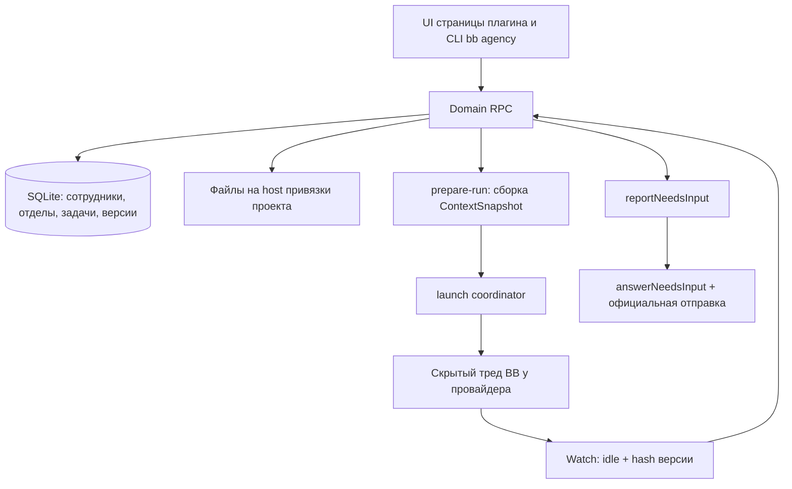

# Агентство

BB-плагин, который превращает набор разрозненных запусков AI-агентов в
**организацию**: постоянные сотрудники, отделы, проекты, поручения, версии
результатов и явная приёмка.

Агент здесь не «чат, который что-то сделал», а сотрудник с версионируемой
инструкцией, ролью, отделом, политикой прав и историей работ. Поручение живёт
своей жизнью: его назначают, запускают, оно возвращается с вопросом, публикует
версию файла и проходит проверку.

> **Статус:** `0.1.0-alpha.13`, рабочая альфа. Постоянные данные, управляемые
> запуски, правила работы, лимиты и бюджеты, очередь запуска, расписания и
> webhook, знания, цели и резервные копии работают. Изоляция проверена только для
> Claude Code — границы честно перечислены ниже и в
> [docs/implementation-readiness.md](docs/implementation-readiness.md).

## Зачем

Обычный сценарий работы с coding-агентами не сохраняет ничего между запусками:
инструкции живут в голове и в CLAUDE.md, результат — в истории чата, «кто
проверил» — нигде. Агентство добавляет недостающий слой:

- **Сотрудник** — именованная сущность с версией инструкции, ролью, провайдером
  и политикой прав. Правка инструкции создаёт новую версию, а не затирает старую.
- **Отдел** — процесс, критерии результата и политика проверки для группы
  сотрудников; у отдела есть руководитель.
- **Привязка к проекту** — проверенная связь с BB-проектом, машиной и корневым
  каталогом. Файлы заказа принадлежат проекту заказчика.
- **Поручение** — бриф, критерий готовности, зависимости, назначение,
  попытки запуска, обсуждение и версии артефактов.
- **Приёмка** — по конкретным `artifactId + version + hash`, а не по фразе
  «готово» в тексте треда.

Проверенная на реальном BB цепочка отдела «Программисты»: Fable руководит,
Sonnet разрабатывает, Opus проверяет, результат принят владельцем.

## Архитектура

### Границы

Агентство владеет сотрудниками, отделами, поручениями, версиями файлов и
запуском **через собственные RPC и CLI**. BB владеет провайдерами, машинами,
тредами и оболочкой UI. Уведомления попадают во входящий журнал и **не**
запускают агентов — запуск возможен только через `prepareLaunch` после
проверки готовности.



### Слои

| Слой | Содержимое | Правило |
| --- | --- | --- |
| `src/shared` | Zod-схемы и RPC-контракт | Один контракт для UI, RPC и CLI |
| `src/domain` | Переходы Job и попыток, правила | Чистая логика без I/O |
| `src/server/db` | SQLite и append-only миграции | Откат кода только с совместимой схемой |
| `src/server/runtime` | isolation, ContextSnapshot, run-store, launch, needs-input | Spawn только после handshake |
| `src/server/dispatcher` | typed inbox → правило → outbox/claim | Live и автозапуск выключены |
| `src/app` | Рабочие экраны на RPC и отдельное демо | Демоданные не смешиваются с рабочими |

Одна бизнес-логика на всех: `bb agency` вызывает те же обработчики и те же
Zod-схемы, что и UI. Отдельного SQL в CLI нет, произвольный RPC закрыт
allowlist — см. [docs/cli.md](docs/cli.md).

### Жизненный цикл поручения

```text
backlog → queued → running → review → done
                      ↓
                 waiting_input / blocked / canceled
```

1. **Durable CRUD.** Поручение получает бриф, критерий готовности, исполнителя и
   закреплённые входные версии файлов (`attachJobInput`).
2. **Готовность.** `getIsolationReadiness` и `GET spawn-contract` ядра. Нет
   контракта или провайдер вне proven (`claude-code`) — запуск недоступен,
   каталог при этом жив.
3. **Снимок контекста.** Неизменяемый `ContextSnapshot`: версии правил, процесса
   отдела, роли, брифа, действующей политики, CLI и host, входы и передачи.
   Слой поручения не отменяет слой отдела; конфликт — это typed-вопрос, а не
   тихий выбор одного из вариантов.
4. **Запуск.** `prepareLaunch` → receipt → скрытый тред BB. `reconcile` не
   создаёт второй spawn.
5. **Наблюдение.** `idle` плюс hash текущей версии артефакта → `review` и
   `awaiting_review`. `idle` без такой версии оставляет поручение в `running`.
6. **Вопрос.** Работник вызывает `reportNeedsInput` — поручение переходит в
   `waiting_input` с сохранёнными вопросами. Комментарий к задаче работу **не**
   продолжает; продолжает `answerNeedsInput` с официальной отправкой.
7. **Приёмка.** Отдельная команда по `artifactId + version + hash`. Публикация
   не равна принятию, а `awaiting_review` — это ожидание проверки.

### Права

Полномочия запуска — пересечение платформы, привязки проекта, отдела,
сотрудника и поручения. Текст поручения не расширяет allowlist. Неизвестная
capability блокирует запуск. Значения секретов не хранятся ни в базе, ни в Git,
ни в уведомлениях — только имена ссылок.

## Интерфейс

Главный экран — поручения по статусам, справа выбор проекта, отдела или
сотрудника. Главная задача выделена и показывает, сколько подзадач закрыто;
подзадачи стоят под ней. Закрытые уходят с доски: подзадачи через 1 ч, остальные
через 24 ч (настройки плагина). Карточка поручения: работа и обсуждение слева,
свойства, файлы и запуски справа.

Плагин добавляет в каждую новую сессию BB инструкцию маршрута: что сделать в
чате, а что поручить отделу проекта и кому. Треды руководителя и исполнителя
задачи получают свою роль. Режим `delegate` / `suggest` / `off` — в настройках.

Файлы открываются по клику в закрываемой правой вкладке BB. Агентство
показывает свой редактор для txt/json/yaml/csv и изображений; `.md`/`.markdown`
открывает и редактирует отдельный плагин «Markdown PRO» (`md-editor`).
Сохранение в редакторе Агентства создаёт новую версию на машине и в папке
привязанного проекта.

Разделы: «Задачи» (список и канбан, архив, поиск по описаниям и комментариям,
сохранённые виды), «Входящие», «Цели», «Проекты», «Отделы», «Сотрудники» (вкладка
«Показатели»), «Автоматизации», «Знания», «Запуски», «Дашборд» расхода и бюджетов,
«Настройки». В настройках владелец меняет поведение без правки кода: правила работы
Агентства, отдела и сотрудника (круги доработки, наблюдение за запуском, лимиты
параллельности, бюджеты, автопроверка, эскалация), общие правила — верхний слой
промпта, шаблоны регламента и должностных инструкций, язык (русский / English),
закрепление версии навыков, резервные копии.

Единые правила интерфейса: [DESIGN.md](DESIGN.md).

## Чего ещё нет

Честный список границ, чтобы не читать альфу как готовый продукт:

- Изоляция всех CLI. Проверена только автоматическая загрузка навыков для
  Claude Code — это не файловая песочница. Codex и OpenCode приёмку не прошли;
  расход их токенов зависит от ядра BB.
- Приёмка по тексту «готово» и вывод `waiting_input` из прозы треда. Оба —
  только typed-команды.
- Резервный CLI при недоступности основного, ночная перепроверка принятых
  результатов, визуальные зависимости задач.
- Двусторонний Telegram и многопользовательская модель.
- Production rollout ядра и SDK готовится отдельно.

## Структура

```text
server.ts                    регистрация серверной части
app.tsx                      регистрация страницы и fileOpener BB
host.ts                      запись копий предпросмотра на выбранный host
src/
  shared/                    Zod-схемы и RPC-контракт
  domain/                    модель сотрудников, отделов, задач, запусков и правил
  server/
    register.ts              сборка зависимостей и регистрация RPC/CLI
    db/                      SQLite и append-only миграции
    inbox/                   сохраняемые входящие уведомления
    triggers/                адаптеры источников событий
    runtime/                 isolation, ContextSnapshot, run-store, launch, prepare-run
    dispatcher/              контракты запуска и сверки состояния
  app/prototype/             используемый UI и демонстрационные данные
components/ui/               компоненты из штатного scaffold BB
skills/agency/               инструкция использования CLI для работника
tests/                       проверки поведения через SDK harness
docs/                        архитектура, события, API и этапы
```

## Установка и разработка

Требуется BB `>=0.43.1 <0.44` и Node 22/24/26. Пакет собирается с закреплённым
BB Plugin SDK; сам tarball SDK в репозиторий не включён — положите его в
`vendor/` согласно `devDependencies` в `package.json`.

```sh
npm ci --include=dev
npm run typecheck
npm test
npm run build
```

Локальная установка в BB из каталога плагина:

```sh
bb plugin install .
bb agency status --json
bb agency help
```

Плагин регистрирует страницу `/plugins/agency/overview` и CLI `bb agency`.
Успешная сборка не означает установку, а заявленная совместимость BB не
доказывает наличие experimental API: запуск дополнительно требует ответа
`/api/v1/system/experimental_thread-spawn-contract` текущего сервера.

Команды CRUD и семантика `--input-json` / server-fs: [docs/cli.md](docs/cli.md).

## Данные и откат

Собственная база: `<BB dataDir>/plugins/agency/data.db`. Соединением владеет BB и
закрывает его при перезагрузке. Исходники и база раздельны. Копию делайте из
«Настройки → Хранение → Резервные копии»: это согласованный снимок SQLite с учётом
WAL, файлы лежат рядом с базой в `backups/`. Восстановление там же: сначала
сохраняется копия текущего состояния, потом данные заменяются. Секреты внешних
адресов и закрепление навыков в копию не входят. Простое копирование активного
`data.db` без WAL не годится.

Закрытые задачи уходят в архив через 30 дней (настройка плагина «Убирать закрытые
задачи в архив через, дней»); архив открывается на доске и ищется, из базы ничего не
удаляется.

`bb plugin disable agency` выключает плагин; сохранённые данные при этом не
удалять. Отключение останавливает наблюдение, но не отменяет уже созданные треды
работников. Перед обновлением сохраните состояние активных попыток и проверьте
их восстановление после включения.

## Документы

**Начать с [рабочего плана и индекса](docs/README.md)**.

- [Анализ, сравнение с аналогами и план развития](docs/operating-model.md)

- [Готовность и границы runtime](docs/implementation-readiness.md)
- [Файловая архитектура и границы модулей](docs/architecture.md)
- [Данные и состояния](docs/data-model.md) · [версии пакетов](docs/dependencies.md)
- [CLI](docs/cli.md) · [API BB: возможности и ограничения](docs/bb-api.md)
- [Правила и контекст разных уровней](docs/instruction-context.md)
- [Снимок запуска](docs/session-context-contract.md) · [revise compiler](docs/context-snapshot-revise.md)
- [Контракты взаимодействий и готовность](docs/interaction-and-runtime.md)
- [Общение и история внутри задачи](docs/task-interaction.md)
- [Архитектура автоматизаций и webhook](docs/automation-architecture.md) · [события](docs/events.md)
- [Импорт собственных MCP через JSON](docs/mcp-import.md) · [навык и каталог](docs/skills-integration.md)
- [Все экраны и поведение прототипа](docs/ui-plan.md) · [единые правила интерфейса](DESIGN.md)
- [Ревью продукта и сравнение с Multica](docs/product-review.md)
- [Этапы и критерии приёмки](docs/roadmap.md)
