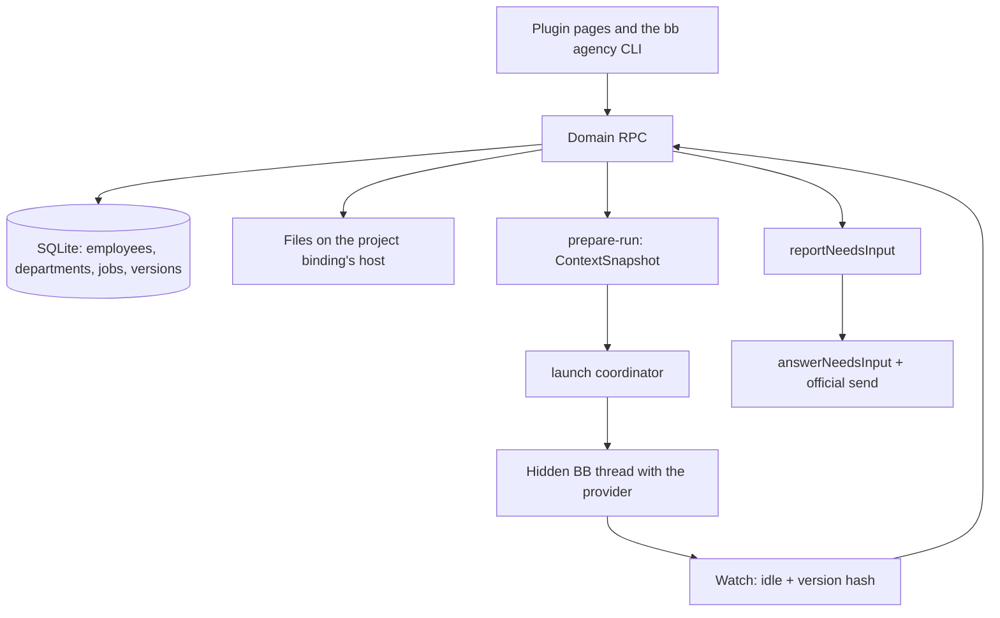

# Agency

**English** · [Русский](README.ru.md)

A BB plugin that turns scattered AI agent runs into an **organization**: standing
employees, departments, projects, jobs, result versions and explicit acceptance.

An agent here is not "a chat that did something" but an employee with a versioned
job description, a role, a department, a permission policy and a work history. A
job has a life of its own: it is assigned, launched, comes back with a question,
publishes a file version and goes through review.

> **Status:** `0.1.0-alpha.18`, a working alpha. Durable data, managed launches,
> work rules, limits and budgets, the launch queue, schedules and webhooks,
> knowledge, goals and backups work. An employee runs on any CLI connected in BB:
> Claude Code, Codex, Cursor, OpenCode and Antigravity are verified end to end;
> the limits are listed below and in
> [docs/implementation-readiness.md](docs/implementation-readiness.md) (Russian).

## Why

A usual workflow with coding agents keeps nothing between runs: instructions live
in someone's head and in CLAUDE.md, the result in a chat history, and "who reviewed
it" nowhere. The Agency adds the missing layer:

- **Employee** — a named entity with a versioned job description, a role, a
  provider and a permission policy. Editing the description creates a new version
  instead of overwriting the old one.
- **Department** — the process, result criteria and review policy of a group of
  employees; every department has a lead.
- **Project binding** — a verified link to a BB project, a machine and a root
  folder. The job's files belong to the client project.
- **Job** — a brief, acceptance criteria, dependencies, an assignee, launch
  attempts, discussion and artifact versions.
- **Acceptance** — of a specific `artifactId + version + hash`, never of the word
  "done" in a thread.

Verified on a live BB: a department lead splits a job into subtasks, an executor
hands in a version, a reviewer checks it and the owner accepts it; the Agency
creates and launches the next step for another department by itself; an employee
whose workplace is a Mac mini tests a site in a real browser.

## Lead decisions and final submission

`bb agency job state --input-json '{"jobId":"<id>"}'` returns the full goal, child states, publications, decision history and provisional lessons. Leads record a changed route with `job decide`; decisions retain evidence and their own CAS revision. The short role policy delegates procedural details to the Agency skill.

New launches submit an exact published `artifactId/version/hash` with `job submit`. Progress comments and plan publication do not trigger review. Rework invalidates the submission; a parent needs finished work children and a fresh final publication. Existing attempts keep their previous protocol until explicit submission, so an upgrade does not force a restart. Generated lesson summaries remain proposals until curated; unrelated lessons are retrieved on demand.

## Starter departments

The kit installs standing departments with a charter, a lead, executors, a reviewer
and an assistant. What each department takes, who works inside it and which skills
it may grant is in
[skills/agency/references/departments.md](skills/agency/references/departments.md)
(Russian, the skill the dispatcher reads). Phrase → department:
[skills/agency/references/routing.md](skills/agency/references/routing.md).

| Department | Takes | Does not take |
| --- | --- | --- |
| Product | Spec / `proposal.md` for a new program | Code |
| Development | Feature / bugfix on an accepted spec | A new program without a spec |
| Design | Screen, HTML prototype, image | CSS/React by the designer |
| Texts and documentation | Docs, UI copy, post, article from an SEO brief | Inventing facts |
| Advertising | Ads, Telegram Ads, Yandex Direct | Google Ads into RF; pressing launch |
| SEO | Core, cocoon, article brief, URL audit | Writing the article |
| Marketing | Offer, media plan, measurement plan | Ads, posts, on-site counters |
| Content and social | Publication pack, listening, rewrite | “Write a post” as plain text; shooting from scratch |
| Research and analytics | Comparison, audience language, corpus, fact-check | A post, a cocoon, buying access |
| Owner office | No other department; cross-department whole | Doing another department's pool by hand |
| Infrastructure and security | Deploy/rollback plan, backups, incident | On-site counters; irreversible without the owner |
| Automation and agents | Skills, schedules, Agency automations | Product features “while we are here” |
| Sales and customers | Offer, draft reply | Sending to the customer |
| Administration | Contract read, invoice, checklist | Signature and payment |

A launch grants **at most two** skills from that department's library. Money, the
ad cabinet and publishing in the company's name stay with the owner.

## Language

The marketplace listing and this README are English. Screens, buttons, settings
and empty states have an English dictionary. **Settings → Agency language**
switches jobs, comments and owner questions between English and Russian. A new
install follows the BB interface language on first paint (`en` unless the BB UI
is Russian).

Worker skills under `skills/agency/` are still written in Russian: they are the
dispatcher skill for this workspace. Agent prompts stay English, with one
language line from the Agency setting. Full English skill files are not in this
release.

## Models on a smaller subscription

Starter employees prefer Claude, then GPT, then Grok. If this BB has only Claude,
a Grok writer is installed on Sonnet (same class). If it has Claude and GPT, those
two are used and Grok is not named. Usage-limit reserves on a new profile are
filled from the other connected families of the same class. An existing team:
Settings → Machines → Employee models → Move to available models.

Before an executor or assistant starts, a separate Jev request evaluates the **complete job plan** (title, brief, acceptance and execution contract), without truncation or loaded instructions. It chooses from the selected model’s supported reasoning levels, including **xhigh / max** where available, and passes the choice explicitly to BB. Skill and memory selection use a separate request. Errors, missing model capabilities and confidence below 60% preserve the profile setting; `launch-effort` logs the reason, effective effort and plan hash/length. The employee profile and selected model do not change.

## Architecture

### Boundaries

The Agency owns employees, departments, jobs, file versions and launches
**through its own RPC and CLI**. BB owns providers, machines, threads and the UI
shell. Notifications land in an inbox and do **not** start agents: a launch
happens only through `prepareLaunch` after a readiness check.



### Layers

| Layer | Contents | Rule |
| --- | --- | --- |
| `src/shared` | Zod schemas and the RPC contract | One contract for UI, RPC and CLI |
| `src/domain` | Job and attempt transitions, rules | Pure logic, no I/O |
| `src/server/db` | SQLite and append-only migrations | Roll code back only with a compatible schema |
| `src/server/runtime` | isolation, ContextSnapshot, run-store, launch, needs-input | Spawn only through the coordinator, after readiness |
| `src/server/dispatcher` | typed inbox → rule → outbox/claim | Event rules, schedules and webhooks |
| `src/app` | Working screens over RPC and a separate demo | Demo data never mixes with real data |

One business logic for everyone: `bb agency` calls the same handlers and the same
Zod schemas as the UI. The CLI has no SQL of its own, and arbitrary RPC is closed
by an allowlist; see [docs/cli.md](docs/cli.md) (Russian).

### Job lifecycle

```text
backlog → queued → running → review → done
                      ↓
                 waiting_input / blocked / canceled
```

1. **Durable CRUD.** A job gets a brief, acceptance criteria, an assignee and
   pinned input file versions (`attachJobInput`). It can wait for other jobs and
   name a next step for another department.
2. **Readiness.** `getIsolationReadiness` with `jobId`: the employee's CLI on the
   project's machine, and project and employee policies that allow that CLI.
   Launch uses public `threads.spawn` (hidden plugin thread); launch identity is
   the Agency database plus the thread's `pluginMetadata`.
3. **Context snapshot.** An immutable `ContextSnapshot`: versions of the rules, the
   department process, the role, the brief, the effective policy, CLI and host,
   inputs and handoffs. The job layer does not cancel the department layer; a
   conflict is a typed question, not a silent choice.
4. **Launch.** `prepareLaunch` → receipt → a hidden BB thread. `reconcile` never
   spawns a second thread.
5. **Watch.** `idle` plus the hash of the current artifact version → `review` and
   `awaiting_review`. `idle` without such a version keeps the job `running`.
6. **Question.** The worker calls `reportNeedsInput` and the job moves to
   `waiting_input` with the questions saved. A job comment does **not** resume
   work; `answerNeedsInput` with the official send does.
7. **Acceptance.** A separate command on `artifactId + version + hash`. Publishing
   is not accepting, and `awaiting_review` means waiting for review.

### Permissions

Launch authority is the intersection of the platform, the project binding, the
department, the employee and the job. A job's text never widens the allowlist. An
unknown capability blocks the launch. Secret values are stored neither in the
database, nor in Git, nor in notifications — only reference names.

### Memory

Four levels, each leaning on the one below it. A launch gets the summary and the
index lines; the bodies behind them are read on demand, and the raw exchange stays
in the database.

| Level | What it is | Where it lives | What reaches a launch |
| --- | --- | --- | --- |
| Work | briefs, comments, questions, published versions, attempts | `agency_job`, `agency_activity`, `agency_artifact_version` | only this job's own text and its pinned inputs |
| Records | knowledge items: fact, decision, procedure, preference, reference, lesson — scoped to the Agency, a department or a project | `agency_knowledge` | one index line per record: kind, title, summary, id |
| Shape | work profiles of a project — how this kind of result is made here: voice, style, approved samples | `agency_work_profile` | the index of profiles; the full text of the one the job follows |
| Passport | a five-section summary of the project: what it is, who uses it, settled decisions, what is not done here, where it heads | `agency_project_passport` | whole, header only, or one line with a command — by the employee's role |

**Where records come from.** After a main job is accepted the Agency writes a lesson
from its facts: how many rework rounds, what the returns were about, how long it took.
With the "the department learns by itself" rule that lesson is accepted at once and
the owner can edit or drop it; otherwise it waits as a proposal. An employee can
propose a record from their own thread, and a remark repeated in three jobs of a
department becomes a proposal too. The moment is always after acceptance: before
that it is a guess.

**How the passport is built.** Not by hand and not by the lead: a cheap background
model sums up what the project already has — its knowledge, work profiles, goals,
the briefs of accepted jobs and the project rules — into at most 2 000 characters.
It rebuilds in batches, after a set number of accepted jobs, and an edition applies
at once; the previous one stays in history and comes back with one button, and an owner's edit
or restore holds twice as long as an ordinary edition. Before a
replacement the decision model looks at it, when the owner has that decision point on:
a secret or a state-of-the-day cancels the replacement and the owner gets a message.

**How it reaches the work.** The prompt of a launch is layered: agency rules →
project (rules, passport, profile index, project knowledge) → department (charter
and its knowledge) → employee → job. Records arrive as index lines, up to 3 500
characters per scope; only pinned and important ones (80+) arrive in full, up to
8 000 per layer. The body of any record is read with `bb agency knowledge get`, and
every such read is counted — the memory budget evicts what nobody ever opened before
it evicts what is merely old. A department keeps 40 accepted records by default, and
an auto-written lesson lives 90 days unless it is pinned. If the decision model is
on, it picks the records that fit the job and the rest are announced by a line with
the command.

**What is not memory.** Project rules (`.bb/AGENTS.md`) live on the machine and
arrive as their own layer. Secrets live in Env Catalog: neither the database, nor a
backup, nor an export holds a value, only the name of a variable. The state of the
day — who is busy, what is in flight — is the board, not memory.

**What is pinned.** The launch snapshot carries the ids and hashes of the records,
the passport and the profile that went into it, so rebuilding a passport or editing a
record cannot slip into a prepared launch unnoticed.

## Interface

The home screen lists jobs by state, with a project, department or employee picker
on the right. A main job stands out and shows how many of its subtasks are closed;
subtasks sit under it. Closed jobs leave the board: subtasks after 1 h, the rest
after 24 h (plugin settings). The job card has the work and discussion on the left
and properties, files and launches on the right.

Ordinary BB chats get a routing section from the project (or a unique folder, or
this thread): Agency, on request, or do it here. A dropdown in the row under the
input, next to access mode, shows the role and can switch this chat.
The plugin setting is only the fallback. An employee gets its role — lead, executor, reviewer or assistant — in
the launch prompt. Instructions and service messages to agents are always in
English; the "Agency language" setting sets the language of reports and comments.

Files open with a click in a closable right-hand BB tab. The Agency has its own
editor for txt/json/yaml/csv and images; `.md` / `.markdown` files open in the
separate Markdown PRO plugin (`md-editor`). Saving in the Agency editor creates a
new version on the machine and in the folder of the bound project.

Sections: Jobs (list and kanban, archive, search in briefs and comments, saved
views), Inbox, Goals, Projects, Departments, Employees (with a Metrics tab),
Automations, Knowledge, Launches, a Dashboard of spend, budgets and CLI subscription usage, and Settings.
The owner changes behavior without code: work rules of the Agency, a department, a
machine and an employee (rework rounds, launch watch, concurrency limits, budgets,
auto review, escalation, "Run without sandbox", nightly recheck), the Agency-wide
rules — the top prompt layer, charter and job description templates, the language
(Russian / English), skill version pinning, backups, model prices and a check of the
employees' models against what this BB has connected (with a move to the nearest
available one), and soft WIP limits of kanban columns. The interface and the standard templates switch between Russian and
English.

Besides its rules, a project has two memory tabs: Passport — the summary of what the
project is, with a preview per delivery size, the history of editions and a one-button
restore — and Work profiles: voice, style, approved samples and an addition to the
acceptance criterion. A department has a Skill library: the set it may raise for a
particular job, with a grant journal — which skill, to whom, for which job and who
decided. The Decision model settings hold both background models: the decision model
with its decision points and the passport writer.

The Agency creates nothing by itself. An empty Agency offers **fourteen starter
departments** (product, development and its conveyor, design, writing, advertising,
SEO, marketing, social, research, owner office, infrastructure, automation, sales,
administration), each with a lead, executors, a reviewer, an assistant, a charter
and job descriptions in Russian or English — or you create your own. A launch
grants **at most two** skills from that department's library. Writing, advertising,
design, SEO, marketing, social and research have locked craft packs; infrastructure,
automation, sales and the owner office still use the kit charter. What each desk
takes: [departments.md](skills/agency/references/departments.md) (Russian). The
conveyor department comes with a CLI per role: a strong model plans, a cheap one
reads the code, a fast one writes it and a model from another vendor reviews it;
when a CLI is not connected in BB that employee starts on the role default. How to
build and tune such a department:
[skills/agency/references/dev-conveyor.md](skills/agency/references/dev-conveyor.md)
(Russian). Starter records are ordinary data: edit, archive or delete them;
untouched ones switch language with one button. A department or an employee goes to
the archive with its history kept, and is deleted only when it never worked.

An implementation subtask carries an execution contract: what to read first, which interfaces
and invariants to keep, which files it may change, what must not be touched and which checks
must pass. Two subtasks of one project folder that may change the same files do not run at
once — the later one waits in the launch queue.

A job's work order is in its card: which jobs must be done before it launches, and
a "next step" for another department that the Agency creates by itself after
acceptance. Messages from scripts and watchdogs (`bb agency notify-owner`,
`bb agency digest`) arrive in Inbox → Messages.

Other BB plugins unlock features and stay invisible without them: with Projects &
Sections a project has several folders on different machines and subtasks between
them; with File Gateway an employee has a workplace on its own machine. BB plugins
are given to an employee one by one in the profile's Plugins tab: the launch gets
their skills and instructions, and other plugins stay out of the isolated launch.
The tab marks what each plugin gives — instructions, a skill, tools — and hides
plugins that only change the BB interface.

Shared interface rules: [DESIGN.md](DESIGN.md) (Russian).

## Compared with other systems

How the Agency relates to systems that have long automated team work. Other systems
are rated from their public documentation (September 2026); sources are listed at the
end of [docs/operating-model.md](docs/operating-model.md). "?" means no data was found,
not that the feature is missing.

| Capability | Linear | Jira SM | Bitrix24 | Paperclip | Multica | Symphony | Agency |
| --- | --- | --- | --- | --- | --- | --- | --- |
| Departments with a lead | no | partial | yes | yes | yes | no | yes |
| Intake and triage of incoming work | yes | yes | partial | yes | ? | no | partial |
| Routing from any chat | partial | no | no | no | no | no | yes |
| Main job and subtasks with progress | yes | yes | yes | yes | yes | no | yes |
| Auto-hide or archive of closed work | yes | ? | ? | no | no | no | yes |
| Heartbeat / stall timeout | yes | no | no | yes | yes | yes | yes |
| Retry and fallback by error type | no | no | no | partial | yes | yes | no |
| Independent review and acceptance of a version | no | partial | partial | yes | partial | yes | yes |
| Budgets per agent or department | no | no | no | yes | no | no | yes |
| WIP / concurrency limits | no | no | no | no | no | yes | yes |
| Department knowledge in the context | no | partial | yes | no | yes | no | yes |
| Schedules and webhooks | partial | yes | yes | yes | yes | no | yes |
| Question to the owner with continuation | yes | no | no | partial | ? | partial | yes |

### What is built in and where the idea comes from

| Feature | How it works in the Agency | Similar in |
| --- | --- | --- |
| Departments and leads | A job goes to the department lead, who splits it into subtasks for executors and reviewers and does not implement | Multica squads, Paperclip org tree, Bitrix24 departments |
| Routing from chats | Every BB session gets the list of departments and what each accepts, plus the command to hand work over | lane-stack routing |
| Intake assessment | The lead records size, risk and decision (accept / split / clarify / return) as job data | Linear triage, lane-stack risk |
| Board hygiene | Closed subtasks leave the board after 1 h, other jobs after 24 h; closed trees go to a searchable archive after 30 days | Linear auto-archive, Plane auto-archive, Vibe Kanban |
| Launch watch | Silence, stall, failed start, provider error and a ceiling per attempt; a stuck job goes to the lead | Symphony stall timeout, Linear stale sessions, lane-stack idle/max |
| Review and acceptance | Executor ≠ reviewer, optional automatic review subtask, acceptance of `artifactId + version + hash`, not of the word "done" | Symphony Human Review, Paperclip review stages, lane-stack acceptance receipt |
| Rework limit | Rework rounds per job are a rule (3 by default), then the owner decides | CrewAI guardrail retries, MetaGPT review loops |
| Execution contract | May change / must not touch / checks, frozen in the launch snapshot | lane-stack task contract |
| Budgets | Monthly budget for the Agency, a department and an employee: warning at a threshold, launches pause at 100% | Paperclip budgets |
| Limits and queue | Concurrent launches per Agency, department and employee; a launch queue by priority; soft WIP limits on kanban columns | Symphony parallel agents, ClickUp WIP limits |
| Assignment and job team | Lead or the least loaded executor or reviewer; reviewers and observers on a job | Jira load-based assignment, Bitrix24 task roles |
| Knowledge | Items scoped to the Agency, a department or a project go into launches; a remark repeated in three jobs becomes a knowledge proposal | Bitrix24 knowledge base, lane-stack "repeated fix → project rule" |
| Project passport | A background model sums the project's own records into a five-section summary, rebuilt in batches; how much of it an employee gets depends on their role | TencentDB Agent Memory L0–L3 (raw → facts → scenes → profile) |
| Work profiles | How this kind of result is made here: voice, style, approved samples and an addition to acceptance; the index reaches every launch of the project, the full text reaches the job it is set on | — |
| Decision model | A fast model answers with a typed decision and its confidence where a rule is too crude: the memory gate, the launch briefing, the passport gate; below the threshold the answer is not applied, an error equals "don't know" | System One (TypeSafe), OpenRouter decisions API |
| Department skill library | The set a department may raise for a particular job: the decision model opens one for a single launch, every grant lands in a journal, and the profile's rights stay untouched | Fixed Binding + ACL in TencentDB Agent Memory |
| Assistants in a department | A fourth role type: they take subtasks on a cheap model, never lead a main job and never hand work out | — |
| Goals, hierarchy, metrics | Goals over main jobs, subordinate departments with escalation, employee metrics | Linear Initiatives, Asana Goals, Paperclip `reportsTo`, Bitrix24 efficiency |
| Questions to the owner | A typed question pauses the job; the answer continues the same thread | Linear agents (the human stays the owner) |
| Automations | Event → rule → job, cron schedules, signed webhooks, Telegram notifications | Jira automation rules, Multica autopilots |
| Work order | Dependencies hold a launch until the jobs it waits for are done; a "next step" job for another department is created and queued after acceptance | Jira automation rules |
| Nightly recheck | A reviewer rechecks the versions accepted that day | lane-stack night review |
| Messages to the owner | `notify-owner`, summaries and watchdogs without a model; Inbox and Telegram | — |
| Machines and plugins | Project folders on several machines, an employee workplace on its own machine, BB plugins per employee, a sandbox rule per machine | — (BB-specific) |

lane-stack is the author's own set of Claude Code agents for orchestrating development work; its rules were an input for this design.

## Not there yet

An honest list of limits, so the alpha is not read as a finished product:

- A file sandbox for employees. Launches go through BB with only the profile's
  skills and plugins, but that is not file isolation. Token accounting of Codex and
  ACP providers (Cursor, OpenCode, Antigravity) depends on the BB core.
- Acceptance by the word "done" and inferring `waiting_input` from thread prose.
  Both are typed commands only.
- A fallback CLI when the main one is unavailable.
- BB plugin tools inside an isolated Claude Code thread: BB 0.43.1 does not attach
  them, so an employee uses the `bb <plugin>` command.
- Two-way Telegram and a multi-user model.
- The production rollout of the core and SDK is prepared separately.

## Layout

```text
server.ts                    server registration
app.tsx                      page and BB fileOpener registration
host.ts                      preview copies on the chosen host
src/
  shared/                    Zod schemas and the RPC contract
  domain/                    employees, departments, jobs, launches and rules
  server/
    register.ts              dependency wiring and RPC/CLI registration
    db/                      SQLite and append-only migrations
    inbox/                   stored incoming notifications
    triggers/                event source adapters
    knowledge/               knowledge records, lessons, repeated remarks
    decisions/               the decision model: client, decision points, key name
    projects/                work profiles and the project passport
    runtime/                 isolation, ContextSnapshot, run-store, launch, prepare-run
    dispatcher/              launch and reconciliation contracts
    flow/                    dependencies and next steps
    owner-messages/          messages, summaries and watchdogs for the owner
  app/prototype/             the UI in use and demo data
  app/i18n/                  English dictionary keyed by the Russian source text
components/ui/               components from the standard BB scaffold
skills/agency/               how a worker uses the CLI
tests/                       behavior checks through the SDK harness
docs/                        architecture, events, API and stages (Russian)
```

## Install and develop

Requires BB `>=0.43.1 <0.44` and Node 22/24/26. The package builds against the
public `@get-bb/plugin-sdk` from npm, pinned in `devDependencies`.

```sh
npm ci --include=dev
npm run typecheck
npm test
npm run build
```

Local install into BB from the plugin folder:

```sh
bb plugin install .
bb agency status --json
bb agency help
```

The plugin registers the `/plugins/agency/overview` page and the `bb agency` CLI.
A successful build is not an install. A launch uses public `threads.spawn`
(origin plugin, hidden visibility, pluginMetadata). Identity of the attempt
stays in the Agency database.

CRUD commands and the `--input-json` / server-fs semantics:
[docs/cli.md](docs/cli.md) (Russian).

## Data and rollback

Own database: `<BB dataDir>/plugins/agency/data.db`. BB owns the connection and
closes it on reload. Sources and the database are separate. Make a copy from
Settings → Storage → Backups: it is a consistent SQLite snapshot that accounts for
WAL, stored next to the database in `backups/`. Restore from the same place: the
current state is saved first, then the data is replaced. Webhook secrets and skill
pins are not part of a backup. Copying an active `data.db` without its WAL is not
a backup.

Closed jobs move to the archive after 30 days (the archive period is a plugin
setting in BB); the archive opens from the board and is searchable, and nothing is
deleted from the database.

`bb plugin disable agency` turns the plugin off; keep the stored data. Disabling
stops the watch but does not cancel worker threads already created. Before an
update, save the state of active attempts and check that they recover after the
plugin is enabled again.

## Documents

The documents are in Russian. **Start with the [work plan and index](docs/README.md)**.

- [What each starter department takes](skills/agency/references/departments.md) · [phrase → department](skills/agency/references/routing.md)
- [Dispatcher skill](skills/agency/SKILL.md) (0.28.5) · [craft-pack protocol](skills/agency/references/craft-pack.md)
- [Analysis, comparison with similar products and the development plan](docs/operating-model.md)
- [Runtime readiness and limits](docs/implementation-readiness.md)
- [File architecture and module boundaries](docs/architecture.md)
- [Data and states](docs/data-model.md) · [package versions](docs/dependencies.md)
- [CLI](docs/cli.md) · [BB API: what it can and cannot do](docs/bb-api.md)
- [Rules and context of different levels](docs/instruction-context.md)
- [How the Agency's memory is kept: what to write, in what words and when](skills/agency/references/memory.md)
- [Launch snapshot](docs/session-context-contract.md) · [revise compiler](docs/context-snapshot-revise.md)
- [Interaction contracts and readiness](docs/interaction-and-runtime.md)
- [Communication and history inside a job](docs/task-interaction.md)
- [Automation and webhook architecture](docs/automation-architecture.md) · [events](docs/events.md)
- [Importing your own MCP servers with JSON](docs/mcp-import.md) · [skill and catalog](docs/skills-integration.md)
- [All screens and prototype behavior](docs/ui-plan.md) · [shared interface rules](DESIGN.md)
- [Product review and comparison with Multica](docs/product-review.md)
- [Stages and acceptance criteria](docs/roadmap.md)
