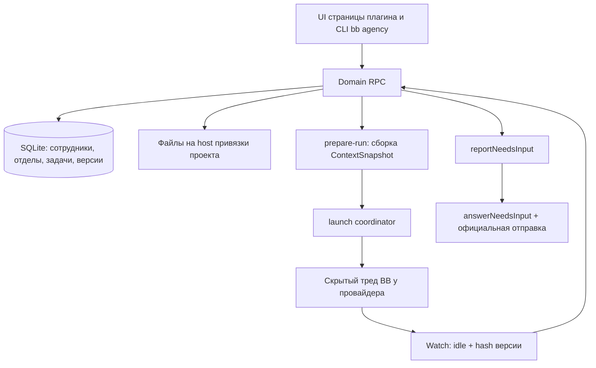

# Агентство

[English](README.md) · **Русский**

BB-плагин, который превращает набор разрозненных запусков AI-агентов в
**организацию**: постоянные сотрудники, отделы, проекты, поручения, версии
результатов и явная приёмка.

Агент здесь не «чат, который что-то сделал», а сотрудник с версионируемой
инструкцией, ролью, отделом, политикой прав и историей работ. Поручение живёт
своей жизнью: его назначают, запускают, оно возвращается с вопросом, публикует
версию файла и проходит проверку.

> **Статус:** `0.1.0-alpha.16`, рабочая альфа. Постоянные данные, управляемые
> запуски, правила работы, лимиты и бюджеты, очередь запуска, расписания и
> webhook, знания, цели и резервные копии работают. Сотрудник работает на любом CLI,
> подключённом в BB: Claude Code, Codex, Cursor, OpenCode и Antigravity проверены
> от запуска до сданной версии. Границы честно перечислены ниже и в
> [docs/implementation-readiness.md](docs/implementation-readiness.md).

## Зачем

Обычный сценарий работы с coding-агентами не сохраняет ничего между запусками:
инструкции живут в голове и в CLAUDE.md, результат — в истории чата, «кто
проверил» — нигде. Агентство добавляет недостающий слой:

- **Сотрудник** — именованная сущность с версией инструкции, ролью, провайдером
  и политикой прав. Правка инструкции создаёт новую версию, а не затирает старую.
- **Отдел** — процесс, критерии результата и политика проверки для группы
  сотрудников; у отдела есть руководитель.
- **Привязка к проекту** — проверенная связь с BB-проектом, машиной и корневым
  каталогом. Файлы заказа принадлежат проекту заказчика.
- **Поручение** — бриф, критерий готовности, зависимости, назначение,
  попытки запуска, обсуждение и версии артефактов.
- **Приёмка** — по конкретным `artifactId + version + hash`, а не по фразе
  «готово» в тексте треда.

Проверено на живом BB: руководитель отдела делит задачу на подзадачи, исполнитель
сдаёт версию, проверяющий проверяет, владелец принимает; следующий шаг другому
отделу Агентство создаёт и запускает само; сотрудник с рабочим местом на Mac mini
проверяет сайт в реальном браузере.

## Стартовые отделы

Кит ставит отделы с регламентом, руководителем, исполнителями, проверяющим и
помощником. Что каждый берёт, кто внутри и какой пул навыков — в
[skills/agency/references/departments.md](skills/agency/references/departments.md).
Фраза владельца → отдел:
[skills/agency/references/routing.md](skills/agency/references/routing.md).

| Отдел | Берёт | Не берёт |
| --- | --- | --- |
| Продукт | Спека / `proposal.md` новой программы | Код |
| Разработка | Feature / bugfix по принятой спеке | Новая программа без спеки |
| Дизайн | Экран, HTML-прототип, картинка | CSS/React руками дизайнера |
| Тексты и документация | Документация, UI-копи, пост, статья по ТЗ | Выдумать факты |
| Реклама | Объявления, Telegram Ads, Директ | Google Ads в РФ; нажать запуск |
| SEO | Ядро, кокон, ТЗ, аудит URL | Написать статью |
| Маркетинг | Оффер, медиаплан, план измерения | Объявления, посты, счётчик на сайте |
| Контент и соцсети | Пакет публикации, слушание, перепаковка | «Напиши пост» как текст; съёмка с нуля |
| Исследования и аналитика | Сравнение, язык ЦА, корпус, фактчек | Пост, кокон, покупка доступа |
| Офис владельца | Нет своего отдела; сквозное целое | Чужой пул своими руками |
| Инфраструктура и безопасность | План выкладки, бэкапы, инцидент | Счётчик на сайте; необратимое без владельца |
| Автоматизация и агенты | Навыки, расписания, автоматизации Агентства | Функции продукта «заодно» |
| Продажи и клиенты | КП, черновик ответа | Отправка клиенту |
| Администрация | Разбор договора, счёт, чек-лист | Подпись и оплата |

На запуск из библиотеки отдела — **не больше двух** навыков. Деньги, кабинет и
публикация от имени компании остаются у владельца.

## Архитектура

### Границы

Агентство владеет сотрудниками, отделами, поручениями, версиями файлов и
запуском **через собственные RPC и CLI**. BB владеет провайдерами, машинами,
тредами и оболочкой UI. Уведомления попадают во входящий журнал и **не**
запускают агентов — запуск возможен только через `prepareLaunch` после
проверки готовности.



### Слои

| Слой | Содержимое | Правило |
| --- | --- | --- |
| `src/shared` | Zod-схемы и RPC-контракт | Один контракт для UI, RPC и CLI |
| `src/domain` | Переходы Job и попыток, правила | Чистая логика без I/O |
| `src/server/db` | SQLite и append-only миграции | Откат кода только с совместимой схемой |
| `src/server/runtime` | isolation, ContextSnapshot, run-store, launch, needs-input | Spawn только через координатор, после проверки готовности |
| `src/server/dispatcher` | typed inbox → правило → outbox/claim | Live и автозапуск выключены |
| `src/app` | Рабочие экраны на RPC и отдельное демо | Демоданные не смешиваются с рабочими |

Одна бизнес-логика на всех: `bb agency` вызывает те же обработчики и те же
Zod-схемы, что и UI. Отдельного SQL в CLI нет, произвольный RPC закрыт
allowlist — см. [docs/cli.md](docs/cli.md).

### Жизненный цикл поручения

```text
backlog → queued → running → review → done
                      ↓
                 waiting_input / blocked / canceled
```

1. **Durable CRUD.** Поручение получает бриф, критерий готовности, исполнителя и
   закреплённые входные версии файлов (`attachJobInput`).
2. **Готовность.** `getIsolationReadiness` с `jobId`: CLI сотрудника на машине
   проекта и политики проекта и сотрудника, которые этот CLI разрешают.
   Запуск идёт штатным `threads.spawn` (скрытый plugin-тред); идентичность запуска —
   база Агентства и `pluginMetadata` треда.
3. **Снимок контекста.** Неизменяемый `ContextSnapshot`: версии правил, процесса
   отдела, роли, брифа, действующей политики, CLI и host, входы и передачи.
   Слой поручения не отменяет слой отдела; конфликт — это typed-вопрос, а не
   тихий выбор одного из вариантов.
4. **Запуск.** `prepareLaunch` → receipt → скрытый тред BB. `reconcile` не
   создаёт второй spawn.
5. **Наблюдение.** `idle` плюс hash текущей версии артефакта → `review` и
   `awaiting_review`. `idle` без такой версии оставляет поручение в `running`.
6. **Вопрос.** Работник вызывает `reportNeedsInput` — поручение переходит в
   `waiting_input` с сохранёнными вопросами. Комментарий к задаче работу **не**
   продолжает; продолжает `answerNeedsInput` с официальной отправкой.
7. **Приёмка.** Отдельная команда по `artifactId + version + hash`. Публикация
   не равна принятию, а `awaiting_review` — это ожидание проверки.

### Права

Полномочия запуска — пересечение платформы, привязки проекта, отдела,
сотрудника и поручения. Текст поручения не расширяет allowlist. Неизвестная
capability блокирует запуск. Значения секретов не хранятся ни в базе, ни в Git,
ни в уведомлениях — только имена ссылок.

### Память

Четыре уровня, каждый опирается на то, что под ним. В запуск идут сводка и строки
индекса, тела за ними читаются по надобности, а сырая переписка остаётся в базе.

| Уровень | Что это | Где лежит | Что доходит до запуска |
| --- | --- | --- | --- |
| Работа | брифы, комментарии, вопросы, опубликованные версии, попытки | `agency_job`, `agency_activity`, `agency_artifact_version` | только текст своей задачи и закреплённые входные версии |
| Записи | знания: факт, решение, процедура, предпочтение, справка, урок — в области Агентства, отдела или проекта | `agency_knowledge` | строка индекса на запись: вид, название, сводка, id |
| Форма | профили работ проекта — как здесь делают такой вид результата: голос, стиль, одобренные эталоны | `agency_work_profile` | индекс профилей; полный текст того, который назначен задаче |
| Паспорт | сводка проекта из пяти разделов: что это, кто пользуется, устоявшиеся решения, чего здесь не делают, куда идём | `agency_project_passport` | целиком, только шапка или строка с командой — по роли сотрудника |

**Откуда берутся записи.** После приёмки главной задачи Агентство складывает урок из
её фактов: сколько было кругов доработки, из-за чего возвращали, сколько заняло. При
правиле «Отдел учится сам» урок принимается сразу, а владелец может поправить его или
убрать; иначе он ждёт решения предложением. Сотрудник может предложить запись из
своего треда, а замечание, повторённое в трёх задачах отдела, тоже становится
предложением. Момент всегда один — после приёмки: до неё это догадка.

**Как собирается паспорт.** Не руками и не руководителем: дешёвая фоновая модель
сводит то, что проект уже накопил, — знания, профили работ, цели, брифы принятых
задач и правила проекта — в сводку не длиннее 2 000 знаков. Пересборка идёт пачками,
через заданное число принятых задач; редакция применяется сразу, прежняя остаётся в
истории и возвращается одной кнопкой; правка владельца и возврат держатся вдвое дольше обычной
редакции. Перед заменой редакцию смотрит оценщик, если владелец включил эту точку решения:
секрет или состояние дня отменяют замену, и владелец получает сообщение.

**Как память доходит до работы.** Промпт запуска послойный: правила Агентства →
проект (правила, паспорт, индекс профилей, знания проекта) → отдел (регламент и его
знания) → сотрудник → поручение. Записи приходят строками индекса, не длиннее 3 500
знаков на область; целиком — только закреплённые и важные (от 80), до 8 000 знаков на
слой. Тело записи читается командой `bb agency knowledge get`, и каждое такое чтение
считается: бюджет памяти вытесняет сначала то, что никто ни разу не открыл, и только
потом просто старое. Отдел держит 40 принятых записей, авто-урок живёт 90 дней, если
его не закрепили. При включённом оценщике в промпт идут записи, отобранные под
задачу, а остальные объявлены строкой с командой.

**Что памятью не является.** Правила проекта (`.bb/AGENTS.md`) лежат на машине и
приходят своим слоем. Секреты живут в Env Catalog: ни база, ни резервная копия, ни
экспорт не хранят значение — только имя переменной. Состояние дня — кто чем занят и
что в работе — это доска, а не память.

**Что закреплено.** Снимок запуска несёт идентификаторы и хэши записей, паспорта и
профиля, которые в него вошли: пересборка паспорта или правка записи не подменят уже
подготовленный запуск незаметно.

## Интерфейс

Главный экран — поручения по статусам, справа выбор проекта, отдела или
сотрудника. Главная задача выделена и показывает, сколько подзадач закрыто;
подзадачи стоят под ней. Закрытые уходят с доски: подзадачи через 1 ч, остальные
через 24 ч (настройки плагина). Карточка поручения: работа и обсуждение слева,
свойства, файлы и запуски справа.

Плагин добавляет в каждую новую сессию BB инструкцию маршрута: что сделать в
чате, а что поручить отделу проекта и кому. Сотрудник получает свою роль —
руководитель, исполнитель, проверяющий или помощник — в промпте запуска. Инструкции и
служебные сообщения агентам всегда на английском; язык отчётов и комментариев
задаёт настройка «Язык Агентства». Режим `delegate` / `suggest` / `off` — в настройках.

Файлы открываются по клику в закрываемой правой вкладке BB. Агентство
показывает свой редактор для txt/json/yaml/csv и изображений; `.md`/`.markdown`
открывает и редактирует отдельный плагин «Markdown PRO» (`md-editor`).
Сохранение в редакторе Агентства создаёт новую версию на машине и в папке
привязанного проекта.

Разделы: «Задачи» (список и канбан, архив, поиск по описаниям и комментариям,
сохранённые виды), «Входящие», «Цели», «Проекты», «Отделы», «Сотрудники» (вкладка
«Показатели»), «Автоматизации», «Знания», «Запуски», «Дашборд» расхода, бюджетов и расхода подписок CLI,
«Настройки». В настройках владелец меняет поведение без правки кода: правила работы
Агентства, отдела и сотрудника (круги доработки, наблюдение за запуском, лимиты
параллельности, бюджеты, автопроверка, эскалация), общие правила — верхний слой
промпта, шаблоны регламента и должностных инструкций, язык (русский / English),
закрепление версии навыков, резервные копии, цены моделей и сверку моделей
сотрудников с тем, что подключено в этом BB (с переводом на ближайшую доступную),
правило «Запуск без песочницы» (в том числе для машины),
ночная перепроверка принятого и мягкие лимиты WIP колонок канбана. Интерфейс и стандартные шаблоны
переключаются между русским и английским.

У проекта, кроме правил, две вкладки памяти: «Паспорт» — сводка «что это за проект» с
предпросмотром по объёмам доставки, историей редакций и возвратом прежней, и «Профили
работ» — голос, стиль, эталоны и добавка к критерию приёмки. У отдела есть «Библиотека
навыков»: набор, который отдел вправе поднять под конкретное задание, с журналом
выдач — какой навык, кому, по какой задаче и кто решил. В настройках «Оценщик» живут
обе фоновые модели: сам оценщик с его точками решения и писарь паспорта.

Агентство ничего не создаёт само. В пустом Агентстве можно взять стартовые отделы —
разработку, разработку-конвейер, исследования и тексты с руководителем, исполнителями,
проверяющими, регламентом и должностными инструкциями на русском или английском — или
создать свои отделы, сотрудников и правила с нуля. У отдела-конвейера каждому шагу задан
свой CLI: сильная модель планирует, дешёвая читает код, быстрая пишет, а проверяет модель
другого вендора; если CLI не подключён в BB, сотрудник получает модель роли по умолчанию.
Как собрать и настроить такой отдел —
[skills/agency/references/dev-conveyor.md](skills/agency/references/dev-conveyor.md). Стартовые записи — обычные данные: их можно
менять, отправлять в архив и удалять, а неизменённые переводятся на другой язык одной
кнопкой. Отдел или сотрудник уходит в архив с сохранённой историей, удалить можно
только того, кто ещё не работал.

У подзадачи реализации есть контракт исполнения: что прочитать сначала, какие интерфейсы и
инварианты сохранить, какие файлы можно менять, что нельзя трогать и какие проверки пройти.
Две подзадачи одной папки проекта с пересечением по файлам одновременно не запускаются:
вторая ждёт в очереди запуска.

Порядок работы задачи — в её карточке: какие задачи должны быть готовы до запуска и «следующий шаг»
другому отделу, который Агентство создаёт само после приёмки. Сообщения скриптов и сторожей
(`bb agency notify-owner`, `bb agency digest`) приходят во «Входящие → Сообщения».

Дополнительные плагины BB открывают возможности, без них они не показываются: с Projects & Sections
у проекта несколько папок на разных машинах и подзадачи между ними, с File Gateway у сотрудника
рабочее место на своей машине. Плагины BB выдаются сотруднику по одному во вкладке «Плагины» профиля:
его запуск получает их навыки и инструкции, остальные плагины в изолированный запуск не попадают. Вкладка
помечает, что даёт каждый плагин — инструкции, навык, инструменты; плагины, которые меняют только
интерфейс BB, в ней не показываются.

Единые правила интерфейса: [DESIGN.md](DESIGN.md).

## Сравнение с другими системами

Как Агентство соотносится с системами, которые давно автоматизируют работу команд. Другие
системы оценены по их открытой документации (сентябрь 2026); источники — в конце
[docs/operating-model.md](docs/operating-model.md). «?» — данных не нашли, это не значит,
что возможности нет.

| Возможность | Linear | Jira SM | Bitrix24 | Paperclip | Multica | Symphony | Агентство |
| --- | --- | --- | --- | --- | --- | --- | --- |
| Отделы с руководителем | нет | частично | да | да | да | нет | да |
| Приём и триаж входящих | да | да | частично | да | ? | нет | частично |
| Маршрут из любого чата | частично | нет | нет | нет | нет | нет | да |
| Главная задача и подзадачи с прогрессом | да | да | да | да | да | нет | да |
| Автоскрытие или архив закрытых | да | ? | ? | нет | нет | нет | да |
| Heartbeat / таймаут зависания | да | нет | нет | да | да | да | да |
| Повтор и fallback по типу ошибки | нет | нет | нет | частично | да | да | нет |
| Независимая проверка и приёмка версии | нет | частично | частично | да | частично | да | да |
| Бюджеты на агента или отдел | нет | нет | нет | да | нет | нет | да |
| WIP / лимиты параллельности | нет | нет | нет | нет | нет | да | да |
| Знания отдела в контексте | нет | частично | да | нет | да | нет | да |
| Расписания и webhook | частично | да | да | да | да | нет | да |
| Вопрос владельцу с продолжением | да | нет | нет | частично | ? | частично | да |

### Что внедрено и откуда идея

| Возможность | Как устроено в Агентстве | Похоже в |
| --- | --- | --- |
| Отделы и руководители | Задача идёт руководителю отдела: он делит её на подзадачи исполнителям и проверяющим и сам не исполняет | Squad в Multica, оргдерево Paperclip, отделы Bitrix24 |
| Маршрут из чатов | Каждая сессия BB получает список отделов, что каждый принимает, и команду поручения | Маршрутизация lane-stack |
| Оценка на входе | Руководитель записывает размер, риск и решение (принять / разбить / уточнить / вернуть) данными задачи | Triage в Linear, risk в lane-stack |
| Гигиена доски | Закрытые подзадачи уходят с доски через 1 ч, остальные через 24 ч; закрытые деревья — в архив с поиском через 30 дней | Автоархив Linear и Plane, Vibe Kanban |
| Наблюдение за запуском | Тишина, зависание, незапуск, ошибка провайдера и потолок попытки; зависшая задача уходит руководителю | Stall-таймаут Symphony, stale-сессии Linear, idle/max в lane-stack |
| Проверка и приёмка | Исполнитель ≠ проверяющий, автоматическая подзадача проверки по правилу, приёмка `artifactId + version + hash`, а не слова «готово» | Human Review в Symphony, стадии проверки Paperclip, квитанция приёмки lane-stack |
| Лимит доработок | Число кругов доработки — правило (по умолчанию 3), дальше решает владелец | Повторы guardrail в CrewAI, циклы проверки MetaGPT |
| Контракт исполнения | Можно менять / нельзя трогать / проверки, закреплены в снимке запуска | Контракт задачи lane-stack |
| Бюджеты | Бюджет в месяц на Агентство, отдел и сотрудника: предупреждение по порогу, пауза запусков на 100% | Бюджеты Paperclip |
| Лимиты и очередь | Одновременные запуски на Агентство, отдел и сотрудника; очередь запуска по приоритету; мягкий WIP колонок канбана | Параллельность Symphony, WIP-лимиты ClickUp |
| Назначение и команда задачи | Руководитель или наименее загруженный исполнитель либо проверяющий; проверяющие и наблюдатели задачи | Назначение по загрузке в Jira, роли задачи Bitrix24 |
| Знания | Материалы Агентства, отдела или проекта идут в запуски; замечание, повторённое в трёх задачах, становится предложением в знания | База знаний Bitrix24, «повторная правка → правило проекта» в lane-stack |
| Паспорт проекта | Фоновая модель сводит записи проекта в сводку из пяти разделов и пересобирает её пачками; сколько её достанется сотруднику, решает его роль | TencentDB Agent Memory L0–L3 (сырьё → факты → сцены → профиль) |
| Профили работ проекта | Как здесь делают такой вид результата: голос, стиль, одобренные эталоны и добавка к приёмке; индекс приходит в каждый запуск проекта, полный текст — в назначенную задачу | — |
| Оценщик | Быстрая модель отвечает типизированным решением с уверенностью там, где правило грубое: привратник памяти, подсказка к запуску, привратник паспорта; ниже порога ответ не применяется, ошибка равна «не знаю» | System One (TypeSafe), decisions API OpenRouter |
| Библиотека навыков отдела | Набор, который отдел вправе поднять под задание: оценщик открывает из него на один запуск, каждая выдача попадает в журнал, права в профиле не меняются | Fixed Binding + ACL в TencentDB Agent Memory |
| Помощники в отделе | Четвёртый тип роли: берут подзадачи на дешёвой модели, не ведут главную задачу и не раздают работу | — |
| Цели, подчинённость, показатели | Цели над главными задачами, подчинённые отделы с эскалацией, показатели сотрудника | Initiatives в Linear, Goals в Asana, `reportsTo` в Paperclip, эффективность Bitrix24 |
| Вопросы владельцу | Typed-вопрос ставит задачу на паузу, ответ продолжает тот же тред | Агенты Linear (человек остаётся владельцем) |
| Автоматизации | Событие → правило → задача, расписания cron, подписанные webhook, уведомления в Telegram | Правила автоматизации Jira, автопилоты Multica |
| Порядок работы | Зависимости держат запуск до готовности нужных задач; «следующий шаг» другому отделу создаётся и ставится в очередь после приёмки | Правила автоматизации Jira |
| Ночная перепроверка | Проверяющий перепроверяет версии, принятые за день | Ночное ревью lane-stack |
| Сообщения владельцу | `notify-owner`, сводки и сторожа без модели; «Входящие» и Telegram | — |
| Машины и плагины | Папки проекта на нескольких машинах, рабочее место сотрудника на своей машине, плагины BB по сотрудникам, правило песочницы для машины | — (особенности BB) |

lane-stack — собственный набор агентов Claude Code автора для оркестрации разработки; его правила учтены при проектировании.

## Чего ещё нет

Честный список границ, чтобы не читать альфу как готовый продукт:

- Файловая песочница сотрудника. Запуск идёт через BB только с навыками и плагинами
  профиля, но это не изоляция файлов. Расход токенов Codex и ACP-провайдеров (Cursor,
  OpenCode, Antigravity) зависит от ядра BB.
- Приёмка по тексту «готово» и вывод `waiting_input` из прозы треда. Оба —
  только typed-команды.
- Резервный CLI при недоступности основного.
- Инструменты плагинов BB в изолированном треде Claude Code: BB 0.43.1 их не подключает,
  сотрудник работает командой `bb <плагин>`.
- Двусторонний Telegram и многопользовательская модель.
- Production rollout ядра и SDK готовится отдельно.

## Структура

```text
server.ts                    регистрация серверной части
app.tsx                      регистрация страницы и fileOpener BB
host.ts                      запись копий предпросмотра на выбранный host
src/
  shared/                    Zod-схемы и RPC-контракт
  domain/                    модель сотрудников, отделов, задач, запусков и правил
  server/
    register.ts              сборка зависимостей и регистрация RPC/CLI
    db/                      SQLite и append-only миграции
    inbox/                   сохраняемые входящие уведомления
    triggers/                адаптеры источников событий
    knowledge/               записи знаний, уроки, повторяющиеся замечания
    decisions/               оценщик: клиент, точки решения, имя ключа
    projects/                профили работ и паспорт проекта
    runtime/                 isolation, ContextSnapshot, run-store, launch, prepare-run
    dispatcher/              контракты запуска и сверки состояния
    flow/                    зависимости задач и следующие шаги
    owner-messages/          сообщения, сводки и сторожа для владельца
  app/prototype/             используемый UI и демонстрационные данные
  app/i18n/                  английский словарь по исходному русскому тексту
components/ui/               компоненты из штатного scaffold BB
skills/agency/               инструкция использования CLI для работника
tests/                       проверки поведения через SDK harness
docs/                        архитектура, события, API и этапы
```

## Установка и разработка

Требуется BB `>=0.43.1 <0.44` и Node 22/24/26. Пакет собирается с публичным
`@get-bb/plugin-sdk` из npm, версия закреплена в `devDependencies`.

```sh
npm ci --include=dev
npm run typecheck
npm test
npm run build
```

Локальная установка в BB из каталога плагина:

```sh
bb plugin install .
bb agency status --json
bb agency help
```

Плагин регистрирует страницу `/plugins/agency/overview` и CLI `bb agency`.
Успешная сборка не означает установку. Запуск идёт штатным `threads.spawn`
(origin plugin, скрытый тред, pluginMetadata). Идентичность попытки хранится в
базе Агентства.

Команды CRUD и семантика `--input-json` / server-fs: [docs/cli.md](docs/cli.md).

## Данные и откат

Собственная база: `<BB dataDir>/plugins/agency/data.db`. Соединением владеет BB и
закрывает его при перезагрузке. Исходники и база раздельны. Копию делайте из
«Настройки → Хранение → Резервные копии»: это согласованный снимок SQLite с учётом
WAL, файлы лежат рядом с базой в `backups/`. Восстановление там же: сначала
сохраняется копия текущего состояния, потом данные заменяются. Секреты внешних
адресов и закрепление навыков в копию не входят. Простое копирование активного
`data.db` без WAL не годится.

Закрытые задачи уходят в архив через 30 дней (настройка плагина «Убирать закрытые
задачи в архив через, дней»); архив открывается на доске и ищется, из базы ничего не
удаляется.

`bb plugin disable agency` выключает плагин; сохранённые данные при этом не
удалять. Отключение останавливает наблюдение, но не отменяет уже созданные треды
работников. Перед обновлением сохраните состояние активных попыток и проверьте
их восстановление после включения.

## Документы

**Начать с [рабочего плана и индекса](docs/README.md)**.

- [Анализ, сравнение с аналогами и план развития](docs/operating-model.md)

- [Готовность и границы runtime](docs/implementation-readiness.md)
- [Файловая архитектура и границы модулей](docs/architecture.md)
- [Данные и состояния](docs/data-model.md) · [версии пакетов](docs/dependencies.md)
- [CLI](docs/cli.md) · [API BB: возможности и ограничения](docs/bb-api.md)
- [Правила и контекст разных уровней](docs/instruction-context.md)
- [Как ведётся память Агентства: что писать, какими словами и когда](skills/agency/references/memory.md)
- [Снимок запуска](docs/session-context-contract.md) · [revise compiler](docs/context-snapshot-revise.md)
- [Контракты взаимодействий и готовность](docs/interaction-and-runtime.md)
- [Общение и история внутри задачи](docs/task-interaction.md)
- [Архитектура автоматизаций и webhook](docs/automation-architecture.md) · [события](docs/events.md)
- [Импорт собственных MCP через JSON](docs/mcp-import.md) · [навык и каталог](docs/skills-integration.md)
- [Все экраны и поведение прототипа](docs/ui-plan.md) · [единые правила интерфейса](DESIGN.md)
- [Ревью продукта и сравнение с Multica](docs/product-review.md)
- [Этапы и критерии приёмки](docs/roadmap.md)
