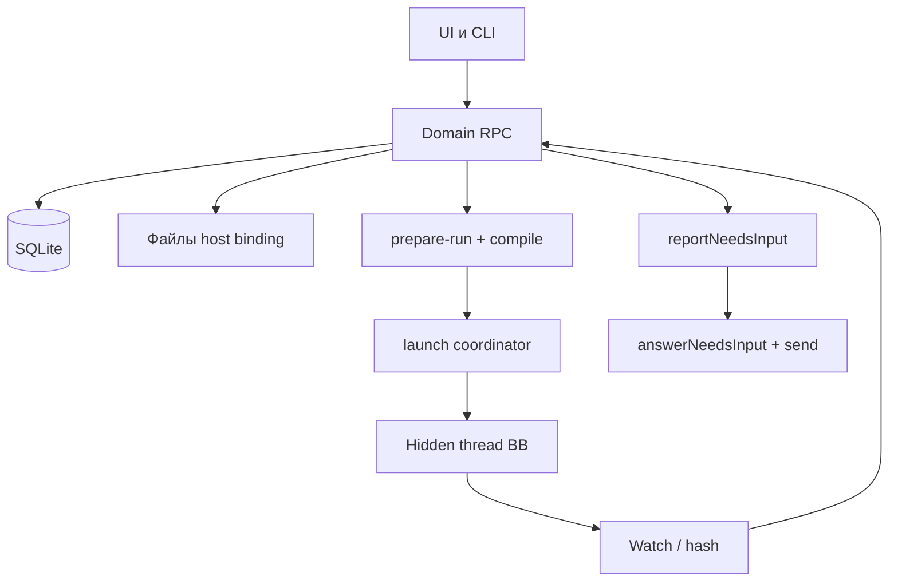

# Архитектура Агентства

Срез: 2026-09-20, source **0.1.0-alpha.16**. [Этапы](roadmap.md), [данные](data-model.md),
[API](bb-api.md). Корневой README — введение установки; здесь модули.

## Назначение и границы

Агентство владеет сотрудниками, отделами, поручениями, версиями файлов и
запуском **через свои RPC/CLI**. BB владеет провайдерами, машинами, тредами и UI.
BB Tasks и Workflows — другие продукты. Notify — inbox / очередь Telegram Projects, не spawn.

Cron и webhook **есть** в правилах отдела (2026-09-17): диспетчер ставит задачу
руководителю. Ни webhook, ни UI realtime не вызывают spawn: только `prepareLaunch`
через координатор.



## Что есть в source

```text
src/shared/contracts          Zod + RPC
src/domain                    переходы Job/attempt без I/O
src/server/db                 append-only миграции, в т.ч. run/needs_input
src/server/services           CRUD, facts, accept
src/server/artifacts          publish/open
src/server/runtime
  isolation.ts                заметка каталога: навыки/MCP не изолируются по тредам
  context-snapshot            compile schema 2
  prepare-run                 reserve + attachJobInput
  run-store                   snapshot, attempt, receipt
  launch                      coordinator, reconcile
  isolated-sdk                verify, completion, watch
  needs-input                 reportNeedsInput / answerNeedsInput
src/server/api                domain-rpc + launch-rpc
src/server/cli                allowlist
src/app/prototype             рабочие экраны на RPC + отдельное демо
skills/agency                 CLI-контракт воркера
```

Нет в продукте: `src/server/interactions` (BB forms), scheduler, EventDefinition
outbox, работающий dispatcher claim-loop, изоляция всех CLI.

`dispatcher/engine.ts` — typed inbox→rule→outbox/claim; live/auto off. `agency_inbox` — pending notify, не replay. Resource-lease (G9-3) отдельно.

## Контекст и полномочия

Снимок: версии правил, процесса, роли, брифа, effective policy, CLI/host,
входы, exclusions, handoff. Слой job не отменяет department. Конфликт —
`reportNeedsInput` с source refs, не silent pick. Закрытие — `answerNeedsInput` + official send.

Права — пересечение платформы, binding, отдела, сотрудника и задачи.
Текст поручения не расширяет allowlist. Неизвестные capabilities = запрет spawn.

## Активация

1. Durable CRUD и pin входов (`attachJobInput`).
2. `getIsolationReadiness` с `jobId` (CLI, политики, правила проекта).
3. `prepareLaunch` → receipt → native `threads.spawn`. `reconcile` не второй spawn.
4. `idle` + hash текущей версии → review / `awaiting_review`.
5. Иначе Job остаётся `running`, пока worker не вызовет `reportNeedsInput`.
6. Accept — отдельная команда по artifactId+version+hash.

## Эксплуатация

Сервер в процессе BB. Production reload/core pin — отдельный rollout.
Откат кода только с совместимой схемой. Старые notify не replay в runtime.
Telegram optional, без второго polling loop.
