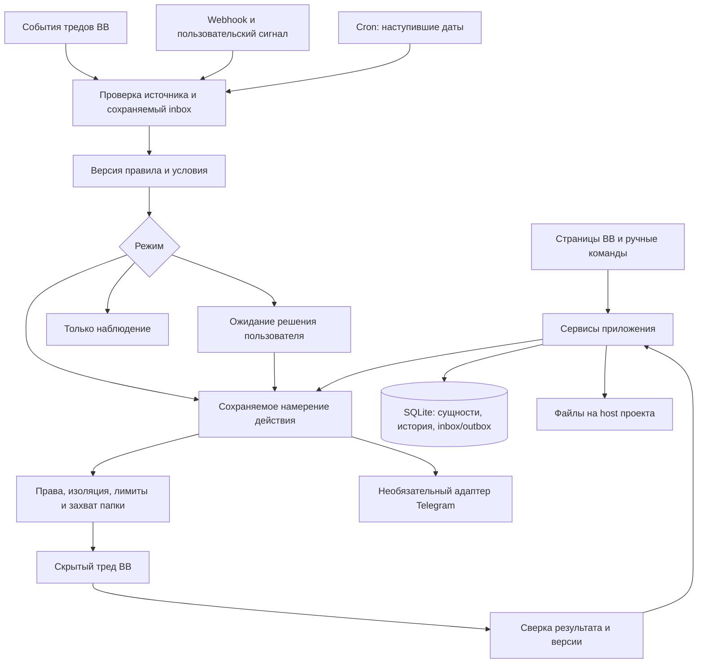

# Архитектура Агентства

Срез: 14 сентября 2026, alpha.12. [Этапы](roadmap.md), [данные](data-model.md),
[подтверждённый API](bb-api.md). Ниже явно разделены существующие модули и план.

## Назначение и границы

Агентство управляет сотрудниками, отделами, поручениями и правилами активации
внутри BB. Обычный пользователь ставит задачу, видит исполнителя и следующий шаг,
отвечает на вопросы и принимает конкретную версию результата без терминала.

BB владеет провайдерами, машинами, средами, тредами, нативными взаимодействиями
и оболочкой UI. Агентство владеет своими сущностями, версиями, назначениями,
правилами, очередью намерений и историей решений. BB Tasks — отдельный продукт:
его интерфейс служит референсом, но синхронизация двух рабочих досок не входит
в первую версию. BB Workflows может доставить сигнал через CLI/RPC; постоянный
слушатель находится в backend плагина. Модель запускается для работы, не ждёт
событий в бесконечном чате.



Ручное назначение и автоматизация используют один сервис запуска и одни проверки.
Ни webhook, ни обработчик события не вызывает spawn напрямую. Сигнал UI realtime
только просит перечитать данные, он не является единственной копией результата.

## Что существует в alpha.12

```text
app.tsx                         navPanel и fileOpener для документов
server.ts                       серверная точка входа
host.ts                         materialize: копия файла на host
src/
  shared/                       RPC, document, machine, telegram контракты
  domain/models.ts              набросок типов, пока не единая модель UI/API
  server/
    register.ts                 регистрация RPC/CLI и зависимостей
    db/database.ts              открытие SQLite через BB
    db/migrations.ts            agency_inbox: журнал пробных notify
    inbox/store.ts              запись и дедупликация уведомления
    triggers/notify.ts          вход CLI/RPC, без исполнения
    triggers/telegram.ts        обнаружение и адаптер optional Telegram API
    runtime/machines.ts         реальный каталог машин/CLI и KV-политики
    runtime/document-files.ts  ограниченная запись копии предпросмотра
    runtime/isolation.ts       явный отказ: изоляция не подтверждена
    dispatcher/ports.ts         интерфейсы, не работающий диспетчер
  app/prototype/                все используемые экраны и демосостояние
    shell.tsx, data.ts          маршруты, коллекции useState и примеры
    jobs*, job-detail*, people*, org-chart*, inbox*, runs*
    task-files*, file-workspace*, document-*, markdown-showcase*
    task-question*, question-contract*, handoff*
    automation*, event-catalog*, webhook*, schedule*
    machines*, telegram*, custom-mcp*, mcp-config*, knowledge*, system*
  app/pages/overview.tsx        прежняя страница состояния, сейчас не смонтирована
components/ui/, hooks/, lib/    штатный scaffold BB
skills/agency/SKILL.md          только существующие status/notify
tests/                         37 проверок: SDK harness, настройки, MCP, файлы, YAML
docs/                          контракты и рабочий план
```

Журнал SQL пока принимает только source=rpc|cli и state=pending. Рабочих таблиц
сотрудников/задач/запусков нет. Настройки CLI и Telegram сохраняются в KV.
Состояние задач/профилей, редактирование документов и их версии живут в странице;
созданные host-копии предпросмотра переживают refresh. Службы, cron, HTTP webhook
и обработчики событий тредов не зарегистрированы.

## Целевая структура — создавать при реализации соответствующего этапа

| Модуль | Ответственность и граница |
| --- | --- |
| src/shared/contracts/ | Версионированные Zod-схемы команд, запросов и событий; совместимость клиентов |
| src/domain/ | Модели, переходы, правила приёмки и политики без SDK, SQLite и I/O |
| src/server/services/ | CRUD, назначения, ответы, результаты, ревью, handoff; одна транзакционная граница команд |
| src/server/db/repositories/ | Хранение агрегатов и revision; последовательные append-only миграции |
| src/server/artifacts/ | Метаданные, неизменяемые версии, hashes, публикация файлов и восстановление незавершённой записи |
| src/server/inbox/ | Нормализованные события, уникальность, rule matches и очередь намерений |
| src/server/dispatcher/ | Claim → prepare → spawn → bind; leases, retry, reconcile и подтверждение завершения |
| src/server/runtime/ | Контекст, проверенные возможности CLI, изоляция, запуск/остановка и перенос между исполнителями |
| src/server/interactions/ | Привязка Job/Run к BB interaction, ответы и безопасные запросы секретов |
| src/server/triggers/ | Адаптеры BB events, cron, HTTP, CLI/RPC; общий реестр EventDefinition |
| src/server/integrations/ | Optional Telegram: обнаружение capabilities, доставка и проверка receipt |
| src/app/pages/ | Экраны, постепенно подключаемые к RPC вместо копирования всего прототипа |
| src/app/components/ | Общие QueueTable, DetailLayout, Activity, AgentIdentity, RequestForm, ArtifactLink |
| src/app/prototype/ | Отдельный режим демонстрации, без смешивания seed-данных с реальными |
| src/host/ | Операции файлов и проверенные host-адаптеры; тонкий host.ts регистрирует их |
| tests/ | Миграции, переходы, контракт SDK, отказ/восстановление, изоляция и пользовательские сценарии |

Не переносить работающие файлы всей пачкой. При первом рабочем экране извлечь
общие компоненты, переключить его источник данных, затем удалить его дублирующий
демо-код либо оставить явно обозначенный fixture. Legacy overview не использовать
как второй главный экран. Отдельные Redis, брокер, React Flow или собственный
Markdown-движок для первой версии не нужны.

## Контекст и полномочия

Снимок запуска содержит версии: правил проекта, процесса отдела, роли сотрудника,
брифа задачи, разрешений, выбранного CLI/модели и материалов. Проект задаёт цель,
факты, бренд и ограничения; отдел — порядок работы и проверяющего; сотрудник —
роль и навыки; задача — конкретный результат и условия приёмки. Иерархию
инструкций платформы это не меняет. Конфликт содержательных правил показывается
в сборке контекста, а не молча разрешается последней строкой промпта.

Фактические права — пересечение допустимого для платформы, проекта, отдела,
сотрудника и выбранного host. Поручение может сузить их, но не расширить.
Внешний payload и документ являются данными. Секреты — ссылки на защищённое
хранилище, без значений в профиле, снапшоте, истории или Telegram.

У запускающего сотрудника не должно быть административного пути изменить свой
allowlist через BB CLI, shell, отложенный поиск tools или общий MCP gateway.
pluginMetadata связывает запуски, но не доказывает полномочия. Проверка каталогов
и фактических вызовов обязательна на каждом поддерживаемом сочетании CLI/host.
Неизвестные возможности означают запрет запуска, а не обход через инструкции.

## Активация, восстановление и файлы

1. Проверить отправителя, привязку проекта, размер и схему сигнала; записать его
   с уникальным ID и digest. После durable commit можно подтвердить приём.
2. Сопоставить версию правила, типизированные условия и режим observe/approve/auto.
   Повтор того же сигнала не создаёт второй ActionIntent.
3. Проверить актуальность задания, права, лимиты, доступность CLI и lease папки.
   Подготовить неизменяемый RunSnapshot до старта.
4. Запустить тред и сохранить связь. При сбое между spawn и bind искать launchId
   и сверять BB; неопределённый исход не повторять слепо.
5. thread.idle означает конец хода. Job завершается только после сохранённого
   результата, проверки формата и требуемой приёмки конкретной версии.
6. После перезапуска сверить незавершённые intent/run/interaction с BB и файлами.
   Callback или realtime может быть пропущен; авторитетны сохранённые состояния.

Для in_place первая версия допускает одного писателя на каноническую папку host.
Lease имеет срок, heartbeat и fencing token; подтверждённая потеря lease запрещает
продолжать запись. Параллельные независимые подзадачи требуют доказанно разных
ресурсов. Передача другому агенту — новая попытка с явным пакетом контекста;
смена CLI не переносит его внутреннюю память автоматически.

Метаданные артефактов принадлежат SQLite, файлы — host/root привязки заказа.
Временный файл → проверка размера/hash → атомарная публикация → запись версии;
сверка очищает или завершает прерванные операции. Проверять traversal и symlink
escape. UI открывает BB file preview только по разрешённой сервером ссылке.
Текущую запись всегда на primary host заменить привязкой заказа при рабочем CRUD.

## Эксплуатация

Серверные службы живут в процессе BB и прекращаются с его остановкой. Для автономии
нужен работающий BB на основной машине; закрытый браузер не должен мешать.
Обновление: согласованный backup SQLite вместе с файлами/версиями → миграции →
проверка совместимости → загрузка без самопроизвольного исполнения старого notify.
Откат кода допустим только с совместимой схемой; иначе восстановление snapshot.
Политика остановки отделяет запрет новых запусков от остановки уже работающих.

Данные, логи и ключи не входят в Git. Сроки хранения, очистка preview, защита
незавершённых запросов от удаления и восстановление из backup проверяются до пилота.
Подключение Telegram необязательно и не создаёт второй polling loop.
