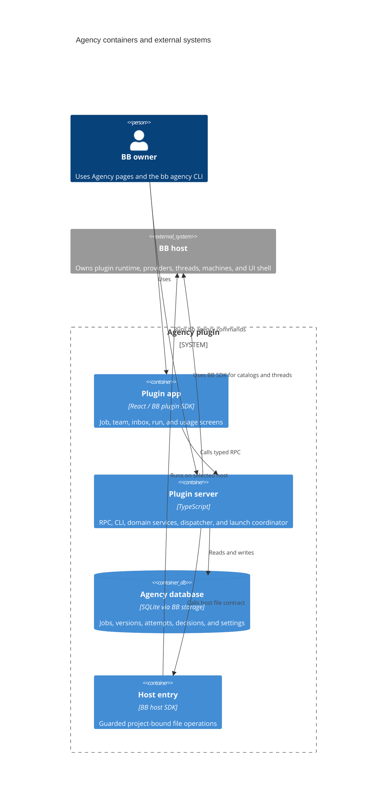

# Agency architecture

TL;DR: The BB plugin app and CLI use registered RPC handlers; server services own persistence and launch coordination, while host handlers perform guarded file operations on the selected machine.

## System context

```mermaid
C4Container
    title Agency containers and external systems
    Person(owner, "BB owner", "Uses Agency pages and the bb agency CLI")
    System_Ext(bb, "BB host", "Owns plugin runtime, providers, threads, machines, and UI shell")
    System_Boundary(agency, "Agency plugin") {
        Container(app, "Plugin app", "React / BB plugin SDK", "Job, team, inbox, run, and usage screens")
        Container(server, "Plugin server", "TypeScript", "RPC, CLI, domain services, dispatcher, and launch coordinator")
        ContainerDb(db, "Agency database", "SQLite via BB storage", "Jobs, versions, attempts, decisions, and settings")
        Container(host, "Host entry", "BB host SDK", "Guarded project-bound file operations")
    }
    Rel(owner, app, "Uses")
    Rel(owner, server, "Runs bb agency commands")
    Rel(app, server, "Calls typed RPC")
    Rel(server, db, "Reads and writes")
    Rel(server, bb, "Uses BB SDK for catalogs and threads")
    Rel(server, host, "Calls host file contract")
    Rel(host, bb, "Runs on selected host")
```

The package declares server, host, app, and skills entry points. `server.ts` calls `registerAgency`; `host.ts` installs the experimental document host contract; the app entry is `app.tsx`. (`package.json:5-10`, `server.ts:1-6`, `host.ts:1-8`)

## Runtime building blocks

| Building block | Responsibility | Evidence |
| --- | --- | --- |
| Shared contracts | Zod schemas and RPC method contract shared by UI and server | `src/server/api/domain-rpc.ts:17-20`, `src/app/data/rpc-agency-api.ts:1-28` |
| Domain | Pure job transitions and dependency checks | `src/domain/job-state.ts:4-15`, `src/domain/job-state.ts:35-111` |
| Server registration | Opens storage, creates services, wires RPC, CLI, and background runtime | `src/server/register.ts:98-155`, `src/server/register.ts:2959-2965` |
| Domain RPC | Performs access resolution and dispatches workspace, job, artifact, team, and rules operations | `src/server/api/domain-rpc.ts:131-190` |
| Dispatcher RPC | Exposes event definitions, sources, rules, inbox ingestion, and action intents | `src/server/api/dispatcher-rpc.ts:17-59` |
| App data adapter | Parses RPC results into UI API views and failure states | `src/app/data/rpc-agency-api.ts:65-124` |
| Host file entry | Routes materialization and guarded file operations to the host | `src/host/entry-handlers.ts:1-10`, `src/host/file-handlers.ts:8-53` |

## Job runtime

1. The caller creates or updates a durable job through domain RPC; handlers resolve access and use the domain store. (`src/server/api/domain-rpc.ts:131-190`)
2. The domain validates transitions. Queueing needs an assignee, binding, brief, and acceptance criteria; running also needs a thread binding. (`src/domain/job-state.ts:39-63`)
3. Launch operations are handled by the launch RPC and coordinator wiring in server registration. A persisted execution status is separate from creating a BB thread. (`src/server/api/launch-rpc.ts:1-24`, `src/server/register.ts:98-125`)
4. The app receives workspace and job results through `createRpcAgencyApi`; invalid or unknown responses become typed errors or unavailable states. (`src/app/data/rpc-agency-api.ts:65-90`)
5. A job reaches `done` only when the current version is accepted and review policy is satisfied. (`src/domain/job-state.ts:64-78`)

## HTTP and RPC boundaries

The main typed RPC contract is registered at `bb.rpc.register`; CLI operations are registered separately. The server also registers a `POST /notify` route with `auth: "none"`; the route uses webhook ingress authentication and returns an ingress receipt or error. (`src/server/register.ts:2631-2657`, `src/server/register.ts:2959-2965`)

API modules under `src/server/api/` are implementation modules used by the registered RPC handlers. Their filenames are not independent HTTP paths. `auth.ts` documents the BB SDK RPC transport path; file operations stay on the host contract instead of the public plugin RPC contract. (`src/server/api/auth.ts:11-27`, `src/server/api/bound-files.ts:1-12`, `src/server/register.ts:2959-2965`)

See [BB API](bb-api.md) for registered routes and API modules, and [Data model](data-model.md) for persistent records.

<!-- lane-pilot:backlinks -->
## Referenced by

- [Agency documentation](README.md)
- [BB API and Agency routes](bb-api.md)
- [Agency data model](data-model.md)
- [Agency gotchas](gotchas.md)
- [Собственные MCP сотрудника](mcp-import.md)
- [Agency overview](overview.md)
