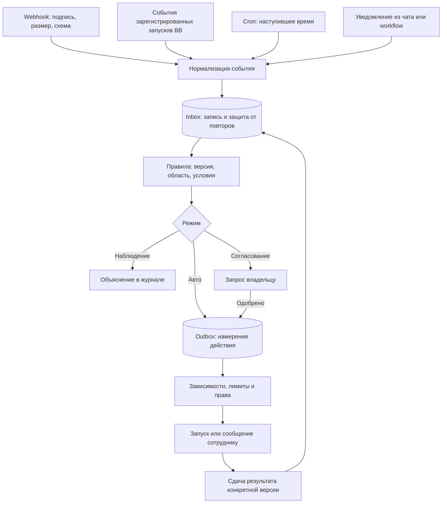

# События, вебхуки и автоматическая работа

Актуальный общий порядок реализации — [рабочий план от 14 сентября](roadmap.md);
состояние alpha.12 и пробелы — [проверка готовности](implementation-readiness.md).
Ниже подробный контракт; номера локальных шагов не заменяют общий план.

Статус: проект решения от 2026-09-13, BB 0.43.1 / SDK 0.4.87.
Реализованный прототип отделён от серверного плана. Публичного webhook и
автоматического запуска сейчас нет. Существующий CLI/RPC только сохраняет Inbox.

## Задача и первая версия

Владелец подключает источник, выбирает понятное событие, условия и получателя.
Он видит, почему правило сработало или не сработало, что будет сделано и где результат.
Пример: исследовательский workflow передал материал → редакция получила задачу →
автор сдал версию → критик проверил → менеджер получил принятый результат.
Слушатель работает на сервере BB; агент запускается только когда есть работа.
Закрытие вкладки не должно останавливать приём. Выключение BB останавливает приём:
отправитель повторяет доставку по квитанции. Это не круглосуточная облачная гарантия.

Первая версия: один точный HTTP-маршрут, JSON v1, один источник на один проект,
политики наблюдения/согласования/авто, условия AND, один адресат на правило,
сохраняемая очередь и ревью версии. Без произвольных JS-условий, конструктора DAG,
произвольных исходящих HTTP-запросов и подключения чужих чатов по маске.

## Как проходит событие



Квитанция HTTP выдаётся после транзакции Inbox, до исполнения. LLM не проверяет
подпись, не выбирает полномочия по входному JSON и не является фоновым слушателем.
Отправитель не может приказать «запусти любого агента» или подменить инструкции.

## Каталог событий

Исчерпывающий список `bb.events.on` из PluginThreadEventPayloads SDK 0.4.87:

| Название в интерфейсе | Системное имя |
|---|---|
| Чат агента создан | thread.created |
| Агент начал работу | thread.active |
| Агент перешёл в ожидание | thread.idle |
| Ошибка в чате агента | thread.failed |
| Чат агента архивирован | thread.archived |
| Чат агента восстановлен | thread.unarchived |
| Чат агента удалён | thread.deleted |
| Агент ожидает ответа или подтверждения | interaction.pending |
| Сообщение поставлено в очередь | message.queued |
| Сообщение из очереди отправлено | message.dispatched |
| Сообщение в очереди отменено | message.cancelled |
| Ход агента завершился ошибкой | turn.failed |
| История чата обновилась | experimental_thread.events |
| В терминал введена команда или текст | experimental_terminal.input |

Последние два экспериментальные; терминальный ввод — не агентское событие.
Каталог UI типизирован через Record<PluginThreadEventName,…>, обновление SDK
потребует сверить новые/удалённые названия. Это список подписок, не всех записей
внутри timeline. `message.dispatch` — hook принятия решения, не событие подписки.
`workflow.completed` в проверенном контракте отсутствует.

`thread.idle` означает остановку хода, не выполненную задачу. `message.dispatched`
касается сообщения из очереди и не доказывает начало хода. `thread.failed` и
`turn.failed` могут описывать один сбой: адаптер не запускает два повтора.
`experimental_thread.events` только будит сверку с курсором, не нового работника
на каждый токен. Терминальные события по умолчанию выключены; включаются только
для явно связанной с запуском сессии, после проверки возможности такой привязки.

Планируемые события домена Агентства: job.created, job.ready_for_review,
review.accepted, review.rejected, dependencies.completed. research.delivered —
пример настраиваемого уведомления workflow, не стандарт BB. В дальнейшем каталог
уведомлений хранит topic, понятное имя, JSON-схему, источник, допустимые проекты.
Внешний источник не может выдавать собственный review.accepted за внутреннюю
приёмку: доменные и внешние источники имеют разные доверенные namespaces.

## Webhook v1: приём

Один точный маршрут `POST /api/v1/plugins/agency/http/notify`.
SDK `bb.http.route` монтирует `/notify` в namespace плагина; `:id` не является
динамическим параметром. Будущий адаптер зарегистрирует маршрут с `auth: none`
только потому, что полностью проверяет авторизацию источника сам, до записи.
Штатный `auth: token` даёт токен всего плагина; внешним источникам нужен отдельный
отзываемый секрет с ограниченным проектом. Это ещё не реализованный выбор.

Источник выбирается по публичному `x-agency-source-id`, а не по полям payload.
Сервер по Source проверяет проект, разрешённые topics, authMode и текущую версию
секрета. При удалении/паузе проекта/источника работа не запускается.

- Предпочтительно HMAC-SHA256 от `timestamp + "." + rawBody`, constant-time compare.
  Заголовки `x-agency-timestamp`, `x-agency-signature: v1=<hex>`; допуск ±5 минут.
  Подпись проверяется по исходным байтам до JSON.parse, лимит размера до чтения.
- Для отправителя без HMAC — выделенный Bearer-токен источника, только HTTPS.
  Токен сравнивается с защищённым хешем. HMAC-секрет нужен в защищённом хранилище
  для проверки подписи. В UI только masked state и ротация; в агентский контекст
  и журналы секреты не попадают. URL/query не используются для секретов.
- JSON UTF-8, максимум 64 KiB; версия схемы, ограниченная длина/глубина данных,
  строгие служебные поля. Вложения бинарными байтами не принимаются.
- Предлагаемые начальные лимиты: 60 запросов/мин на источник, burst 10;
  настраиваются владельцем. Превышение даёт 429 с Retry-After.
- Внешние ссылки считаются данными. Приём не скачивает URL; артефакты получает
  отдельный адаптер с проверкой доступа, типа, размера и запретом локальных/
  служебных адресов и переадресаций на них. Локальные пути из webhook не читаются.

```json
{
  "schemaVersion": 1,
  "eventId": "delivery-2026-09-13-42",
  "topic": "research.delivered",
  "occurredAt": "2026-09-13T18:00:00Z",
  "subject": {"externalId": "research-42", "version": "1"},
  "data": {"status": "ready", "reference": "artifact:research-42"}
}
```

Source/projectId, receivedAt, provenance и внутренние causation/correlation ID
назначает сервер. Внешний correlation можно сохранить отдельно как справку.
Запрещены входные provider, model, MCP, skill, shell command и системный промпт
как настройки исполнения. Текст источника не становится инструкцией.

Ключ дедупликации `(sourceId,eventId)` + хеш нормализованного валидированного тела;
подпись и время доставки не входят в хеш, чтобы отправитель мог переподписать повтор.
Одинаковый повтор → 200 duplicate с прежней квитанцией; тот же ID с другим телом →
409. Новый принятый → 202 с receiptId и состоянием accepted, не «агент выполнил».
400 — формат, 401 — авторизация, 403 — выключенный/недопустимый источник или topic,
413 — размер, 415 — тип, 429 — лимит, 503 — не удалось сохранить. Отправитель повторяет
сетевые/429/5xx с backoff, jitter и тем же eventId. Ошибки не раскрывают секреты.

## Правила и действия

Rule имеет версию и привязан к проекту, источнику и topic. AND-условия первой
версии: equals, in, exists по разрешённым полям типизированной схемы; сравнение
строго типизировано. Отсутствующее поле не считается совпадением. Без eval,
произвольных путей файлов и regex от отправителя. UI сначала показывает событие,
затем доступные для него поля. «Все условия» / OR-группы — следующий этап.

Условия проверяются по снимку события, а право и актуальное состояние задачи —
повторно в транзакции непосредственно перед действием. Изменение условий
не переписывает уже принятые решения: MatchedRule хранит ruleVersion и объяснение.
Если совпали несколько правил, срабатывают все разрешённые правила по отдельности;
UI предупреждает о нескольких действиях. Приоритет управляет очередью, не
неявным подавлением остальных. Для одного действия unique(event,ruleVersion,action).

Режимы:
- Выключен: новый приём для Source отклоняется; Rule не запускает новые действия.
- Наблюдение (по умолчанию): записать событие, совпадения и предполагаемый маршрут.
- Согласование: подготовить действие во «Входящих». Approve связывается с версией
  правила/события/целью; устаревшее согласование требует нового решения.
- Автоматически: создать разрешённое действие в очередь после проверок.

Действия первой версии: создать задачу отделу/сотруднику; доставить уведомление
в уже существующую связанную задачу; запросить решение владельца. Назначение
ревью и продолжение зависимостей выполняют внутренние проверяемые переходы.
Повтор попытки — по Run/requestId с лимитами, не новый произвольный spawn.
Публикации и расходы не разблокируются включением автоматизации: действуют
полномочия проекта/задачи. Шаблон поручения владельца отделён от вставленных данных.

Область совпадения обязательна: только свои Run, проекты и зарегистрированные
sources. Нельзя подписаться на все личные чаты пользователя по умолчанию.
Завершение workflow передаётся его worker через типизированный notify.
Для события BB, у которого нет source payload, поля предоставляет конкретный
адаптер; неизвестный payload уходит в rejected/quarantine, а не LLM-догадку.

## Очередь, режимы наложения и восстановление

Ключ одного процесса: source + rule + subject.externalId; разные версии материала
сохраняются отдельно. Новое событие во время работы: queue (по умолчанию), skip
с причиной или latest (заменить только ожидающие, не текущий Run). Параллельный
режим добавляется после проверки независимости результатов. FIFO по receivedAt,
occurredAt справочный; доменные приёмки сверяются с текущей версией артефакта.

Лимиты: доступные слоты BB/host, сотрудник, отдел, проект; меньший допустимый
предел. На run снимок профиля, ruleVersion, инструкции, budget и deadline.
Предлагаемый лимит цепочки 12 шагов, review 2 возврата, 3 технических повтора с
backoff; задаются владельцем и имеют серверный максимум. Причинная цепочка не
может снова применять то же правило к тому же subjectVersion без явного разрешения.

Inbox и действие записываются транзакционно. Dispatcher захватывает lease с TTL,
heartbeat и версией владельца. Spawn — внешний побочный эффект: после сбоя в окне
spawn→bind ищем уже созданный запуск по launchId и проверяем собственную БД;
неизвестный исход блокируем для разбора, не запускаем ещё раз вслепую. Exactly-once
для внешних действий не обещаем. Metadata помогает найти Run, не подтверждает права.

После рестарта служба сверяет leases/Run/BB и продолжает очереди. Native callbacks
не являются сохраняемой шиной: их будильники теряются при выключении. Курсор
истории и сверка текущего состояния восстанавливают только доступные факты;
невосстановимое событие показывается как пробел. Новый сотрудник не запускается
только из-за самого факта reload. Старый Inbox alpha.1 остаётся legacy/observe и
никогда не проигрывается автоматически при появлении исполнения.

Сбой после лимита → failed/dead-letter с причиной, попытками и ручным повтором.
Повтор сохраняет originalEventId и новую попытку, а не подменяет исходное событие.
Пауза запрещает новые действия, накопленные ожидающие сохраняет. Отмена Run —
отдельное явное действие. Просроченный запрос владельцу не считается одобренным.

Cron использует тот же Inbox: уникальная Occurrence(ruleVersion, scheduledAtUTC),
IANA timezone, политика DST/пропуска в интерфейсе. Один серверный tick проверяет
nextRunAt; смена timezone пересчитывает будущие даты, а не переписывает историю.
Пропуски: skip / last / bounded catch-up; несколько осенних локальных часов
различаются по UTC. Для v1 один запуск на выбранное локальное время; preview
показывает выбранный UTC offset и поведение на переходах DST.

## Сущности и состояния

| Сущность | Основные данные и связь |
|---|---|
| EventSource | id, projectId, kind, authMode, secretRef, allowedTopics, enabled |
| EventDefinition | sourceNamespace, topic, название, schemaVersion, schema |
| InboxEvent | id, sourceId, eventId, digest, normalizedBody, receivedAt, provenance |
| RuleVersion | id/version, source scope, topic, typed conditions, mode, action |
| RuleMatch | eventId, ruleVersion, matched, explanation, evaluatedAt |
| ActionIntent | id, matchId, subject/version, state, approvalId, uniqueKey |
| DeliveryAttempt | intentId, attempt, lease owner/expiry, outcome, retryAt |
| Approval | intent/version, requestedBy, approver, decision, expiresAt |
| RunAttempt | launchId, jobId, threadId, agentVersion, contextSnapshot, state |
| ScheduleOccurrence | ruleVersion, scheduledAtUTC, delivery state |

Inbox: accepted → evaluated / rejected. Обработка каждого Match/Intent имеет своё
состояние: observed, awaiting_approval, queued, running, succeeded, skipped,
failed, canceled. Не делать один status=done у события, скрывающий частичный сбой
нескольких правил. История append-only с actor/source/time/cause и ссылками.
Очистка: начальное предложение 30 дней тел событий, 90 дней метаданных и попыток;
ключи дедупликации не короче максимального окна повторов. Сроки редактируются
в настройках, текущие pending/Run/approval не удаляются очисткой.

## Модули и страницы

- domain/events.ts, rules.ts, transitions.ts: типы и чистые проверки.
- server/triggers/webhook.ts + auth.ts + normalize.ts: входной HTTP и адаптеры.
- server/inbox/store.ts, outbox.ts, leases.ts: durable запись/намерения/захват.
- server/dispatcher/engine.ts, reconcile.ts, approvals.ts: выполнение и восстановление.
- server/runtime/context.ts: [сборка инструкций](instruction-context.md).
- repositories/sources.ts, rules.ts, matches.ts, attempts.ts: SQLite migrations.
- app: каталог автоматизаций; Триггер / Действие / Ограничения / Проверка / История.
  Подключение источника: имя, проект, auth, секрет masked/rotate/revoke, здоровье.
  Триггер: название события + (системное имя), поля условий, режим.
  Проверка: пример payload → результат каждого условия → предполагаемое действие.
  История: приём, автор/источник, сработавшие правила, задача/Run, попытки и ошибка.
  Настройки: пауза, квоты, сроки хранения. Входящие: подготовленное согласование.

Модули создаются по мере реализации; документ не означает уже доступный CRUD.
В alpha.6 показаны черновые поля webhook и локальный preview JSON/условий/режима.
Preview не проверяет подпись, дедупликацию, сеть и фактические права.

## Этапы и проверяемая готовность

1. Контракты и source registry: schema fixtures и все 14 названий SDK; project scope.
2. HTTP observe-only: подпись/raw bytes, ротация, размер, replay/duplicate/conflict,
   недоступная БД → нет ложного 202, rate-limit, одинаковый receipt после restart.
3. Rules/dry-run: typed AND, отсутствующее поле, multiple matches, точное объяснение,
   снимок версий и согласование. Пока без spawn.
4. После доказанной изоляции: один vertical cycle от webhook до задачи/артефакта;
   crash до/после spawn и согласования, offline host, paused source, stale review.
5. BB adapters + cron: cursor recovery, двойной failure, lifecycle scope, DST и
   bounded catch-up; не пробуждать на поток токенов и собственные служебные события.
6. Пилот: закрытый UI, restart BB, restore SQLite backup, смена правил во время
   очереди, повтор одной доставки 10 раз → одно намерение; человек видит результат.

Открыто перед backend: способ secret storage на установленном BB; защищённый
маршрут через BB Connect без браузерной cookie (проверить доступность для sender);
реальная фильтрация MCP/skills выбранного CLI; связь terminal→Run. Это проверки
реализации, не повод обещать готовый webhook или собирать секреты сейчас.

## Ревью alpha.9

[Ревью продукта и критерии следующей версии](product-review.md) уточняет
ID/membership и привязки BB, сохранение/revision, работу в общей папке,
жизненный цикл назначения/ответа/повтора/остановки и сценарии первого запуска.
Реализованные UI-исправления и оставшиеся пункты разделены в таблице всех экранов.
