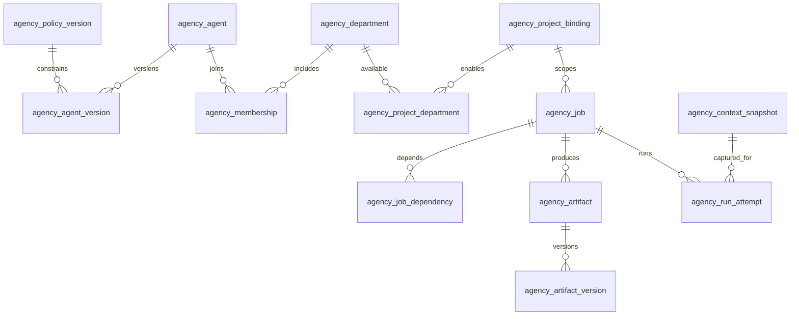

# Agency data model

TL;DR: The Agency database stores current organization and job records, immutable versions, launch attempts, acceptance evidence, and durable operational queues.

## Storage contract

The server opens the plugin database through BB storage and applies append-only migrations. Each shipped migration is extended with later statements instead of rewriting old migration SQL. (`src/server/register.ts:139-155`, `src/server/db/migrations.ts:50-51`)

Core entity relationships:

Diagram relationships summarize foreign keys and runtime ownership. The core table declarations are in migrations. (`src/server/db/migrations.ts:62-165`, `src/server/db/migrations.ts:173-190`, `src/server/db/migrations.ts:250-277`)

## Organization and placement

| Table | Meaning (purpose, fields, allowed values, units) | Invariants and access |
| --- | --- | --- |
| `agency_policy_version` | `id` identifies an immutable policy; `allowed_capabilities`, `cli_host_constraints`, and `secret_refs` are serialized policy components. | Secret values are not stored here; version references are used by agent and project binding records. (`src/server/db/migrations.ts:62-67`) |
| `agency_agent` | `id`, `name`, `state`, `current_version_id`, `revision`, `updated_at`. `state` is active, paused, or archived. | Current profile points to a version; revision supports conflict detection. (`src/server/db/migrations.ts:68-75`) |
| `agency_agent_version` | `id`, `agent_id`, version number, role, instructions, provider/model, selected skill/MCP IDs, and policy version ID. | `(agent_id, version)` is unique; versions reference agent and policy. Later migrations add reasoning, plugin IDs, and service tier. (`src/server/db/migrations.ts:76-90`, `src/server/db/migrations.ts:566-575`, `src/server/db/migrations.ts:645-655`) |
| `agency_department` | `id`, `name`, lead agent, current process version, revision, and update time. | Lead references an agent. (`src/server/db/migrations.ts:91-99`) |
| `agency_process_version` | `id`, department, instructions, acceptance criteria, and review policy. | A process version belongs to a department. (`src/server/db/migrations.ts:100-107`) |
| `agency_membership` | Department ID, agent ID, role, and later `helps_agent_id`. | One row per department/agent pair; role is lead, executor, reviewer, or assistant after table rebuild. (`src/server/db/migrations.ts:108-115`, `src/server/runtime/assistants/migration.ts:7-20`) |
| `agency_project_binding` | Agency ID plus BB project, environment, host, canonical root, policy, optional section, revision, and update time. | The binding is checked against BB environment metadata when created. (`src/server/db/migrations.ts:116-127`, `src/server/api/auth.ts:61-79`) |
| `agency_project_department` | Binding ID and department ID. | Composite primary key prevents a duplicate department link within one binding. (`src/server/db/migrations.ts:128-134`) |

## Jobs, results, and execution

| Table | Meaning (purpose, fields, allowed values, units) | Invariants and access |
| --- | --- | --- |
| `agency_job` | ID/key, binding, department, title, brief, acceptance text, state, parent, assignee, priority, due time, revision, update time; later columns add reviewers/observers, closure time, contract, profile, section, work kind, origin thread, and rework source. | Unique job key; state check limits values; assignment and placement are foreign keys. (`src/server/db/migrations.ts:135-157`, `src/server/db/migrations.ts:572-573`, `src/server/db/migrations.ts:601-610`, `src/server/db/migrations.ts:633-634`, `src/server/db/migrations.ts:660-660`, `src/server/db/migrations.ts:714-717`, `src/server/runtime/client-bounce/service.ts:9-10`, `src/server/db/migrations.ts:745-748`) |
| `agency_job_dependency` | Job and prerequisite job IDs. | Composite key, no self-dependency; domain validation also rejects dependency cycles. (`src/server/db/migrations.ts:158-165`, `src/domain/job-state.ts:83-111`) |
| `agency_job_facts` | Job ID plus thread-bound, confirmed-continuation, and open-question flags. | One facts row per job; transition guards consume these facts. (`src/server/db/migrations.ts:166-172`, `src/domain/job-state.ts:16-29`) |
| `agency_artifact` | Artifact ID and owning job ID. | Artifact is scoped to its job. (`src/server/db/migrations.ts:173-177`) |
| `agency_artifact_version` | Artifact/job IDs, version, host, relative path, MIME type, byte size, content hash, and author. | `(artifact_id, version)` is the key; acceptance checks a specific version/hash. (`src/server/db/migrations.ts:178-191`, `src/domain/artifact-version.ts:1-30`) |
| `agency_artifact_acceptance` | Artifact/job IDs, accepted version/hash, and timestamp. | One acceptance record per artifact/job pair. (`src/server/db/migrations.ts:202-211`) |
| `agency_activity` | Event ID, job, actor, kind, causation ID, timestamp, JSON references, and later optional comment text. | Append-only job history is read by workspace/detail operations. (`src/server/db/migrations.ts:192-201`, `src/server/db/migrations.ts:246-249`) |
| `agency_context_snapshot` | Snapshot ID, job, digest, serialized snapshot, and creation time. | Digest is unique; snapshot is linked to a job and launch attempt. (`src/server/db/migrations.ts:250-258`) |
| `agency_run_attempt` | Attempt ID, job, attempt number, snapshot, digest, optional thread/launch IDs, state, revision, and timestamps. | State is prepared/launching/running/waiting_input/awaiting_review/succeeded/failed/canceled/unknown; unique job/attempt number and a partial unique index for active attempts. (`src/server/db/migrations.ts:259-282`, `src/server/db/migrations.ts:327-381`) |
| `agency_launch_receipt` | Launch/attempt/job/snapshot IDs, digest, optional thread, spawn kind, bind state, reconciliation flag, request ID, timestamps and error fields. | One receipt per attempt. Spawn kind and bind state are constrained enums. (`src/server/db/migrations.ts:284-302`) |
| `agency_job_input_ref` | Target/source job, artifact version/hash, host/path, acceptance flag, and creation time. | Composite key pins a specific input version to the target job. (`src/server/db/migrations.ts:303-317`) |
| `agency_job_handoff` | Handoff destination job, source attempt, target agent version, mode, reason, and state. | One handoff record per target job. (`src/server/db/migrations.ts:318-325`) |
| `agency_request` | Request ID, operation kind, result JSON, creation time; later payload, actor, and scope JSON fields. | Request ID is the idempotency key for request results. (`src/server/db/migrations.ts:212-220`, `src/server/db/migrations.ts:246-248`) |
| `agency_artifact_publish_intent` | Request/artifact/job/binding IDs, host/root and binding revision, relative path, MIME type, byte size, hash, author, version, state, optional failure code, creation time. | State is pending/committed/failed; artifact/job/version is unique. (`src/server/db/migrations.ts:223-245`) |
| `agency_inbox` | Project and event IDs, source (rpc/cli), topic, reference, receive time, pending state. | `(project_id, event_id)` is the primary key; this legacy notification inbox is distinct from dispatcher `agency_inbox_event`. (`src/server/db/migrations.ts:52-61`) |

Job states are guarded by `JOB_TRANSITIONS`: `backlog`, `queued`, `running`, `review`, `waiting_input`, `blocked`, `done`, and `canceled`. `done` requires acceptance of the current result and review policy; `running` requires a bound thread. (`src/domain/job-state.ts:4-15`, `src/domain/job-state.ts:39-78`)

| From | To | Guard/function | When |
| --- | --- | --- | --- |
| `backlog` | `queued`, `blocked`, `canceled` | `assertJobTransition`; queue also requires assignee, binding, brief, and acceptance. (`src/domain/job-state.ts:4-5`, `src/domain/job-state.ts:39-48`) | Owner queues or blocks a planned job, or explicitly cancels it. |
| `queued` | `running`, `blocked`, `canceled` | `assertJobTransition` checks the edge; queue/run also require assignment, binding, brief, and acceptance, and `running` requires `threadBound`. (`src/domain/job-state.ts:39-59`) | After a confirmed thread bind, the launch callback transitions a queued job to `running`; `blocked` and `canceled` are also allowed edges. (`src/server/runtime/isolated-sdk/job-running.ts:8-40`, `src/domain/job-state.ts:5-6`) |
| `running` | `review`, `waiting_input`, `blocked`, `canceled` | Review requires a current published artifact. Needs-input is persisted by `reportNeedsInput`. (`src/domain/job-state.ts:6-7`, `src/domain/job-state.ts:64-66`, `src/server/runtime/needs-input/report.ts:218-247`) | Worker publishes, asks owner, or work is blocked/canceled. |
| `waiting_input` | `running`, `blocked`, `canceled` | Return to running requires confirmed continuation and no open questions or blockers. (`src/domain/job-state.ts:7-8`, `src/domain/job-state.ts:49-58`) | Owner submits an answer through `answerNeedsInput`; stale comments do not resume the worker. (`src/server/runtime/needs-input/answer.ts:430-460`) |
| `blocked` | `queued`, `running`, `waiting_input`, `canceled` | Queue/running requirements still apply. (`src/domain/job-state.ts:8-9`, `src/domain/job-state.ts:39-58`) | Blocker is resolved or owner cancels. |
| `review` | `done`, `running`, `blocked`, `canceled` | Done requires accepted current version and review policy; return to running requires a comment. (`src/domain/job-state.ts:9-10`, `src/domain/job-state.ts:59-78`) | Reviewer/owner accepts or returns the result. |
| `done` | `review` | This edge reopens a delivered job for review; the transition map alone does not identify the trigger. (`src/domain/job-state.ts:12`) | Rework/reclamation reopens `done` to `review`, then moves the job to `running` with a rework comment. (`src/server/runtime/rework/service.ts:132-156`) |
| `canceled` | — | Terminal in `JOB_TRANSITIONS`. (`src/domain/job-state.ts:11-12`) | No further job transition is allowed. |

Run-attempt status transitions use `assertAttemptTransition`, independently of job status. `unknown` and `awaiting_review` cannot trigger a new spawn; `failed` is terminal for that attempt. (`src/server/runtime/run-store/states.ts:7-45`)

| From | To | Transition meaning | Function |
| --- | --- | --- | --- |
| `prepared` | `launching`, `running`, `canceled` | Begin spawn, confirmed binding, or cancel before launch. | `assertAttemptTransition` (`src/server/runtime/run-store/states.ts:7-9`) |
| `launching` | `running`, `failed`, `canceled`, `unknown` | Confirm spawn, reject/fail, cancel, or preserve an uncertain outcome. | (`src/server/runtime/run-store/states.ts:9`) |
| `running` | `waiting_input`, `awaiting_review`, `succeeded`, `failed`, `canceled`, `unknown` | Ask owner, submit for review, complete, fail, cancel, or lose certainty. | (`src/server/runtime/run-store/states.ts:10`) |
| `waiting_input` | `running`, `failed`, `canceled`, `unknown` | Confirmed answer resumes the same thread; other results resolve or preserve uncertainty. | (`src/server/runtime/run-store/states.ts:11`, `src/server/runtime/needs-input/answer.ts:452-460`) |
| `awaiting_review` | `running`, `succeeded`, `failed`, `canceled`, `unknown` | Rework continues same thread; review may accept/fail; it cannot respawn. | (`src/server/runtime/run-store/states.ts:12-13`, `src/server/runtime/run-store/states.ts:32-34`) |
| `unknown` | `running`, `failed`, `canceled`, `succeeded` | Reconciliation resolves uncertainty; automatic spawn retry is refused. | (`src/server/runtime/run-store/states.ts:14`, `src/server/runtime/run-store/states.ts:29-30`) |
| `succeeded` | `running` | Accepted customer work may be returned for rework on the same thread. | (`src/server/runtime/run-store/states.ts:15-16`) |
| `failed`, `canceled` | — | Terminal attempt states. | (`src/server/runtime/run-store/states.ts:17-18`) |

## Questions and event dispatch

| Table | Meaning (purpose, fields, allowed values, units) | Invariants |
| --- | --- | --- |
| `agency_job_needs_input` | Current job/attempt/launch/thread IDs, request ID, serialized questions, body hash, timestamps. | One current row per job; durable question reporting is separate from BB thread interactions. (`src/server/db/migrations.ts:381-393`) |
| `agency_job_needs_input_wait` | Wait ID plus job/run identity, request, questions/hash, close time, and timestamps. | Partial unique index permits one open wait per job; request ID is unique; history is indexed by job/time. (`src/server/db/migrations.ts:435-453`) |
| `agency_job_needs_input_answer` | Request and wait IDs, job/run identity, answer JSON/hash, expected process and snapshot versions, send state/error, dispatch claim, revision pins, queued message ID, timestamps. | Request ID is primary key; answers bind to the waiting attempt and captured instruction versions. (`src/server/db/migrations.ts:394-410`, `src/server/db/migrations.ts:430-434`, `src/server/db/migrations.ts:461-465`) |
| `agency_job_needs_input_amendment` | Request, job/attempt, process/snapshot IDs, copied process/job text and hashes, wait ID, creation time. | Immutable record of the text revisions against which an answer is sent. (`src/server/db/migrations.ts:412-429`, `src/server/db/migrations.ts:466-470`) |
| `agency_event_definition` | Topic, schema version, namespace, label, payload schema JSON, creation time. | Topic/schema-version composite key. (`src/server/db/migrations.ts:484-492`) |
| `agency_event_source` | Source ID, project, kind, enabled flag, creation time. | Source is resolved before events are accepted. (`src/server/db/migrations.ts:493-499`) |
| `agency_inbox_event` | Event/source/project IDs, topic, body digest and JSON, reference, provenance, depth, causation, state, receive time. | `(source_id, event_id)` unique to prevent duplicate ingestion. (`src/server/db/migrations.ts:500-516`) |
| `agency_rule_version` | Rule/version/project, optional source, topic, conditions, mode, action payload, depth/retry limits, enabled flag, creation time. | `(rule_id, version)` unique; match refers to a version. (`src/server/db/migrations.ts:517-532`) |
| `agency_rule_match` | Match ID, inbox event, rule version, matched flag, explanation, evaluation time. | Event/rule-version pair unique. (`src/server/db/migrations.ts:533-543`) |
| `agency_action_intent` | Intent ID, match, unique key, state, subject, attempt count, lease/error, optional job, timestamps; later revision/fencing/claim/launch fields. | Unique key deduplicates effects; mutable claims use revision/fencing metadata. (`src/server/db/migrations.ts:544-564`) |
| `agency_parent_wake` | Activity/causation/child IDs, child key/state, parent job/attempt/launch/thread IDs, send state/code/message, dispatch claim, optional queued message, timestamps. | Composite activity/parent-attempt key; send state is pending/confirmed/queued/unknown/rejected/skipped. (`src/server/db/migrations.ts:574-598`) |
| `agency_stale_nudge` | Nudge and optional batch IDs, job/thread, state start, attempt number, send state/claim/message, sent revision, next check, optional decision/reason, creation time. | Job/batch indexes support sweep lookup; it records state and send evidence for stale-job nudges. (`src/server/db/migrations.ts:722-742`) |
| `agency_handin_hold` | Job ID, returned result hash, remark. | `(job_id, hash)` prevents repeated hold for the same result hash. (`src/server/db/migrations.ts:745-748`) |
| `agency_schedule_cursor` | Rule version, IANA timezone, last scheduled UTC time, updated time. | One cursor per rule version. (`src/server/triggers/cron/migration.ts:2-7`) |
| `agency_schedule_occurrence` | Rule version, scheduled UTC time, timezone, offset minutes, misfire policy, state, optional inbox ID, creation time. | `(rule_version_id, scheduled_at_utc)` unique; state is planned, emitted, or skipped. (`src/server/triggers/cron/migration.ts:8-18`) |

The dispatcher RPC exposes rule/source/event and action-intent operations; mutation handlers resolve access before dispatching to the engine. (`src/server/api/dispatcher-rpc.ts:17-59`)

## Other persisted domains

The remaining operational tables, including their field meanings and per-table keys, are described in [Operational data model](data-model/operations.md). That page covers knowledge, ideas, goals, passport, work profiles, scheduled occurrences, retries, reminders, review, recovery, trace, usage, and owner messages. (`src/server/db/migrations.ts:630-720`, `src/server/runtime/agent-fallback.ts:43-60`)

This page describes the core data areas; auxiliary table columns and lifecycle details are documented with each owning subsystem. See [Architecture](architecture.md) for ownership and [Gotchas](gotchas.md) for transition constraints.

<!-- lane-pilot:backlinks -->
## Referenced by

- [Agency documentation](README.md)
- [Agency architecture](architecture.md)
- [Revise: ContextSnapshot compiler (schemaVersion 2)](context-snapshot-revise.md)
- [Operational data model](data-model/operations.md)
- [Agency gotchas](gotchas.md)
- [Агентство как рабочая организация агентов](operating-model.md)
- [Agency overview](overview.md)
- [Задача как рабочее пространство команды](task-interaction.md)
