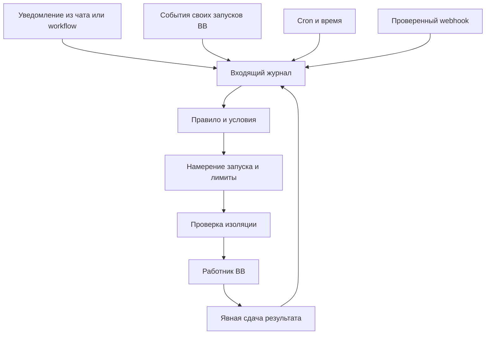

# Активация по событиям и уведомлениям

Актуальный общий порядок — [рабочий план](roadmap.md);
границы — [проверка готовности](implementation-readiness.md).
Cron и webhook через launch gate — [автоматизации](automation-architecture.md).

Агент не обязан постоянно работать, ожидая сигнала. Слушает фоновая служба плагина.
Она сохраняет событие, проверяет правило и запускает нужного сотрудника.
Это позволяет работать при закрытом UI и переживать перезапуск службы.

## Пример

`research.delivered` с версией артефакта → правило отдела → независимый критик.
`review.accepted` → редактор. `review.rejected` → автор с замечаниями, до лимита
возвратов. Приёмка принадлежит владельцу задачи. Один event не равен готовой задаче.
`thread.idle` только вызывает сверку; не создаёт `job.done` сам по себе.

## Реализовано в alpha.1

CLI и RPC notify принимают `{eventId, projectId, topic, reference}`. Источник
(`cli` или `rpc`) устанавливает сервер. Запись сохраняется в SQLite со статусом
pending. Повтор projectId+eventId с теми же данными возвращает duplicate=true;
с другим topic/reference — ошибка. Другой проект имеет своё пространство eventId.
Вход строгий, ограничен по длине; лишние поля отклоняются. Ссылки не открываются.
Это квитанция хранения, не подтверждение доставки сотруднику.

В этой версии projectId и reference — непрозрачные ссылки, существование и права
на них не проверяются, потому что исполнения нет. Перед появлением исполнения
потребуются проверка проекта/источника и явное включение правила. Уведомления
каркаса нельзя автоматически проигрывать при обновлении до запускающей версии.

Typed контур (AGY-11): `ingestInboxEvent` → версия правила → match → outbox/claim.
`notify` в `agency_inbox` диспетчер не читает. `dispatchTick`/`claim` с `live=true`
отклоняются до root gate. Spawn из callback нет. G9-3 resource-lease — отдельный
модуль, не этот dispatcher.

## BB Workflows

BB Workflows выполняет заданный JS-конвейер; сам скрипт не имеет сети/файловой
системы и не является постоянно работающей шиной подписок. Worker такого workflow
может вызвать `bb agency notify ...`; затем заканчивает работу. В будущей версии
диспетчер применит к событию правило. Получение уведомления напрямую от сервиса
Workflows требует отдельного адаптера и подтверждённого API; не придумываем
событие `workflow.completed` в BB.

## Следующие адаптеры

- BB lifecycle: слушать только threadId, зарегистрированные в собственной Runs,
  а не все пользовательские чаты. Сверять состояние при старте/возвращении host.
- Cron: один минутный background.schedule; пользовательские расписания в БД,
  IANA timezone, nextRunAt UTC, уникальная Occurrence, политики пропусков/наложений.
- Webhook: один точный маршрут POST /notify с проверкой токена/подписи. BB route
  не разворачивает :department как параметр; адресат находится в проверяемом теле.
- Отделы и работники: только свои подтверждённые результаты; маршрут проверяет
  допустимость адресата и сохраняет проект, цепочку причин, версию артефакта.

## Доставка и восстановление

Не обещаем exactly-once внешних действий. Inbox/outbox и уникальные ключи дают
защиту от повторной постановки. Окно spawn → bind(threadId) закрываем сверкой
launchId; при неизвестном исходе — остановка для разбора, не слепой повтор.
Лимиты глубины, повторов и причинные ID предотвращают циклы самопробуждения.

`background.service` слушает и обрабатывает очередь только после этапа изоляции.
Обработчики событий будят сервис, периодическая сверка восстанавливает пропуски.
Нельзя полагаться только на эфемерный realtime или объект Promise в памяти.

## Детальный контракт

[Архитектура автоматизаций и webhook](automation-architecture.md) описывает каталог
14 событий SDK, HTTP v1, источники, условия, режимы, дедупликацию, восстановление,
страницы и критерии этапов. [Уровни инструкций](instruction-context.md) задают
сборку контекста, права и обработку противоречий. Это план, не работающий endpoint.
