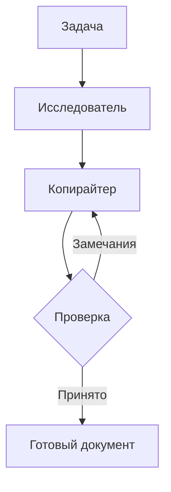
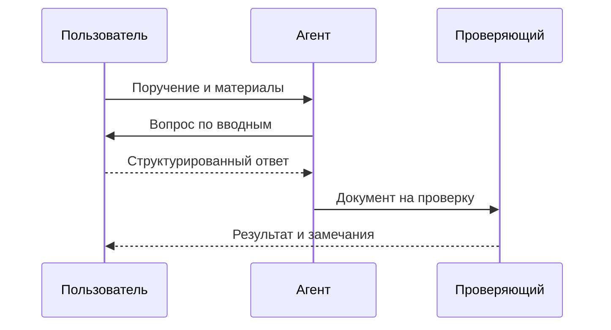

# Документ, который удобно читать

Это файл для проверки оформления в задаче **AG-102**. Откройте «Исходник», чтобы увидеть разметку, или «Редактор», чтобы изменить пример.

## Текст и акценты

Обычный текст, **жирное начертание**, *курсив*, ***жирный курсив***, ~~зачёркнутый текст~~ и `фрагмент кода` в строке. [Ссылка на задачу](/plugins/agency/overview/jobs/AG-102).

Два пробела в конце строки дают перенос.  
Следующая строка остаётся в том же абзаце.

### Заголовок третьего уровня

#### Заголовок четвёртого уровня

##### Заголовок пятого уровня

###### Заголовок шестого уровня

---

## Списки и готовность

1. Собрать вводные.
2. Подготовить результат.
   - Основной документ.
   - Приложения и источники.
3. Передать на проверку.

- [x] Поддержать обычный Markdown.
- [x] Показать таблицы и диаграммы.
- [ ] Пользователь проверил оформление.

> Краткая цитата или важное замечание.
>
> Второй абзац внутри цитаты.
> > Вложенная цитата.

## Таблица

| Этап | Исполнитель | Файлов | Состояние |
| :--- | :--- | ---: | :---: |
| Исследование | София | 3 | Готово |
| Текст | Анна | 2 | На проверке |
| Дизайн | Илья | 0 | Ожидает |

## Фрагменты кода

```typescript
interface Task {
  id: string;
  status: 'queued' | 'running' | 'review';
}
const task: Task = { id: 'AG-102', status: 'review' };
```

```json
{
  "event": "review.accepted",
  "taskId": "AG-102",
  "attachments": ["Оффер.md"]
}
```

## Иерархия папок

```text
agency/
├── brief.md
├── research/
│   ├── audience.md
│   └── sources.md
└── output/
    ├── offer.md
    └── review.md
```

Это моноширинный блок: ветви и отступы сохраняются, длинные строки прокручиваются горизонтально.

## Схема процесса



## Общение исполнителей



## Формулы

Встроенная формула: $$E = mc^2$$.

$$
\text{Готовность} = \frac{\text{выполнено}}{\text{всего}} \times 100\%
$$

$$
\sum_{i=1}^{n} i = \frac{n(n+1)}{2}
$$

## Проверка расширений

Этот пример покрывает обычный Markdown, таблицы и списки задач GFM, YAML-шапку, Mermaid и математику. Произвольные MDX-компоненты и исполняемый HTML не являются частью поддерживаемого формата.

Одинарные знаки доллара остаются обычным текстом: $100. Для формул в BB используйте двойные знаки доллара.

Сноска для проверки текущего рендерера.[^example]

[^example]: Дополнительное пояснение в конце документа.
