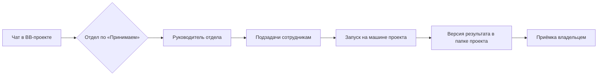

# Operating model implementation notes

TL;DR: This page preserves the implementation and automation sections split from the historical operating-model analysis.

[Operating model overview](operating-model.md) · [Roadmap and runtime notes](operating-model-roadmap.md)

## 7. Системная инструкция делегирования

Плагин добавляет раздел к инструкциям каждого нового треда через `bb.agents.contributeInstructions` ([instructions.ts](../src/server/delegation/instructions.ts)). Текст строится из данных плагина синхронно и укладывается в 4000 символов: список отделов режется, правила в конце сохраняются.

Реализация определяет режим сессии до сборки инструкций проекта; RPC-изменения задач отправляют сигнал обновления, а переходы дочерней задачи ставят пробуждение родителя для заданных состояний (`src/server/delegation/instructions.ts:482-498`, `src/server/api/domain-rpc.ts:168-177`, `src/server/runtime/parent-wake/service.ts:15-22`, `src/server/runtime/parent-wake/service.ts:203-239`).

| Аудитория | Как определяется | Что получает |
| --- | --- | --- |
| Обычный чат в привязанном проекте | нет попытки запуска с этим `threadId`; есть привязка с отделами для `projectId` | Маршрут «сделать здесь / поручить / спросить»; если задача из этого чата ждёт сырьё — вопросы возвращаются сюда |
| Чат в непривязанном проекте | нет привязки, но отделы в Агентстве есть | Короткая заметка: поручение невозможно без привязки |
| Руководитель задачи | тред попытки, исполнитель = руководитель отдела | Оркестрация: подзадачи с `parentJobId`, участники отдела с id, исполнитель ≠ проверяющий, ждать сообщения Агентства без sleep, итог без самоприёмки |
| Исполнитель задачи | тред попытки, исполнитель не руководитель | Выполнять самому, не перепоручать, вопросы через `report-needs-input`, результат — версией |

Настройки плагина («Агентство» в BB):

| Параметр | По умолчанию | Смысл |
| --- | --- | --- |
| Инструкция делегирования в сессиях | `delegate` | `suggest` — только предложить владельцу; `off` — не добавлять |
| Скрывать готовые подзадачи через, ч | 1 | 0 — не скрывать |
| Скрывать готовые задачи без родителя через, ч | 24 | главные и самостоятельные; 0 — не скрывать |

> [!WARNING] Границы
> - Инструкция применяется при следующем создании сессии провайдера. Уже идущие сессии её не получают.
> - Дочерний тред BB плагин по `threadId` не отличает, поэтому правило «не перепоручай» стоит в тексте, а не в коде. Переход на `bb.agents.configure` дал бы `parentThreadId`, но этот API выбирает и набор навыков; риск для проверенной доставки навыков в изолированные треды не проверен.
> - Треды попыток, созданные до этого прохода, получат роль при следующем возобновлении сессии.

<details>
<summary>Текст для обычного чата на живых данных проекта BB-сервис</summary>

```text
## Агентство: куда направить работу
В BB работает Агентство — постоянные отделы агентов с руководителем, очередью задач и приёмкой результата. Перед работой выбери маршрут:
- Сделай сам в этом треде: ответ или объяснение, разовая команда, небольшая правка, срочное, настройка самого BB или Агентства.
- Поручи Агентству: многошаговая работа с отдельным результатом (код, текст, исследование, аудит), нужна независимая проверка, работа переживёт этот чат, или владелец просит «поручи/делегируй».
- Не уверен — назови владельцу маршрут одной фразой и дождись ответа.
- Ты дочерний тред или субагент, которому уже поручили часть работы, — выполняй её, не перепоручай.

Отделы проекта — выбирай по сути результата, не по модели:
Привязка bnd_… (~/Documents/Проект):
- «Программисты» — Руководитель принимает требования → разработчик реализует и тестирует → … Руководитель: Руководитель программистов — Fable (agt_1970268cbf6bea7fcbaa7393); сотрудников: 3; departmentId dep_dfebd1ffe3ad9809fe4ee1a0
…
Подходящего отдела нет — не создавай поручение, скажи владельцу, какого отдела не хватает.

Как поручить:
`bb agency job create --input-json '{"requestId":"<новый UUID>","bindingId":"<bindingId привязки>","departmentId":"…","assignedAgentId":"<руководитель отдела>","title":"…","brief":"…","acceptance":"…"}'`
- key назначит сервер. brief: цель, входы, границы (что не трогать). acceptance: проверяемый критерий результата.
- Назначай руководителю отдела: он декомпозирует и раздаёт подзадачи. Исполнителей в обход него не назначай.
- После создания сообщи владельцу ключ AG-N и следующий шаг. Поручённую работу сам не выполняй; запуск не объявляй без квитанции `bb agency launch prepare`.
```

</details>

## 8. Что изменено и как проверено

| Изменение | Файлы |
| --- | --- |
| Миграция 52: `closed_at` с заполнением из журнала переходов | [migrations.ts](../src/server/db/migrations.ts), [repositories.ts](../src/server/db/repositories.ts), [catalog.ts](../src/server/api/catalog.ts) |
| Контракт: `closedAt`, `boardPolicySchema`, необязательные поля `createJob` | [job.ts](../src/shared/contracts/job.ts), [rpc-contract.ts](../src/shared/rpc-contract.ts) |
| Автоключ AG-N | [domain-store.ts](../src/server/services/domain-store.ts) |
| Настройки плагина и инструкция | [register.ts](../src/server/register.ts), [instructions.ts](../src/server/delegation/instructions.ts) |
| Пробуждение на done / canceled | [parent-wake/service.ts](../src/server/runtime/parent-wake/service.ts) |
| Доска и канбан | [job-board.ts](../src/app/data/job-board.ts), [jobs.tsx](../src/app/prototype/jobs.tsx), [jobs-workspace.tsx](../src/app/prototype/jobs-workspace.tsx), [jobs-workspace.css](../src/app/prototype/jobs-workspace.css) |
| Карточка | [job-detail.tsx](../src/app/prototype/job-detail.tsx) |
| Тесты | [board-hygiene](../tests/board-hygiene.test.ts), [job-board](../tests/job-board.test.ts), [jobs-board-ui](../tests/jobs-board-ui.test.tsx), [delegation-instructions](../tests/delegation-instructions.test.ts) |

Проверка: `typecheck` PASS · `vitest` PASS · `build` PASS · `bb plugin reload agency` PASS. В живом рантайме:

- миграция 52 применена; у AG-2201…AG-2205 время закрытия восстановлено из журнала;
- `listWorkspace` отдаёт `board`;
- `createJob` без ключа проходит схему (проверено на несуществующей привязке, записи не создано);
- в браузере пять закрытых задач скрыты и раскрываются, AG-1 и AG-2201 выделены, путь и порядок блоков карточки верны;
- текст инструкции собран на реальной базе для трёх аудиторий.

## 9. Автоматизации

> [!NOTE]
> Историческая ревизия 2026-09-16. Все пункты плана ниже закрыты: этап 6 раздела 11 и раздел 13.

Ревизия 2026-09-16. Контур «событие → правило → намерение» написан и покрыт тестами, но работает только вручную:

| Компонент | Состояние |
| --- | --- |
| Каталог событий, источников, правил; ручные ingest и tick | готово (RPC, CLI, UI) |
| Действие правила | только `observe` и `prepare_job` без проекта, исполнителя и данных события |
| Порт запуска диспетчера | заглушка: `createDispatcherRpc({ db })` без порта, claim → `capability_unavailable` |
| Фоновая сверка, cron, webhook | модули и тесты есть (`triggers/cron`, `webhook-ingress`, `durable-inbox`), в `register.ts` не подключены |
| Telegram-отправка | `telegram.enqueue` написан, не вызывается |
| Сторожа сроков и простоя | нет |
| Живые данные | таблицы событий, правил и намерений пусты |

Встроенные Автоматизации BB уже умеют запускать скрипт или агента по cron с часовым поясом, делать повторы и ставить на паузу после трёх ошибок. Поэтому свой планировщик сейчас не нужен: регулярное поручение — скрипт, который вызывает `bb agency job create` и `launch prepare` с детерминированным `requestId` (UUIDv5 от автоматизации и периода). Рецепт — в навыке, `references/automations.md`.

План:

- [x] **S.** Отправка владельцу из CLI: `bb agency notify-owner` и `bb agency digest` — «Входящие → Сообщения» и Telegram (раздел 13).
- [x] **S.** Шаблоны скриптов для сводки, сторожа и регулярной задачи: `bb agency scripts` (раздел 13).
- [x] **M.** «Следующий шаг» и зависимости задач в RPC, CLI и карточке; ожидающая задача стартует из очереди сама (раздел 13, живой прогон AG-14 → AG-15).
- [x] **M.** Порт запуска диспетчера и фоновая сверка (этап 6).
- [x] **L.** Webhook `POST /notify` с подписью, секретами, темами и UI источника (этап 6).

## 10. Проекты, машины и отделы: решение

Принято 2026-09-16.



| Вопрос | Решение |
| --- | --- |
| Что такое проект | Папка BB-проекта на одной машине (ProjectBinding). Сервер BB ставит задачи и хранит историю; сотрудник запускается на машине проекта и работает с файлами этой папки |
| Проект на нескольких машинах | Каждая нужная папка подключается отдельно, у каждой свои задачи. В списке проектов папки сгруппированы по BB-проекту, у каждой видны машина и путь |
| Отделы | Общие для агентства (`availability: all`, по умолчанию): принимают задачи из любого подключённого проекта. Можно ограничить выбранными проектами (`selected`) в карточке отдела |
| Как задача из чата попадает в отдел | Инструкция чата перечисляет рабочие места проекта (машина, папка, bindingId) и отделы; агент выбирает отдел по «Принимаем» и ставит задачу руководителю |
| Отключить проект | `archiveProjectBinding`: новые задачи, связи и запуски закрыты, история и файлы остаются, можно вернуть |
| Удалить проект | `deleteProjectBinding`: только без задач и записей файлов; BB-проект и папка не трогаются |
| Дубли | Одну папку нельзя подключить дважды, пока подключение активно |
| Правила проекта | Вкладка «Правила» на странице проекта: читает и сохраняет `.bb/AGENTS.md` на машине проекта через хост-часть (`replace` с проверкой хэша). CLI: `bb agency project rules` / `rules-save` |

Что нужно, чтобы работа шла на другой машине, например OVH:

- [x] хост подключён к BB и онлайн;
- [x] Claude Code установлен и авторизован на этой машине;
- [x] в папке проекта есть `.bb/AGENTS.md`;
- [x] политика привязки и сотрудника разрешает `hostId` этой машины;
- [x] роли навыков (`agency-isolated-catalog-roles-v1.json`) перечисляют эту машину в `hostIds`, иначе запуск вернёт `catalog_host_mismatch`.
- [x] команды Агентства работают у сотрудника на этой машине. В песочнице Linux (OVH) `bb` не видит сервер BB, поэтому сотрудникам, которые работают там, включают правило «Запуск без песочницы» — лучше в отдельной папке, а не рядом с боевым приложением.

Дальше:

- [x] P0: роли навыков перечисляют машины (`hostIds`), версия закрепляется кнопкой (этап 4).
- [x] P0: проверка перед запуском — машина онлайн, CLI, `.bb/AGENTS.md` — с причиной в карточке и «Готовность к запуску» проекта.
- [x] P1: сообщения руководителю о межотдельных подзадачах.
- [x] P1: разделы project-folders в подписи проекта (этап 7).
- [x] P1: макетные блоки страницы отдела показываются только в примере.

<!-- lane-pilot:backlinks -->
## Referenced by

- [Operating model roadmap and runtime notes](operating-model-roadmap.md)
- [Агентство как рабочая организация агентов](operating-model.md)
