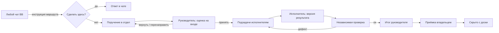
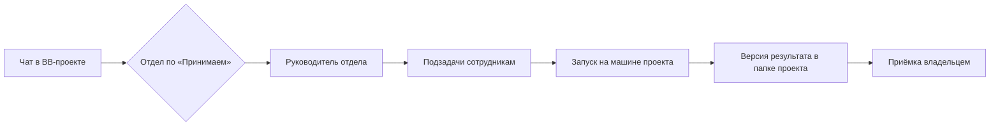

# Агентство как рабочая организация агентов

Сверено 2026-09-16 с исходниками после alpha.12 и живым плагином на Mac mini. Здесь итог анализа того, что уже создано, сравнение с системами, которые давно автоматизируют работу команд, и план доработки. Детальные контракты остаются в профильных документах ([readiness](implementation-readiness.md), [data-model](data-model.md), [DESIGN](../DESIGN.md)).

> [!IMPORTANT] Коротко
> - **Фундамент сильнее, чем у большинства аналогов.** Версии инструкций, изоляция запуска, typed-вопросы владельцу и приёмка по `artifactId + version + hash` есть только у нас и частично в Paperclip.
> - **Не хватало организационного слоя.** Не было приёма задач «откуда угодно», руководитель не узнавал о закрытии подзадач, доска не чистилась, не отличались главные задачи от подзадач. Часть закрыта в этом проходе (разделы 5 и 8).
> - **Главные пробелы P0 дальше:** оценка на входе (триаж) как данные, наблюдение за зависшими запусками, сообщения о межотдельных подзадачах, автоматический запуск правил «событие → поручение».
> - **Интерфейс:** главное — решения владельца, главные задачи с прогрессом, возраст ожидания. Всё остальное вторично и раскрывается.

## 1. Что уже есть

| Область | Состояние | Комментарий |
| --- | --- | --- |
| Задачи: список, канбан, карточка | готово | RPC и SQLite, revision/CAS, подзадачи через parentJobId, зависимости |
| Запуск сотрудника | частично | Проверен только claude-code: изоляция и spawn-contract. Одна активная попытка на задачу |
| Вопросы владельцу | готово | `reportNeedsInput` → `waiting_input` → `answerNeedsInput` в тот же тред |
| Версии результата и приёмка | готово | Публикация ≠ приёмка; done только с принятой текущей версией |
| Отделы и сотрудники | частично | Руководитель, состав, регламент, модель; отделы общие для всех проектов или только для выбранных. Не сохраняются лимиты, права shell/delegate; в карточке отдела остались макетные блоки |
| Проекты | готово | Папка BB-проекта на машине; список по BB-проектам; отключение, возврат, удаление без задач; защита от дублей; вкладка «Правила» (.bb/AGENTS.md) |
| Сдача результата | готово | Порядок сдачи в промпте, инструкции и навыке: отчёт `.agency/jobs/<ключ>/report.md` → публикация версии → итоговый комментарий. Напоминание, если ход закончен без версии; после двух — blocked |
| Навык сотрудников | готово | `agency` 0.6.0 и `agency-artifacts` доставляются в каждый запуск независимо от профиля |
| Пробуждение руководителя | готово | Сообщение в тред руководителя при review / waiting_input / blocked, теперь и при done / canceled |
| Автоматизации (inbox → rule → intent) | частично | Правила сохраняются и сверяются вручную; порт запуска — заглушка, фоновой сверки, cron и webhook нет. Регулярная работа — через Автоматизации BB (раздел 9) |
| Знания | демо | В рабочем режиме действия отказывают |
| Настройки «Общие» | демо | Лимит параллельности и пауза живут только в памяти страницы |
| Дашборд расхода | готово | Расход по фактическим тредам, сумма главной задачи с подзадачами |
| Контекст запуска | готово | Промпт запуска собирается из слоёв agency → project → department → agent → job → handoff: сотрудник видит регламент отдела и свою должностную инструкцию |
| Наблюдение за зависаниями | частично | Есть напоминание о несданном результате после хода. Нет stall-таймаута для треда, который «висит» в работе, и лимита времени попытки |

## 2. С чем сравнивали

| Система | Что у неё взять |
| --- | --- |
| **Paperclip** | Оргдерево `reportsTo` и цепочка эскалации; атомарный захват задачи (409); review/approval-стадии перехватывают переход в done; бюджеты: 80% — предупреждение, 100% — пауза; heartbeat с `timeoutSec` и `graceSec`; маршрутизация входящих 6 правилами с запасным triage-агентом |
| **Multica** | Squad: задачу получает только лидер и раздаёт участникам; heartbeat 15 с, dispatch-таймаут 5 мин; до 2 повторов, при сети до 3, ошибки агента не повторяются; журнал доставок автопилота |
| **Linear / Linear Agents** | Triage-очередь; авто-архив закрытых (по умолчанию 6 мес.); «Отменено» в скрытом лотке колонок; прогресс родителя по доле закрытых подзадач; SLA-цвета серый → жёлтый → оранжевый → красный; делегат ≠ ответственный: человек остаётся владельцем; сессия агента stale после 30 мин без активности |
| **OpenAI Symphony** | stall 5 мин, ход ≤ 1 ч, ≤ 10 агентов параллельно, экспоненциальный повтор до 5 мин; успешный запуск ведёт в «Human Review», а не сразу в done |
| **Jira Service Management** | Типы заявок → очереди → правила trigger/condition/action; round-robin и назначение по загрузке через правила |
| **Bitrix24** | Отдел = руководитель + сотрудники; роли в задаче: постановщик / соисполнители / наблюдатели; шаблоны задач по регламенту; база знаний на отдел; формула эффективности |
| **Plane** | Auto-close неактивных, auto-archive закрытых через 1/3/6/9/12 мес.; задачи активного цикла защищены |
| **ClickUp / Monday / Asana** | Мягкие WIP-лимиты с цветом; форма приёма с группой «Новые»; AI-сотрудники с обязательными checkpoints человека |
| **Vibe Kanban** | По умолчанию видны To do → In progress → In review → Done; Backlog и Cancelled скрыты за «All» |
| **CrewAI / AutoGen / MetaGPT** | Иерархический процесс с менеджером; guardrail на результат с 3 повторами; лимит циклов проверки 5; Task/Progress ledger оркестратора с перепланированием при застое; бюджет команды останавливает раунды |
| **claude-lane-stack** (наш) | Контракт исполнения owns/never_touch/verify с хэшем; квитанция приёмки; idle 900 с / max 7200 с, проверка зависания раз в 5 мин; 1 повтор тем же провайдером → 1 fallback только после второй ошибки доступности; проверки L0/L1/L2; «будильник» PM; закрытый список делегатов; второе одинаковое исправление → правило проекта |

## 3. Модель работы, к которой идём



Правила организации:

1. **Задача живёт в одном отделе.** Межотдельная работа — подзадача в другом отделе, а не смена владельца.
2. **Руководитель оркестрирует, но не исполняет.** Декомпозиция, назначение, проверка итогов, сводный отчёт.
3. **Исполнитель ≠ проверяющий.** Дефект оформляется подзадачей доработки и повторной проверкой.
4. **Готовность — это принятая версия,** а не слово «готово» в тексте.
5. **Человек — владелец, агент — делегат** (как в Linear): решения, приёмка и бюджет остаются за владельцем.
6. **Закрытое уходит с доски,** но не из истории.

## 4. Матрица возможностей

| Возможность | Linear | Jira SM | Bitrix24 | Paperclip | Multica | Symphony | lane-stack | Агентство |
| --- | --- | --- | --- | --- | --- | --- | --- | --- |
| Отделы с руководителем | нет | частично | да | да | да | нет | нет | да |
| Приём и триаж входящих | да | да | частично | да | ? | нет | частично | нет |
| Маршрут из любого чата | частично | нет | нет | нет | нет | нет | да | да |
| Главная задача и подзадачи с прогрессом | да | да | да | да | да | нет | да | да |
| Автоскрытие или архив закрытых | да | ? | ? | нет | нет | нет | нет | да |
| Heartbeat / stall-таймаут | да | нет | нет | да | да | да | да | частично |
| Повтор и fallback по типу ошибки | нет | нет | нет | частично | да | да | да | нет |
| Независимая проверка и приёмка версии | нет | частично | частично | да | частично | да | да | да |
| Бюджеты на агента или отдел | нет | нет | нет | да | нет | нет | нет | нет |
| WIP / лимиты параллельности | нет | нет | нет | нет | нет | да | частично | нет |
| База знаний отдела в контексте | нет | частично | да | нет | да | нет | да | нет |
| Расписания и webhook | частично | да | да | да | да | нет | да | частично |
| Вопрос владельцу с продолжением | да | нет | нет | частично | ? | частично | нет | да |

«?» — в открытой документации данных не нашли; это не значит, что возможности нет.

## 5. Пробелы и план

### P0 — закрыто в этом проходе

- [x] Гигиена доски: время закрытия `closed_at`, скрытие подзадач через 1 ч, остальных задач через 24 ч, настройки плагина, строка «Скрыто завершённых».
- [x] Главные задачи жирным с прогрессом «закрыто/всего», подзадачи под главной, семейный порядок, числовая сортировка ключей.
- [x] Инструкция делегирования во всех сессиях: обычный чат, руководитель задачи, исполнитель задачи; режимы `delegate` / `suggest` / `off`.
- [x] `createJob` без `key`, `priority`, `dueAt`, `parentJobId`: сервер назначает AG-N, поручение можно создать из любого чата.
- [x] Руководитель получает сообщение, когда подзадача принята или отменена.

### P0 — следующим

- [x] **Зона ответственности отдела.** Регламент отдела по шаблону с разделами «Принимаем / Не принимаем / Входы / Процесс / Эскалация»; инструкция маршрута читает «Принимаем». Кнопка «Вставить шаблон регламента» в настройках отдела. Отдельных полей в схеме нет: раздел в тексте регламента.
- [ ] **Оценка на входе.** У задачи из чата блок `triage`: размер S/M/L, риск low/medium/high, решение руководителя «принять / вернуть с вопросом / перенаправить в отдел X», кто и когда. Переход backlog → queued требует решения. Риск задаёт проверку: high — обязательная независимая проверка и ночная перепроверка (как `risk` в lane-stack).
- [ ] **Наблюдение за запусками.** Метка «Нет активности» после 5 мин без событий треда. Через 30 мин — задача `blocked` с причиной `stalled` и сообщение руководителю. Потолок попытки 2 ч. Повтор: один тем же провайдером только для классифицированной недоступности; ошибки контракта и проверки не повторяются. Значения из lane-stack (900/7200 с), Symphony (5 мин / 1 ч) и Linear (30 мин stale).
- [x] **Правила отдела и проекта в запуске.** `composeWorkerPrompt` в `spawn-args.ts` собирает слои снимка в порядке [instruction-context](instruction-context.md).
- [ ] **Межотдельные подзадачи.** Пробуждение родителя требует того же отдела (`sameBindingDepartment`). Для подзадачи в другом отделе руководитель сейчас ничего не узнаёт.
- [ ] **Контракт исполнения.** Поля задачи «Можно менять» / «Нельзя трогать» / «Проверки», замораживаются в ContextSnapshot при старте (task YAML v2 из lane-stack).
- [x] **Навык `agency` 0.4.0.** Модель организации, создание отделов и сотрудников, шаблоны регламента и должностных инструкций, циклы руководителя, исполнителя и проверяющего, протокол возврата, автоматизации через BB. Хэш пакета перезакреплён в `agency-isolated-catalog-roles-v1.json` (резервная копия рядом).
- [x] **Возврат задачи не по профилю.** Комментарий «Возврат: …» + переход в blocked; руководитель получает сообщение, владелец видит главную задачу в «Требуют внимания». Правило в навыке, в инструкциях треда и в шаблонах должностей.

### P1

> [!NOTE]
> Исторический список. Актуальный статус P1 и P2 — в [разделе 11](#11-закрытие-роадмапа).

- [ ] **Лимиты параллельности:** сотрудник — 1 активная попытка, отдел — WIP, общий лимит; очередь `queued` по приоритету. Мягкий WIP на колонку с цветом (ClickUp). Настройки «Общие» сделать реальными.
- [ ] **Бюджеты:** токены или деньги на отдел и сотрудника за месяц; 80% — предупреждение, 100% — пауза новых запусков (Paperclip). Основа — существующий дашборд расхода.
- [ ] **Сроки:** цвет по `dueAt` (серый → жёлтый → оранжевый → красный за 24 ч до срока, Linear SLA); сейчас подсвечено только ожидание человека дольше суток.
- [ ] **Автоназначение в отделе:** по умолчанию руководитель; по правилу отдела — по роли или по загрузке (least-loaded, Jira).
- [ ] **Лимит циклов доработки:** 3 круга «проверка → доработка», затем `blocked` и вопрос владельцу (CrewAI 3, MetaGPT 5).
- [ ] **Знания на данных:** материал с областью (проект / отдел / сотрудник), источником и статусом проверки; доставка в запуск по области. Второе одинаковое замечание проверяющего → предложение записи в знания отдела (правило lane-stack).
- [ ] **Автоматизации в live:** см. раздел 9.
- [ ] **Ночная перепроверка:** периодическая задача отдела проверки по результатам, принятым за день, с findings версиями артефакта.
- [ ] **Подпись привязок:** три проекта «BB-сервис · BB-сервис · MAC Mini» неразличимы; две привязки на один корень `/BB-сервис` — предупреждение о дубле.

### P2

- [ ] Цели и инициативы над главными задачами (Linear Initiatives, Asana Goals).
- [ ] Подчинённость отделов и эскалация по цепочке (Paperclip `reportsTo`).
- [ ] Показатели сотрудника: доля принятых с первой версии, среднее число доработок, расход на задачу.
- [ ] Серверный архив закрытых через N дней отдельно от скрытия с доски (Linear 6 мес., Plane 1–12 мес.).
- [ ] Сохранённые виды, поиск по истории, визуальные зависимости.

## 6. Интерфейс: что первично

### Главная — очередь задач

| Уровень | Что | Статус |
| --- | --- | --- |
| Первичное | Секции «Ожидает решения / Ждёт ответа / На проверке» сверху; возраст ожидания с подсветкой после суток | готово |
| Первичное | Главные задачи жирным с «закрыто/всего», подзадачи под главной | готово |
| Вторичное | Исполнитель; отдел только на широкой панели | готово |
| Свёрнуто | Завершённые после срока — «Скрыто завершённых: N · Показать» | готово |
| Убрано | Повтор ключа в названии, одинаковая синяя точка, «BB-сервис» в каждой строке | готово |
| Дальше | Канбан: 8 колонок не помещаются даже на 1440 px. По умолчанию «К запуску / В работе / Нужен ответ (blocked + waiting_input) / На проверке / Готово», бэклог и отменённые — отдельным видом (Vibe Kanban, Linear) | TODO |

### Карточка задачи

| Уровень | Что | Статус |
| --- | --- | --- |
| Первичное | Текущий этап и одно действие владельца; результат рядом с приёмкой | готово |
| Первичное | У главной задачи: «Главная задача» в шапке, подзадачи выше описания, полный путь | готово |
| Вторичное | Описание и критерии; свойства справа | готово |
| Раскрывается | История запусков и сверка, диагностика, иерархия и связи | готово |
| Дальше | В брифе видны технические id (`agt_…`, `bnd_…`): показывать имена по каталогу; длинный бриф сворачивать после старта работы | TODO |

### Навигация

Группы «Работа / Команда / Управление» оставить. «Знания» и «Настройки → Общие» пока не на данных — пометка «пилот» до реализации, чтобы не выдавать демо за рабочие разделы.

## 7. Системная инструкция делегирования

Плагин добавляет раздел к инструкциям каждого нового треда через `bb.agents.contributeInstructions` ([instructions.ts](../src/server/delegation/instructions.ts)). Текст строится из данных плагина синхронно и укладывается в 4000 символов: список отделов режется, правила в конце сохраняются.

| Аудитория | Как определяется | Что получает |
| --- | --- | --- |
| Обычный чат в привязанном проекте | нет попытки запуска с этим `threadId`; есть привязка с отделами для `projectId` | Маршрут «сделать здесь / поручить / спросить», отделы проекта с руководителем и id, минимальная команда `bb agency job create`, правило для дочерних тредов |
| Чат в непривязанном проекте | нет привязки, но отделы в Агентстве есть | Короткая заметка: поручение невозможно без привязки |
| Руководитель задачи | тред попытки, исполнитель = руководитель отдела | Оркестрация: подзадачи с `parentJobId`, участники отдела с id, исполнитель ≠ проверяющий, ждать сообщения Агентства без sleep, итог без самоприёмки |
| Исполнитель задачи | тред попытки, исполнитель не руководитель | Выполнять самому, не перепоручать, вопросы через `report-needs-input`, результат — версией |

Настройки плагина («Агентство» в BB):

| Параметр | По умолчанию | Смысл |
| --- | --- | --- |
| Инструкция делегирования в сессиях | `delegate` | `suggest` — только предложить владельцу; `off` — не добавлять |
| Скрывать готовые подзадачи через, ч | 1 | 0 — не скрывать |
| Скрывать готовые задачи без родителя через, ч | 24 | главные и самостоятельные; 0 — не скрывать |

> [!WARNING] Границы
> - Инструкция применяется при следующем создании сессии провайдера. Уже идущие сессии её не получают.
> - Дочерний тред BB плагин по `threadId` не отличает, поэтому правило «не перепоручай» стоит в тексте, а не в коде. Переход на `bb.agents.configure` дал бы `parentThreadId`, но этот API выбирает и набор навыков; риск для проверенной доставки навыков в изолированные треды не проверен.
> - Треды попыток, созданные до этого прохода, получат роль при следующем возобновлении сессии.

<details>
<summary>Текст для обычного чата на живых данных проекта BB-сервис</summary>

```text
## Агентство: куда направить работу
В BB работает Агентство — постоянные отделы агентов с руководителем, очередью задач и приёмкой результата. Перед работой выбери маршрут:
- Сделай сам в этом треде: ответ или объяснение, разовая команда, небольшая правка, срочное, настройка самого BB или Агентства.
- Поручи Агентству: многошаговая работа с отдельным результатом (код, текст, исследование, аудит), нужна независимая проверка, работа переживёт этот чат, или владелец просит «поручи/делегируй».
- Не уверен — назови владельцу маршрут одной фразой и дождись ответа.
- Ты дочерний тред или субагент, которому уже поручили часть работы, — выполняй её, не перепоручай.

Отделы проекта — выбирай по сути результата, не по модели:
Привязка bnd_… (~/Documents/Проект):
- «Программисты» — Руководитель принимает требования → разработчик реализует и тестирует → … Руководитель: Руководитель программистов — Fable (agt_1970268cbf6bea7fcbaa7393); сотрудников: 3; departmentId dep_dfebd1ffe3ad9809fe4ee1a0
…
Подходящего отдела нет — не создавай поручение, скажи владельцу, какого отдела не хватает.

Как поручить:
`bb agency job create --input-json '{"requestId":"<новый UUID>","bindingId":"<bindingId привязки>","departmentId":"…","assignedAgentId":"<руководитель отдела>","title":"…","brief":"…","acceptance":"…"}'`
- key назначит сервер. brief: цель, входы, границы (что не трогать). acceptance: проверяемый критерий результата.
- Назначай руководителю отдела: он декомпозирует и раздаёт подзадачи. Исполнителей в обход него не назначай.
- После создания сообщи владельцу ключ AG-N и следующий шаг. Поручённую работу сам не выполняй; запуск не объявляй без квитанции `bb agency launch prepare`.
```

</details>

## 8. Что изменено и как проверено

| Изменение | Файлы |
| --- | --- |
| Миграция 52: `closed_at` с заполнением из журнала переходов | [migrations.ts](../src/server/db/migrations.ts), [repositories.ts](../src/server/db/repositories.ts), [catalog.ts](../src/server/api/catalog.ts) |
| Контракт: `closedAt`, `boardPolicySchema`, необязательные поля `createJob` | [job.ts](../src/shared/contracts/job.ts), [rpc-contract.ts](../src/shared/rpc-contract.ts) |
| Автоключ AG-N | [domain-store.ts](../src/server/services/domain-store.ts) |
| Настройки плагина и инструкция | [register.ts](../src/server/register.ts), [instructions.ts](../src/server/delegation/instructions.ts) |
| Пробуждение на done / canceled | [parent-wake/service.ts](../src/server/runtime/parent-wake/service.ts) |
| Доска и канбан | [job-board.ts](../src/app/data/job-board.ts), [jobs.tsx](../src/app/prototype/jobs.tsx), [jobs-workspace.tsx](../src/app/prototype/jobs-workspace.tsx), [jobs-workspace.css](../src/app/prototype/jobs-workspace.css) |
| Карточка | [job-detail.tsx](../src/app/prototype/job-detail.tsx) |
| Тесты | [board-hygiene](../tests/board-hygiene.test.ts), [job-board](../tests/job-board.test.ts), [jobs-board-ui](../tests/jobs-board-ui.test.tsx), [delegation-instructions](../tests/delegation-instructions.test.ts) |

Проверка: `typecheck` PASS · `vitest` PASS · `build` PASS · `bb plugin reload agency` PASS. В живом рантайме:

- миграция 52 применена; у AG-2201…AG-2205 время закрытия восстановлено из журнала;
- `listWorkspace` отдаёт `board`;
- `createJob` без ключа проходит схему (проверено на несуществующей привязке, записи не создано);
- в браузере пять закрытых задач скрыты и раскрываются, AG-1 и AG-2201 выделены, путь и порядок блоков карточки верны;
- текст инструкции собран на реальной базе для трёх аудиторий.

## 9. Автоматизации

Ревизия 2026-09-16. Контур «событие → правило → намерение» написан и покрыт тестами, но работает только вручную:

| Компонент | Состояние |
| --- | --- |
| Каталог событий, источников, правил; ручные ingest и tick | готово (RPC, CLI, UI) |
| Действие правила | только `observe` и `prepare_job` без проекта, исполнителя и данных события |
| Порт запуска диспетчера | заглушка: `createDispatcherRpc({ db })` без порта, claim → `capability_unavailable` |
| Фоновая сверка, cron, webhook | модули и тесты есть (`triggers/cron`, `webhook-ingress`, `durable-inbox`), в `register.ts` не подключены |
| Telegram-отправка | `telegram.enqueue` написан, не вызывается |
| Сторожа сроков и простоя | нет |
| Живые данные | таблицы событий, правил и намерений пусты |

Встроенные Автоматизации BB уже умеют запускать скрипт или агента по cron с часовым поясом, делать повторы и ставить на паузу после трёх ошибок. Поэтому свой планировщик сейчас не нужен: регулярное поручение — скрипт, который вызывает `bb agency job create` и `launch prepare` с детерминированным `requestId` (UUIDv5 от автоматизации и периода). Рецепт — в навыке, `references/automations.md`.

План:

- [ ] **S.** Отправка владельцу из CLI (`bb agency notify-owner` поверх `telegram.enqueue`) — для сторожей и сводок без модели.
- [ ] **S.** Шаблоны скриптов для регулярного поручения, сторожа и сводки; команда, которая печатает готовый скрипт по отделу.
- [ ] **M.** «Следующий шаг» задачи: при приёмке создаётся поручение другому отделу (цепочка без руководителя), плюс зависимости задач в RPC/CLI и автопостановка в очередь, когда зависимости закрыты.
- [ ] **M.** Порт запуска диспетчера (`createJob` + `prepareLaunch`), расширение `prepare_job` (привязка, исполнитель, шаблон из данных события), фоновая сверка `bb.background.schedule`.
- [ ] **L.** Webhook: `bb.http.route` поверх готовых `handleWebhookIngress` и `createDurableWebhookInbox`, хранилище секретов и тем, UI источника, внешний адрес через BB Connect.

## 10. Проекты, машины и отделы: решение

Принято 2026-09-16.



| Вопрос | Решение |
| --- | --- |
| Что такое проект | Папка BB-проекта на одной машине (ProjectBinding). Сервер BB ставит задачи и хранит историю; сотрудник запускается на машине проекта и работает с файлами этой папки |
| Проект на нескольких машинах | Каждая нужная папка подключается отдельно, у каждой свои задачи. В списке проектов папки сгруппированы по BB-проекту, у каждой видны машина и путь |
| Отделы | Общие для агентства (`availability: all`, по умолчанию): принимают задачи из любого подключённого проекта. Можно ограничить выбранными проектами (`selected`) в карточке отдела |
| Как задача из чата попадает в отдел | Инструкция чата перечисляет рабочие места проекта (машина, папка, bindingId) и отделы; агент выбирает отдел по «Принимаем» и ставит задачу руководителю |
| Отключить проект | `archiveProjectBinding`: новые задачи, связи и запуски закрыты, история и файлы остаются, можно вернуть |
| Удалить проект | `deleteProjectBinding`: только без задач и записей файлов; BB-проект и папка не трогаются |
| Дубли | Одну папку нельзя подключить дважды, пока подключение активно |
| Правила проекта | Вкладка «Правила» на странице проекта: читает и сохраняет `.bb/AGENTS.md` на машине проекта через хост-часть (`replace` с проверкой хэша). CLI: `bb agency project rules` / `rules-save` |

Что нужно, чтобы работа шла на другой машине, например OVH:

- [x] хост подключён к BB и онлайн;
- [x] Claude Code установлен и авторизован на этой машине;
- [x] в папке проекта есть `.bb/AGENTS.md`;
- [x] политика привязки и сотрудника разрешает `hostId` этой машины;
- [x] роли навыков (`agency-isolated-catalog-roles-v1.json`) перечисляют эту машину в `hostIds`, иначе запуск вернёт `catalog_host_mismatch`.

Дальше:

- [ ] P0: роли навыков по машинам, а не одна машина на весь сервер.
- [ ] P0: проверка перед запуском — машина онлайн, CLI установлен, `.bb/AGENTS.md` на месте — с понятной причиной в карточке.
- [ ] P1: сообщения руководителю о межотдельных подзадачах.
- [ ] P1: разделы project-folders в подписи проекта (`sectionId` сейчас не заполняется).
- [ ] P1: страница отдела без макетных блоков («Пауза», «Материалы отдела», «Когда включается руководитель»).

## 11. Закрытие роадмапа

Живой чеклист на 2026-09-17. Порядок — сверху вниз: каждый этап опирается на предыдущий. Отметка ставится, когда изменение проверено тестами, собрано, перезагружено и проверено в интерфейсе или живым запуском.

### Уже закрыто

- [x] P0: сквозной живой прогон (AG-1), запуск на нескольких машинах, наблюдение за зависаниями, межотдельные сообщения, оценка на входе данными, стоимость задачи.
- [x] Типы ролей в отделе, запрет проверять свою работу, возврат на доработку командой, остановка запуска, ручные статусы только для решений человека.
- [x] Аудит цепочек интерфейса (32 пункта): формы сотрудника, отдела, задачи, готовность проекта, подсказки.
- [x] Пересоздание Агентства: 3 отдела, 10 сотрудников, регламенты по шаблону; дубль привязки и старые регламенты ушли вместе со старой базой.
- [x] Любой провайдер BB в профиле с предупреждением о запуске; язык сотрудников и системных сообщений.

### Этап 1. Правила работы — настраиваемые пороги и политики

- [x] Хранилище правил: Агентство → отдел → сотрудник, эффективное значение и источник.
- [x] Лимит кругов доработки на сервере; мелкие дефекты без нового круга; «проверка обязательна» в отделе.
- [x] Пороги наблюдения за запуском и число напоминаний о сдаче из правил.
- [x] Модели и уровень рассуждения по умолчанию для типов ролей.
- [x] Интерфейс: «Настройки → Правила работы», правила в карточке отдела, CLI `bb agency rules`.

### Этап 2. Бюджеты, параллельность, сроки

- [x] Бюджет в месяц на отдел и сотрудника: предупреждение и пауза запусков.
- [x] Лимиты параллельных запусков: общий, отдел, сотрудник.
- [x] Сроки: подсветка в списке и карточке, напоминание до срока.

### Этап 3. Гарантии сдачи

- [x] Автор версии — сотрудник попытки; сервер запрещает принять свою версию.
- [x] Проверка итогового комментария при сдаче.
- [x] Контракт исполнения в задаче: можно менять / нельзя трогать / проверки; закрепляется в снимке запуска.

### Этап 4. Шаблоны и общие правила Агентства

- [x] Редактируемые шаблоны: регламент, должностные инструкции по типам ролей, бриф.
- [x] Общие правила Агентства — верхний слой промпта — с версиями.
- [x] «Машины → Навыки Агентства»: закрепление версии навыка кнопкой вместо ручного хэша.

### Этап 5. Распределение работы

- [x] Автоназначение в отделе по типу роли и загрузке.
- [x] Очередь запуска: задача в очереди стартует сама, когда освобождается лимит.

### Этап 6. События и автоматизации (роадмап 4–5)

- [x] Правила «событие → поручение» и цепочка «исполнитель → проверяющий» без ручного запуска.
- [x] Расписание и webhook через проверку запуска; очередь из Telegram.

### Этап 7. Интерфейс

- [x] Канбан по умолчанию из 5 колонок; бэклог и отменённые — отдельный вид.
- [x] Имена вместо `agt_…`/`bnd_…` в брифах; длинный бриф сворачивается.
- [x] Разделы project-folders в подписях проектов.
- [x] Штатный диалог вместо системного `confirm`; пометка «пилот» у демо-разделов.
- [x] Перевод интерфейса на английский по настройке языка.

### Этап 8. Знания и развитие (P2)

- [x] Знания на данных с доставкой в запуск по области.
- [x] Цели над главными задачами; подчинённость отделов и эскалация.
- [x] Показатели сотрудника; серверный архив закрытых; сохранённые виды и поиск.

### Этап 9. Переносимость и выпуск (роадмап 6)

- [x] Первый запуск без личных путей; резервная копия и восстановление из интерфейса.
- [x] Живой запуск на OVH: отдельная папка-песочница на сервере, AG-8 — запуск из карточки, публикация версии, автоматический переход на проверку, приёмка, попытка `succeeded` (2026-09-17).
- [x] Коммит, версия `0.1.0-alpha.13`, README.

Вне плагина: изолированный запуск других CLI и расход их токенов зависят от ядра BB.

## Источники

- Paperclip: [issues](https://github.com/paperclipai/paperclip/blob/master/docs/api/issues.md), [execution policy](https://github.com/paperclipai/paperclip/blob/master/docs/guides/execution-policy.md), [org structure](https://github.com/paperclipai/paperclip/blob/master/docs/guides/board-operator/org-structure.md), [costs](https://github.com/paperclipai/paperclip/blob/master/docs/api/costs.md), [agents runtime](https://github.com/paperclipai/paperclip/blob/master/docs/agents-runtime.md), [external task protocol](https://github.com/paperclipai/paperclip/blob/master/docs/specs/external-task-protocol.md)
- Multica: [squads](https://multica.ai/docs/squads), [issues](https://multica.ai/docs/issues), [runs](https://multica.ai/docs/tasks), [autopilots](https://multica.ai/docs/autopilots)
- Linear: [triage](https://linear.app/docs/triage), [archive](https://linear.app/docs/delete-archive-issues), [sub-issues](https://linear.app/docs/parent-and-sub-issues), [SLA](https://linear.app/docs/sla), [board layout](https://linear.app/docs/board-layout), [agents](https://linear.app/developers/agent-interaction)
- OpenAI Symphony: [SPEC.md](https://github.com/openai/symphony/blob/main/SPEC.md)
- Jira Service Management: [queues](https://support.atlassian.com/jira-service-management-cloud/docs/how-are-queues-used-in-jira-service-management/), [SLA](https://support.atlassian.com/jira-service-management-cloud/docs/set-up-sla-goals/), [automation](https://support.atlassian.com/jira-service-management-cloud/docs/how-do-when-if-and-then-statements-work-for-automation/)
- Bitrix24: [роли в задаче](https://helpdesk.bitrix24.ru/open/17962166/), [эффективность](https://helpdesk.bitrix24.ru/open/18124434/), [база знаний](https://www.bitrix24.ru/features/company/knowledge-base/)
- Plane: [automations](https://docs.plane.so/automations/overview) · ClickUp: [WIP limits](https://help.clickup.com/hc/en-us/articles/6304619369623-Work-in-Progress-Limits) · Vibe Kanban: [issues](https://github.com/BloopAI/vibe-kanban/blob/main/docs/issue-management.mdx)
- CrewAI: [processes](https://docs.crewai.com/en/concepts/processes), [tasks](https://docs.crewai.com/en/concepts/tasks) · AutoGen: [Magentic-One](https://microsoft.github.io/autogen/stable/user-guide/agentchat-user-guide/magentic-one.html) · MetaGPT: [roles](https://github.com/FoundationAgents/MetaGPT/blob/main/metagpt/roles/role.py)
- claude-lane-stack: `plugins/lane-stack/agents/dev-orchestrator.md`, `docs/FILE-CONTRACT.md`, `docs/LANE-EXEC.md`, `docs/ROUTING.md`, `docs/SOLO-ORCHESTRATION.md`
- Прежнее сравнение с Multica: [product-review](product-review.md)
