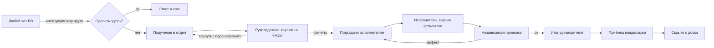

# Агентство как рабочая организация агентов

Сверено 2026-09-16 с исходниками после alpha.12 и живым плагином на Mac mini. Здесь итог анализа того, что уже создано, сравнение с системами, которые давно автоматизируют работу команд, и план доработки. Детальные контракты остаются в профильных документах ([readiness](implementation-readiness.md), [data-model](data-model.md), [DESIGN](../DESIGN.md)).

> [!NOTE] Снимок 2026-09-16
> Таблица раздела 1 — не статус **0.1.0-alpha.16**. Текущая карта отделов и пулов —
> [departments.md](../skills/agency/references/departments.md), навык **0.28.5**.
> Триаж, stall-таймаут, cron/webhook и память (знания, паспорт, профили) закрыты
> позже; читать [roadmap](roadmap.md) и корневой README.

> [!IMPORTANT] Коротко
> - **Фундамент сильнее, чем у большинства аналогов.** Версии инструкций, изоляция запуска, typed-вопросы владельцу и приёмка по `artifactId + version + hash` есть только у нас и частично в Paperclip.
> - **Не хватало организационного слоя.** Не было приёма задач «откуда угодно», руководитель не узнавал о закрытии подзадач, доска не чистилась, не отличались главные задачи от подзадач. Часть закрыта в этом проходе (разделы 5 и 8).
> - **Главные пробелы P0 дальше:** оценка на входе (триаж) как данные, наблюдение за зависшими запусками, сообщения о межотдельных подзадачах, автоматический запуск правил «событие → поручение».
> - **Интерфейс:** главное — решения владельца, главные задачи с прогрессом, возраст ожидания. Всё остальное вторично и раскрывается.

Разделы реализации и runtime вынесены в [заметки реализации](operating-model-implementation.md) и [роадмапа и runtime](operating-model-roadmap.md).

## 1. Что уже есть

В исходниках заданы проверяемые переходы задач, типизированные исходы запуска и состояния диспетчеризации событий (`src/domain/job-state.ts:4-15`, `src/server/runtime/launch/coordinator.ts:43-65`, `src/server/dispatcher/engine.ts:324-383`).

| Область | Состояние | Комментарий |
| --- | --- | --- |
| Задачи: список, канбан, карточка | готово | RPC и SQLite, revision/CAS, подзадачи через parentJobId, зависимости |
| Запуск сотрудника | готово | Любой CLI, подключённый в BB: Claude Code, Codex, Cursor, OpenCode, Antigravity проверены живым запуском. Профиль хранит CLI, модель, рассуждение и быстрый режим. Одна активная попытка на задачу |
| Вопросы владельцу | готово | `reportNeedsInput` → `waiting_input` → `answerNeedsInput` в тот же тред |
| Версии результата и приёмка | готово | Публикация ≠ приёмка; done только с принятой текущей версией |
| Отделы и сотрудники | частично | Руководитель, состав, регламент, модель; отделы общие для всех проектов или только для выбранных. Не сохраняются лимиты, права shell/delegate; в карточке отдела остались макетные блоки |
| Проекты | готово | Папка BB-проекта на машине; список по BB-проектам; отключение, возврат, удаление без задач; защита от дублей; вкладка «Правила» (.bb/AGENTS.md) |
| Сдача результата | готово | Порядок сдачи в промпте, инструкции и навыке: отчёт `.agency/jobs/<ключ>/report.md` → публикация версии → итоговый комментарий. Напоминание, если ход закончен без версии; после двух — blocked |
| Навык сотрудников | готово | `agency` 0.6.0 и `agency-artifacts` доставляются в каждый запуск независимо от профиля |
| Пробуждение руководителя | готово | Сообщение в тред руководителя при review / waiting_input / blocked, теперь и при done / canceled |
| Автоматизации (inbox → rule → intent) | частично | Правила сохраняются и сверяются вручную; порт запуска — заглушка, фоновой сверки, cron и webhook нет. Регулярная работа — через Автоматизации BB (раздел 9) |
| Знания | демо | В рабочем режиме действия отказывают |
| Настройки «Общие» | демо | Лимит параллельности и пауза живут только в памяти страницы |
| Дашборд расхода | готово | Расход по фактическим тредам, сумма главной задачи с подзадачами |
| Контекст запуска | готово | Промпт запуска собирается из слоёв agency → project → department → agent → job → handoff: сотрудник видит регламент отдела и свою должностную инструкцию |
| Наблюдение за зависаниями | частично | Есть напоминание о несданном результате после хода. Нет stall-таймаута для треда, который «висит» в работе, и лимита времени попытки |

## 2. С чем сравнивали

| Система | Что у неё взять |
| --- | --- |
| **Paperclip** | Оргдерево `reportsTo` и цепочка эскалации; атомарный захват задачи (409); review/approval-стадии перехватывают переход в done; бюджеты: 80% — предупреждение, 100% — пауза; heartbeat с `timeoutSec` и `graceSec`; маршрутизация входящих 6 правилами с запасным triage-агентом |
| **Multica** | Squad: задачу получает только лидер и раздаёт участникам; heartbeat 15 с, dispatch-таймаут 5 мин; до 2 повторов, при сети до 3, ошибки агента не повторяются; журнал доставок автопилота |
| **Linear / Linear Agents** | Triage-очередь; авто-архив закрытых (по умолчанию 6 мес.); «Отменено» в скрытом лотке колонок; прогресс родителя по доле закрытых подзадач; SLA-цвета серый → жёлтый → оранжевый → красный; делегат ≠ ответственный: человек остаётся владельцем; сессия агента stale после 30 мин без активности |
| **OpenAI Symphony** | stall 5 мин, ход ≤ 1 ч, ≤ 10 агентов параллельно, экспоненциальный повтор до 5 мин; успешный запуск ведёт в «Human Review», а не сразу в done |
| **Jira Service Management** | Типы заявок → очереди → правила trigger/condition/action; round-robin и назначение по загрузке через правила |
| **Bitrix24** | Отдел = руководитель + сотрудники; роли в задаче: постановщик / соисполнители / наблюдатели; шаблоны задач по регламенту; база знаний на отдел; формула эффективности |
| **Plane** | Auto-close неактивных, auto-archive закрытых через 1/3/6/9/12 мес.; задачи активного цикла защищены |
| **ClickUp / Monday / Asana** | Мягкие WIP-лимиты с цветом; форма приёма с группой «Новые»; AI-сотрудники с обязательными checkpoints человека |
| **Vibe Kanban** | По умолчанию видны To do → In progress → In review → Done; Backlog и Cancelled скрыты за «All» |
| **CrewAI / AutoGen / MetaGPT** | Иерархический процесс с менеджером; guardrail на результат с 3 повторами; лимит циклов проверки 5; Task/Progress ledger оркестратора с перепланированием при застое; бюджет команды останавливает раунды |
| **claude-lane-stack** (наш) | Контракт исполнения owns/never_touch/verify с хэшем; квитанция приёмки; idle 900 с / max 7200 с, проверка зависания раз в 5 мин; 1 повтор тем же провайдером → 1 fallback только после второй ошибки доступности; проверки L0/L1/L2; «будильник» PM; закрытый список делегатов; второе одинаковое исправление → правило проекта |

## 3. Модель работы, к которой идём

```mermaid
flowchart LR
  A[Любой чат BB] -->|инструкция маршрута| B{Сделать здесь?}
  B -->|да| C[Ответ в чате]
  B -->|нет| D[Поручение в отдел]
  D --> E[Руководитель: оценка на входе]
  E -->|принять| F[Подзадачи исполнителям]
  E -->|вернуть / перенаправить| D
  F --> G[Исполнитель: версия результата]
  G --> H[Независимая проверка]
  H -->|дефект| F
  H -->|ок| I[Итог руководителя]
  I --> J[Приёмка владельцем]
  J --> K[Скрыто с доски]
```

Правила организации:

1. **Задача живёт в одном отделе.** Межотдельная работа — подзадача в другом отделе, а не смена владельца.
2. **Руководитель оркестрирует, но не исполняет.** Декомпозиция, назначение, проверка итогов, сводный отчёт.
3. **Исполнитель ≠ проверяющий.** Дефект оформляется подзадачей доработки и повторной проверкой.
4. **Готовность — это принятая версия,** а не слово «готово» в тексте.
5. **Человек — владелец, агент — делегат** (как в Linear): решения, приёмка и бюджет остаются за владельцем.
6. **Закрытое уходит с доски,** но не из истории.

## 4. Матрица возможностей

| Возможность | Linear | Jira SM | Bitrix24 | Paperclip | Multica | Symphony | lane-stack | Агентство |
| --- | --- | --- | --- | --- | --- | --- | --- | --- |
| Отделы с руководителем | нет | частично | да | да | да | нет | нет | да |
| Приём и триаж входящих | да | да | частично | да | ? | нет | частично | частично |
| Маршрут из любого чата | частично | нет | нет | нет | нет | нет | да | да |
| Главная задача и подзадачи с прогрессом | да | да | да | да | да | нет | да | да |
| Автоскрытие или архив закрытых | да | ? | ? | нет | нет | нет | нет | да |
| Heartbeat / stall-таймаут | да | нет | нет | да | да | да | да | да |
| Повтор и fallback по типу ошибки | нет | нет | нет | частично | да | да | да | нет |
| Независимая проверка и приёмка версии | нет | частично | частично | да | частично | да | да | да |
| Бюджеты на агента или отдел | нет | нет | нет | да | нет | нет | нет | да |
| WIP / лимиты параллельности | нет | нет | нет | нет | нет | да | частично | да |
| База знаний отдела в контексте | нет | частично | да | нет | да | нет | да | да |
| Расписания и webhook | частично | да | да | да | да | нет | да | да |
| Вопрос владельцу с продолжением | да | нет | нет | частично | ? | частично | нет | да |

«?» — в открытой документации данных не нашли; это не значит, что возможности нет. Колонка «Агентство» обновлена 2026-09-19 (alpha.16); колонки других систем — по ревизии 2026-09-16.

## 5. Пробелы и план

### P0 — закрыто в этом проходе

- [x] Гигиена доски: время закрытия `closed_at`, скрытие подзадач через 1 ч, остальных задач через 24 ч, настройки плагина, строка «Скрыто завершённых».
- [x] Главные задачи жирным с прогрессом «закрыто/всего», подзадачи под главной, семейный порядок, числовая сортировка ключей.
- [x] Инструкция делегирования во всех сессиях: обычный чат, руководитель задачи, исполнитель задачи; режимы `delegate` / `suggest` / `off`.
- [x] `createJob` без `key`, `priority`, `dueAt`, `parentJobId`: сервер назначает AG-N, поручение можно создать из любого чата.
- [x] Руководитель получает сообщение, когда рабочая подзадача принята, отменена, ждёт ответа или заблокирована. Автоматическая проверка QC руководителя не будит.

### P0 — следующим

- [x] **Зона ответственности отдела.** Регламент отдела по шаблону с разделами «Принимаем / Не принимаем / Входы / Процесс / Эскалация»; инструкция маршрута читает «Принимаем». Кнопка «Вставить шаблон регламента» в настройках отдела. Отдельных полей в схеме нет: раздел в тексте регламента.
- [x] **Оценка на входе.** Руководитель пишет оценку комментарием с данными `intake_size` / `intake_risk` / `intake_decision`; карточка показывает «Оценка: …». Если включена точка оценщика `intake`, Агентство само пишет ту же оценку при запуске руководителя — это предложение: подзадачи не создаются, `return` и `clarify` сами не блокируют. Цепочка: S+low → помощник и дешёвая модель без лишней проверки; L или high → исполнитель и независимый review. Переход в очередь оценку не требует; ночная перепроверка — правило отдела (раздел 13). Каждое обращение оценщика (и молчание) пишется в журнал: `bb agency decisions log`, на экране настроек оценщика.
- [x] **Наблюдение за запусками.** Тишина, зависание, незапуск, ошибка провайдера и потолок попытки — пороги в «Правилах работы» (этап 1); зависшая задача уходит руководителю в `blocked` с причиной.
- [x] **Правила отдела и проекта в запуске.** Слои снимка компилируются в порядке [instruction-context](instruction-context.md); spawn указывает на пакет `.agency/jobs/<key>/TASK.md`.
- [x] **Межотдельные подзадачи.** Руководитель получает сообщение о подзадаче любого отдела и любой папки того же дерева задач.
- [x] **Контракт исполнения.** «Можно менять» / «Нельзя трогать» / «Проверки» закрепляются в снимке запуска (этап 3).
- [x] **Навык `agency` 0.4.0.** Модель организации, создание отделов и сотрудников, шаблоны регламента и должностных инструкций, циклы руководителя, исполнителя и проверяющего, протокол возврата, автоматизации через BB. Хэш пакета перезакреплён в `agency-isolated-catalog-roles-v1.json` (резервная копия рядом).
- [x] **Возврат задачи не по профилю.** Комментарий «Возврат: …» + переход в blocked; руководитель получает сообщение, владелец видит главную задачу в «Требуют внимания». Смешанный продукт руководитель режет на подзадачи в принимающие отделы, а не возвращает корень. Пачка поручений в один отдел: каждое оценить, своё оставить, чужое отдать или вернуть, L — этапы. Правило в навыке, в инструкциях треда и в шаблонах должностей.

### P1

> [!NOTE]
> Исторический список. Актуальный статус P1 и P2 — в [разделе 11](#11-закрытие-роадмапа).

- [x] **Лимиты параллельности:** общий, отдел, сотрудник, очередь запуска по приоритету (этапы 2 и 5); мягкий WIP на колонку канбана — раздел 13.
- [x] **Бюджеты:** на Агентство, отдел и сотрудника за месяц с предупреждением и паузой (этап 2).
- [x] **Сроки:** подсветка по `dueAt` и напоминание до срока (этап 2).
- [x] **Автоназначение в отделе:** руководитель, исполнитель или проверяющий с наименьшей загрузкой (этап 5).
- [x] **Лимит циклов доработки:** правило отдела, по умолчанию 3 круга (этап 1).
- [x] **Знания на данных:** область, источник, статус, доставка в запуск (этап 8); повторяющееся замечание становится предложением в знания отдела — раздел 13.
- [x] **Автоматизации в live:** расписание, webhook, Telegram (этап 6), сообщения владельцу и сводки — раздел 13.
- [x] **Ночная перепроверка:** правило отдела и час; задача проверяющему с принятыми версиями входами — раздел 13.
- [x] **Подпись привязок:** «Раздел / Папка · Машина», повторное подключение той же папки запрещено (этап 7, раздел 10).

### P2

- [x] Цели над главными задачами (этап 8).
- [x] Подчинённость отделов и эскалация (этап 8).
- [x] Показатели сотрудника (этап 8).
- [x] Серверный архив закрытых (этап 8).
- [x] Сохранённые виды и поиск (этап 8); зависимости в карточке задачи — раздел 13.

## 6. Интерфейс: что первично

### Главная — очередь задач

| Уровень | Что | Статус |
| --- | --- | --- |
| Первичное | Секции «Ожидает решения / Ждёт ответа / На проверке» сверху; возраст ожидания с подсветкой после суток | готово |
| Первичное | Главные задачи жирным с «закрыто/всего», подзадачи под главной | готово |
| Вторичное | Исполнитель; отдел только на широкой панели | готово |
| Свёрнуто | Завершённые после срока — «Скрыто завершённых: N · Показать» | готово |
| Убрано | Повтор ключа в названии, одинаковая синяя точка, «BB-сервис» в каждой строке | готово |
| Дальше | Канбан: 8 колонок не помещаются даже на 1440 px. По умолчанию «К запуску / В работе / Нужен ответ (blocked + waiting_input) / На проверке / Готово», бэклог и отменённые — отдельным видом (Vibe Kanban, Linear) | TODO |

### Карточка задачи

| Уровень | Что | Статус |
| --- | --- | --- |
| Первичное | Текущий этап и одно действие владельца; результат рядом с приёмкой | готово |
| Первичное | У главной задачи: «Главная задача» в шапке, подзадачи выше описания, полный путь | готово |
| Вторичное | Описание и критерии; свойства справа | готово |
| Раскрывается | История запусков и сверка, диагностика, иерархия и связи | готово |
| Дальше | В брифе видны технические id (`agt_…`, `bnd_…`): показывать имена по каталогу; длинный бриф сворачивать после старта работы | TODO |

### Навигация

Группы «Работа / Команда / Управление» оставить. «Знания» и «Настройки → Общие» пока не на данных — пометка «пилот» до реализации, чтобы не выдавать демо за рабочие разделы.

## Work-rule groups in the interface

The department panel defines seven groups; machine and employee panels define separate sandbox and review controls. These declarations describe UI fields and hints, not enforcement sites. (`src/app/prototype/work-rules.tsx:85-159`)

| Group | Controls, bounds, and UI description |
| --- | --- |
| Rework and review | Rework rounds 1–10; auto-review; nightly recheck hour 0–23; minor-defect handling. Hints describe reviewer subtasks and up to 20 accepted versions per project folder (`src/app/prototype/work-rules.tsx:87-94`). |
| Department memory | Auto-learning; capacity 5–200; lifetime 7–365 days. Hints distinguish proposed and accepted lessons; pinned records are exempt from eviction and expiry (`src/app/prototype/work-rules.tsx:97-103`). |
| Launch monitoring | Quiet 1–240 min; stall 2–720 min; start 1–120 min; provider error 1–120 min; attempt ceiling 0.5–24 h (`src/app/prototype/work-rules.tsx:106-114`). |
| Stale jobs | Blocked/running thresholds and repeat interval 0–720 h; up to 10 reminders. Zero disables a threshold or repeat; escalation sends an Inbox message without closing the job (`src/app/prototype/work-rules.tsx:117-124`). |
| Project passport | Lead, reviewer, executor, assistant choose `full`, `header`, or `command` delivery (`src/app/prototype/work-rules.tsx:55-82`, `src/app/prototype/work-rules.tsx:126`). |
| Sandbox | The shared `runWithoutSandbox` field is boolean: off selects the sandboxed CLI mode, on selects full host permissions. Machine and employee sandbox groups reuse the field; the machine hint offers “Use department rules,” “Yes,” and “No.” (`src/app/prototype/work-rules.tsx:48-59`, `src/app/prototype/work-rules.tsx:141-157`) |
| Delivery and deadlines | Completion reminders 0–5; due reminder 0–336 h; department escalation 0–720 h. Zero disables reminders/escalation (`src/app/prototype/work-rules.tsx:132-137`). |

## Источники

- Paperclip: [issues](https://github.com/paperclipai/paperclip/blob/master/docs/api/issues.md), [execution policy](https://github.com/paperclipai/paperclip/blob/master/docs/guides/execution-policy.md), [org structure](https://github.com/paperclipai/paperclip/blob/master/docs/guides/board-operator/org-structure.md), [costs](https://github.com/paperclipai/paperclip/blob/master/docs/api/costs.md), [agents runtime](https://github.com/paperclipai/paperclip/blob/master/docs/agents-runtime.md), [external task protocol](https://github.com/paperclipai/paperclip/blob/master/docs/specs/external-task-protocol.md)
- Multica: [squads](https://multica.ai/docs/squads), [issues](https://multica.ai/docs/issues), [runs](https://multica.ai/docs/tasks), [autopilots](https://multica.ai/docs/autopilots)
- Linear: [triage](https://linear.app/docs/triage), [archive](https://linear.app/docs/delete-archive-issues), [sub-issues](https://linear.app/docs/parent-and-sub-issues), [SLA](https://linear.app/docs/sla), [board layout](https://linear.app/docs/board-layout), [agents](https://linear.app/developers/agent-interaction)
- OpenAI Symphony: [SPEC.md](https://github.com/openai/symphony/blob/main/SPEC.md)
- Jira Service Management: [queues](https://support.atlassian.com/jira-service-management-cloud/docs/how-are-queues-used-in-jira-service-management/), [SLA](https://support.atlassian.com/jira-service-management-cloud/docs/set-up-sla-goals/), [automation](https://support.atlassian.com/jira-service-management-cloud/docs/how-do-when-if-and-then-statements-work-for-automation/)
- Bitrix24: [роли в задаче](https://helpdesk.bitrix24.ru/open/17962166/), [эффективность](https://helpdesk.bitrix24.ru/open/18124434/), [база знаний](https://www.bitrix24.ru/features/company/knowledge-base/)
- Plane: [automations](https://docs.plane.so/automations/overview) · ClickUp: [WIP limits](https://help.clickup.com/hc/en-us/articles/6304619369623-Work-in-Progress-Limits) · Vibe Kanban: [issues](https://github.com/BloopAI/vibe-kanban/blob/main/docs/issue-management.mdx)
- CrewAI: [processes](https://docs.crewai.com/en/concepts/processes), [tasks](https://docs.crewai.com/en/concepts/tasks) · AutoGen: [Magentic-One](https://microsoft.github.io/autogen/stable/user-guide/agentchat-user-guide/magentic-one.html) · MetaGPT: [roles](https://github.com/FoundationAgents/MetaGPT/blob/main/metagpt/roles/role.py)
- claude-lane-stack: `plugins/lane-stack/agents/dev-orchestrator.md`, `docs/FILE-CONTRACT.md`, `docs/LANE-EXEC.md`, `docs/ROUTING.md`, `docs/SOLO-ORCHESTRATION.md`
- Прежнее сравнение с Multica: [product-review](product-review.md)

<!-- lane-pilot:backlinks -->
## Referenced by

- [Operating model implementation notes](operating-model-implementation.md)
- [Operating model roadmap and runtime notes](operating-model-roadmap.md)
- [Рабочий план и закрытые этапы](roadmap.md)
