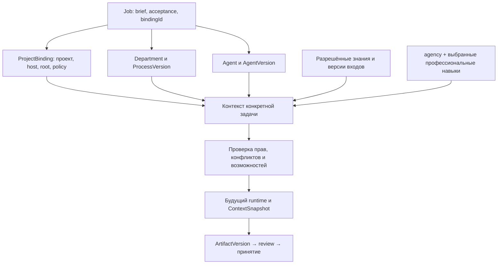

# Основной навык плагина и справочный каталог

Сверено с рабочим checkout 2026-09-14. Эта адаптация меняет инструкции в skills/agency; серверные интерфейсы и исполнение не добавлены.

## Разделение

- **agency** — основной навык работы в продукте: реальный контекст, сущности, подготовка изменений, статусы, передачи, версии и приёмка.
- **model-task-prompts** — вспомогательный метод подготовки поручения исполнителю; не владелец структуры Job и не dispatcher.
- **agency-artifacts** — вспомогательный формат документов; не владелец ArtifactVersion и Job.state.
- Профессиональные навыки — выбранные методы AgentVersion, а не общие правила всего агентства.
- Каталог agency-router — просмотр примеров и адаптация по выбору пользователя. Его 208 поручений, модельные назначения и папки автоматически в сотрудников не импортируются.

Один основной skill не означает один гигантский промпт. Он читает нужную процедуру из references. Конкретные инструкции сотрудников хранятся в AgentVersion.instructions; процесс и приёмка отдела — в ProcessVersion; brief и acceptance заказа — в Job. Новые статические навыки «копирайтер плагина», «дизайнер плагина» не нужны лишь для повторения этих полей.

## Сборка контекста

Нижняя часть исполнения — целевой путь, не текущая функция. Сейчас assessIsolation возвращает false и execution=unavailable. Этот skill не снимает ограничение и не делает snapshot своими словами.

## Реализация и доступ

В рабочем коде есть постоянные сущности, CRUD/RPC и allowlisted CLI (`docs/cli.md`): `--input-json`, те же схемы, requestId и expectedRevision. Произвольный RPC и чтение клиентского файла без `--source server-fs` закрыты. Существование RPC в TypeScript не даёт отдельный MCP-tool.

До такого интерфейса skill готовит конкретные значения полей или использует реально доступный UI по поручению. Не читает/правит SQLite напрямую. Передача runtime требует отдельно реализованных и проверенных запуска, изоляции, контекстного snapshot и регистрации результатов.

## Что не переносится из универсального стандарта буквально

| Общая методичка | Применение в плагине |
|---|---|
| project.json/root | Материалы проекта; действительная привязка выполнения — ProjectBinding |
| work/tasks/<id>/task.json | Допустимый файловый пакет, но каноническая задача — Job; не второй задачник |
| task_ref system=bb-task | Job Агентства — собственная сущность: external + Job.id, если общий формат нужен |
| artifact_id/status/version в YAML | Метаданные документа, отдельно от плагинных Artifact/ArtifactVersion |
| approved | Не означает вызов acceptArtifactVersion и не завершает Job |
| preset моделей | Только пример; исполнитель/навыки/политики берутся из реального AgentVersion |
| Отдельная роль в каталоге | Не создаёт сотрудника, Membership или полномочия |

## Следующий этап реализации

1. Добавить агентский интерфейс чтения контекста и разрешённых изменений поверх существующих сервисов; не создавать второй слой бизнес-правил в навыке.
2. Собирать версионированный контекст из записей плагина; фиксировать реально выбранные skills/MCP и конфликты.
3. Проверить исполнение одного провайдера с изоляцией; только затем включать Run.
4. Проверить полный цикл Job → результат → новая версия → ревью → доработка/принятие, включая устаревший hash и конфликт revision.

Подключение контролируется кодом и тестами. Текст навыка не является реализацией этих этапов.
