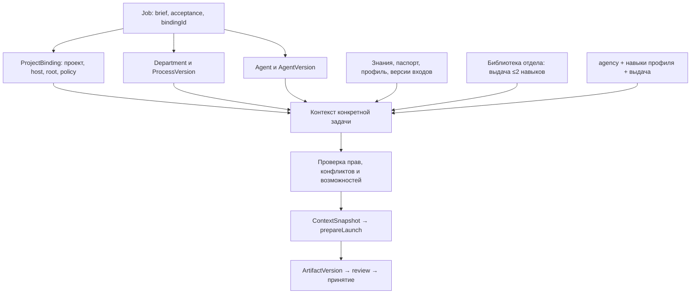

# Основной навык плагина и справочный каталог

Сверено 2026-09-20 с **0.1.0-alpha.16**, навык **0.28.5**. Этот файл описывает,
как skill стыкуется с продуктом; серверные контракты — в [cli.md](cli.md) и
[session-context-contract.md](session-context-contract.md). Карта отделов —
[departments.md](../skills/agency/references/departments.md).

## Разделение

- **agency** — основной навык работы в продукте: реальный контекст, сущности, подготовка изменений, статусы, передачи, версии и приёмка. Версия в YAML `skills/agency/SKILL.md`.
- **model-task-prompts** — вспомогательный метод подготовки поручения исполнителю; не владелец структуры Job и не dispatcher.
- **agency-artifacts** — вспомогательный формат документов; не владелец ArtifactVersion и Job.state.
- Профессиональные навыки — выбранные методы AgentVersion **или** выдача из библиотеки отдела на один запуск (не больше двух). Не общие правила всего агентства.
- Каталог agency-router — просмотр примеров и адаптация по выбору пользователя. Его 208 поручений, модельные назначения и папки автоматически в сотрудников не импортируются.

Один основной skill не означает один гигантский промпт. Он читает нужную процедуру из `references/`. Конкретные инструкции сотрудников хранятся в AgentVersion.instructions; процесс и приёмка отдела — в ProcessVersion; brief и acceptance заказа — в Job.

## Сборка контекста

Исполнение — рабочий путь: `getIsolationReadiness` с `jobId` → квитанция `prepareLaunch` → скрытый тред. Навык не подменяет координатор и не объявляет `running` без квитанции.

## Реализация и доступ

Постоянные сущности, CRUD/RPC и allowlisted CLI (`docs/cli.md`): `--input-json`, те же схемы, requestId и expectedRevision. Произвольный RPC и чтение клиентского файла без `--source server-fs` закрыты. Полный список операций — `bb agency help`, не таблица 2026-09-14 в том файле.

До запуска skill готовит конкретные значения полей или использует UI. Не читает/правит SQLite напрямую.

## Что не переносится из универсального стандарта буквально

| Общая методичка | Применение в плагине |
|---|---|
| project.json/root | Материалы проекта; действительная привязка выполнения — ProjectBinding |
| work/tasks/<id>/task.json | Допустимый файловый пакет, но каноническая задача — Job; не второй задачник |
| task_ref system=bb-task | Job Агентства — собственная сущность: external + Job.id, если общий формат нужен |
| artifact_id/status/version в YAML | Метаданные документа, отдельно от плагинных Artifact/ArtifactVersion |
| approved | Не означает вызов acceptArtifactVersion и не завершает Job |
| preset моделей | Только пример; исполнитель/навыки/политики берутся из реального AgentVersion |
| Отдельная роль в каталоге | Не создаёт сотрудника, Membership или полномочия |

## Что ещё не в навыке

1. Не обещать файловую песочницу всех CLI.
2. Не подменять `threads.interactions` карточкой Агентства своими словами.
3. Киты Инфра / Автоматизация / Продажи / Офис без пакета ремесла — читать «Принимаем» в `department get`, не выдумывать пул.
