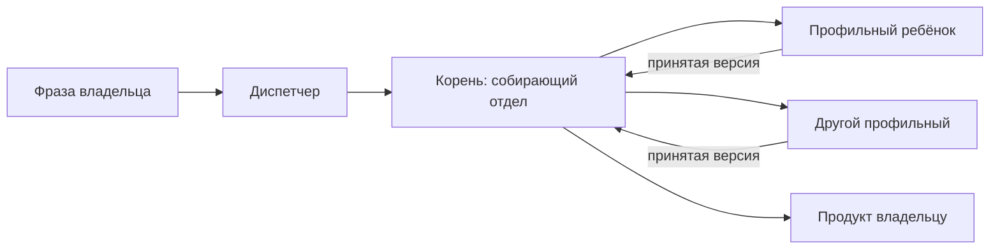

# Цепочки поручений

Это не 16 бумажных отделов из внешнего каталога рецептов. Там — результаты и этапы. Здесь те же цепочки кладутся на **живые отделы** через корень + `job depend` / `job next-step`. Диспетчер ставит только корень; лид режет детей.

Один отдел — это строка [карты поступления](routing.md), не цепочка. Не дублируй routing здесь.

Владелец касается двух раз: утвердить предложение (новая программа) и принять готовый продукт. Публикация, кабинет, деньги — всегда владелец.

Готовые пакеты ремесла (Тексты, Реклама, Дизайн, SEO, Маркетинг, Соцсети) в цепочку входят как есть. Исследования — пока кит, пока стол ремесла не зафиксировал пул. У Маркетинга библиотека пустая: навыка стратегии в каталоге нет.

Живые ID этого инстанса — в карте чата `routing-map.md`, не здесь.

Фиксация 2026-09-20: ментор @thread:thr_ar57xyywhs, судья — чат диспетчера (другой вендор).

## Как собирать цепочку

1. Корень — отдел, который **собирает** результат ([routing.md](routing.md)).
2. Ребёнок в профильный отдел. Не «всё в первый попавшийся».
3. Порядок: `depend` (ждать принятую версию) или `next-step`.
4. Статья, объявление, макет, код — разные дети, не один исполнитель.
5. Нет штата VIDEO / CRM / CARE. Нарезка **готового** видео — тот же класс, что перепаковка исходника: корень «Контент и соцсети», навык на задачу, публикует владелец. Съёмка с нуля — возврат «нет отдела». CRM-письма: Продажи. Карточки товара: Тексты + Дизайн.

## Рабочие цепочки

| ID | Владелец говорит | Корень | Этапы | Не делать |
| --- | --- | --- | --- | --- |
| CH-site | Сайт / приложение с нуля | Продукт `new-program` | proposal → SEO-02 карта (тема + proposal, не «дыры живой страницы») + Тексты: оффер/H1 → Дизайн: прототип → Тексты: микрокопи → Разработка: код → Инфра: INF-01 план выкладки → **владелец** → после URL: SEO-04 аудит | сразу код; SEO пишет статьи; карта только после URL |
| CH-screen | Новый / поправить экран | Дизайн | design.md + HTML-прототип → после приёмки Разработка | дизайнер пишет React |
| CH-cocoon | Кокон, семантика, карта страниц | SEO | нет языка ЦА → Исследования RES-02; SEO: ядро + карта + ТЗ → Тексты: статьи по принятым ТЗ | SEO пишет статью; reddit/tavily в пуле SEO |
| CH-ads | Telegram Ads / Директ | Реклама | нет УТП → Маркетинг; нет посадки → Тексты; **вход:** цели и UTM; пакет → **владелец** запускает | агент жмёт кабинет; Google Ads в РФ |
| CH-campaign | Сквозная кампания, медиаплан | Маркетинг | обещание + доли каналов + **план измерения** (цели, события, UTM) → дети SEO / Реклама / Соцсети. Счётчик на сайте → Разработка `feature`. Кабинеты — владелец | объявления в Маркетинге; счётчик в Инфраструктуре |
| CH-post | Собрать публикацию | Контент и соцсети | признак корня: собирается пакет, а не «напиши текст». Картинка → Дизайн. Длинный текст / статья → Тексты. Короткий пост без картинки Соцсети пишут сами (порог). Публикация — владелец | всё в Тексты; три отдела на подпись |
| CH-research | Сравни / собери факты | Исследования | отчёт → по нужде Тексты. RES-05 мониторинг: корень Исследования, правило расписания → Автоматизация AUT-01 | исследование пишет пост |

Один отдел (баг, ТЗ уже есть, КП, навык, DNS, «непонятно») — только [routing.md](routing.md), без CH-*.

## Соответствие внешнему каталогу рецептов

| Journey / группа | Куда |
| --- | --- |
| `site-to-seo`, WEB, SOFTWARE-08 | CH-site |
| `software-release` | routing: Разработка |
| `design-direction` | CH-screen |
| `semantic-architecture` | CH-cocoon |
| CONTENT | routing: Тексты (ТЗ уже есть) |
| Ads / `facebook` | CH-ads; Google RF → Директ |
| STRATEGY | CH-campaign |
| `social-content` | CH-post, если собирают публикацию |
| `research-dossier` | CH-research |
| `call-to-brief`, BRIEF | Офис; не новый отдел |
| `measurement` | CH-campaign: план у Маркетинга; счётчик — Разработка `feature`; кабинеты — владелец |
| `operations-automation` | routing: Автоматизация |
| `catalogue` | Тексты + Дизайн; код магазина → Разработка |
| `crm-sequence` | Продажи + владелец (отправка) |
| `reels-production` | готовое видео → Соцсети (перепаковка); съёмка с нуля — нет отдела |

## Диспетчеру

Не копируй десятки OUT-пакетов в Job. Если несколько отделов собирают продукт — строка CH-*, только корень. Один отдел — routing, без цепочки. Лид режет сам.
