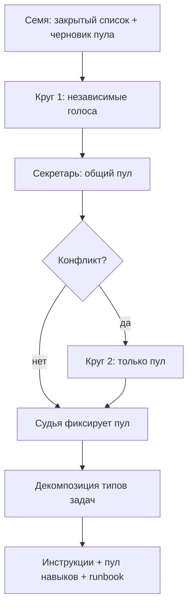

# Стол ремесла отдела

Это не стол «какой стек у нового приложения» ([круглый стол](council.md)). Это разбор **одного живого отдела**: какие задачи он берёт, как их режет, какой навык открывает, какая инструкция и рабочая документация.

Отдел критиков как штат **не создаём**. Персоны — в брифе. Судья — этот чат организатора или лид, **другой вендор**, чем критики. Судья не пишет третий процесс и не усредняет.

## Зачем общий пул, а не «каждый накидал своё»

Круг 1 без рамки плодит новые отделы, новые роли и новые MCP. Нужен **закрытый список типов идей**. Критик может только:

- оставить пункт семени;
- вычеркнуть;
- склеить два пункта семени в один;
- добавить пункт, который **уже есть в закрытом списке ситуаций отдела**, но забыт в семени.

Нельзя: новый отдел, новый тип роли, «давайте ещё канал», MCP в профиль сотрудника, навык автору чтобы обойти проверку.

После круга 1 секретарь (или судья) публикует **общий пул**. Круг 2 читает только его: согласиться / отвергнуть / пометить конфликт. Новых пунктов в круге 2 нет, кроме «в семени дыра по закрытому списку».

Потолок: 2 круга. Нет конфликта — круга 2 нет. Франкенштейн процесса запрещён: один цельный маршрут на тип задачи.

## Выход, не протокол

Владелец и лид отдела видят пакет ремесла, не спор:

1. Общий пул (зафиксирован).
2. Декомпозиция: тип задачи → входы → кто → навык на запуск → артефакт → кто проверяет.
3. Правка инструкции лида / исполнителя / проверяющего.
4. Список `pool-save merge` (только `bb-user`).
5. Рабочая документация «как что использовать» в артефакте отдела.

## Когда запускать

По одному отделу. Не все пятнадцать параллельно. Очередь: Тексты → Реклама → Дизайн/сайт → SEO → остальные, если после трёх пакетов ещё дыра. После фиксации пакета обнови [карту поступления](routing.md): какие фразы идут сюда и что отдел имеет из инструкций и пула.

Не запускать стол ремесла на багфикс в коде и не вместо калитки `new-program`.

## Круги



1. Организатор кладёт семя: закрытый список ситуаций отдела и черновые пункты пула. Это генерация. Критики в круге 1 **не генерируют отдел заново**.
2. 3–4 персоны, каждая в своём чате, свой файл. Состав без инноватора, если семя уже собрано: скептик, оператор, заказчик, исследователь. Инноватор — только если семени нет.
   **Разные вендоры на одном столе.** Не сажать всех на одну модель (в том числе не 4× GPT Luna и не 4× Gemini). По одному месту: Gemini, Sonnet, DeepSeek, Groq/OSS (или другой свободный провайдер). Luna — максимум одно место, и только если квота жива. Судья — другой вендор, чем любой из критиков этого круга.
3. Круг 2 — только при конфликте, с чужими записками во входе.
4. Судья фиксирует пул одним файлом. Дальше обычные модели пишут инструкции — критики это не делают.

## Закрытые типы пунктов пула

Каждый пункт — ровно один тип:

| Тип | Смысл |
| --- | --- |
| `situation` | фраза владельца → этот отдел (или split) |
| `intake` | без чего не начинаем |
| `split` | ребёнок в другой **уже существующий** отдел |
| `step` | шаг процесса внутри отдела |
| `skill` | роутер из каталога `bb-user` на запуск исполнителя |
| `review-skill` | навык **проверяющего**, не автора |
| `profile` | нужен `workProfileKey` |
| `owner` | только владелец (деньги, кабинет, публикация) |
| `wont` | сознательно не делаем |

## Формат записки критика (до 40 строк)

```text
роль: skeptic | operator | customer | researcher
отдел: …

keep: id, id, …
drop: id — одна фраза почему
merge: id+id → новый заголовок
missed: situation из закрытого списка, которого нет в семени

конфликт: id — в чём спор с семенем
не делать: …
```

Идентификаторы только из семени (`W-03`) или `missed:` со ссылкой на строку закрытого списка. Свободный эссе — брак сдачи.

## После фиксации пула

Для каждого `situation` в пуле одна карточка декомпозиции:

| Поле | Что писать |
| --- | --- |
| Берём? | да / split куда / возврат |
| Входы | 2–5 обязательных |
| Делает | роль отдела |
| Навык | имя `bb-user`, не lane-stack |
| Артефакт | имя файла и критерий |
| Проверка | кто и каким `review-skill` |
| Владелец | если нужен |

Из карточек — три текста: инструкция лида (таблица ситуаций), инструкция исполнителя (пул работ + какой скилл), runbook «как что использовать».
