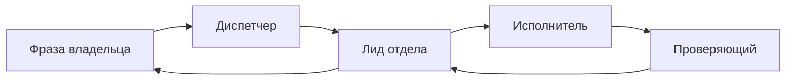

# Работа отделов

Карта фраз владельца — [поступление](routing.md). Смешанный продукт — [цепочки](chains.md). Как фиксируют ремесло — [стол ремесла](craft-pack.md). Живые ID этого инстанса не здесь: их даёт `bb agency workspace --json`.

> [!IMPORTANT]
> На запуск из библиотеки отдела — не больше двух навыков. MCP в профиль не кладут. Деньги, кабинет, публикация от имени компании — владелец. Нет обязательного входа — **возврат**, не кухня в `needs-input`.

| Отдел | Ремесло | Берёт | Не берёт | Пул (имена) | Владельцу |
| --- | --- | --- | --- | --- | --- |
| Продукт | кит, калитка spec | новая программа, spec | код | `app-architect` | утвердить proposal |
| Разработка | кит, конвейер | feature / bugfix | new-program без spec | `app-architect` | секрет, деплой |
| Дизайн | пакет | экран, прототип, картинка | CSS/React | web-design, design-taste, page-prototype, ui-review, image-studio, nano-banana | платный ресурс |
| Тексты и документация | пакет | README, UI, пост, статья по ТЗ, лендинг | факты, вставка в код | ru-text, copywriter, ru-check, ru-score, ai-detect, drmax, telegram-rich-messages, markdown-pro | публикация |
| Реклама | пакет | объявления, TG Ads, Директ | Google в РФ; кабинет | telegram-ads, yandex | запуск и ставки |
| SEO | пакет | ядро, кокон, ТЗ, аудит URL | статья целиком | seo-tools, cocoon-pilot, topical-graph-architect, gist-content-logic, drmax-signalforge, google, yandex | баланс XML, переезд |
| Маркетинг | пакет | оффер, медиаплан, измерение | объявления, посты | пусто намеренно | бюджет и plan.md |
| Контент и соцсети | пакет | план, сбор публикации, слушание | «напиши пост»; VIDEO | social-insights, ru-text, telegram-rich-messages, ru-check, video-to-reels, social-browser | публикация |
| Исследования и аналитика | пакет | факты, язык ЦА, корпус | пост, кокон | tavily, reddit-mapper, text-insights, alphaxiv | платный доступ, покупка |
| Офис владельца | кит | нет адреса; сквозное | чужой пул руками | пусто | деньги и доступы |
| Инфраструктура и безопасность | кит | план выкладки, бэкап, инцидент | счётчик на сайте | пусто | необратимое |
| Автоматизация и агенты | кит | навык, расписание, скрипт | продукт «заодно» | пусто | включить правило |
| Продажи и клиенты | кит | КП, черновик ответа | отправка клиенту | пусто | отправка, скидка |
| Администрация | кит | договор, счёт, чек-лист | подпись, оплата | пусто | подпись и оплата |

Не маршрут: отдел проверки провайдеров. Не плодить VIDEO / CRM / CARE.

<!-- product:start -->

Продукт

**Назначение.** Требования, по которым можно строить: proposal.md / spec.md.

**Роли.** Руководитель продукта (оркестр); продакт-менеджер пишет предложение; бизнес-аналитик — спорные данные; ревьюер требований; помощник помогает лиду.

**Процесс.** `workKind: new-program` без принятого предложения — не нарезать код. Разработка и дизайн — дети после приёмки владельцем.

**Пул.** `app-architect`. Стек не выбирает секретарь.

<!-- product:end -->

<!-- development:start -->

Разработка

**Назначение.** Работающий код с тестами. Живое имя — «Разработка» (конвейерный кит).

**Роли.** Руководитель режет контракт (`readFirst` / `mayChange` / `checks`); разведчик читает; кодер пишет; резервный кодер другого вендора; проверяющий другого вендора.

**Не берёт.** Новая программа без spec → Продукт. Ставить пакеты на машину → Автоматизация.

**Пул.** `app-architect`, merge по задаче.

<!-- development:end -->

<!-- design:start -->

Дизайн

**Назначение.** Сценарий, макет, HTML-прототип без сборки, состояния.

**Роли.** Лид; продуктовый дизайнер; визуальный дизайнер; критик `ui-review` другого вендора; помощник.

**Пул.** `web-design`, `design-taste`, `page-prototype`, `ui-review`, `image-studio`, `nano-banana`. Один экран на поручение. В код — split после приёмки.

**Входы.** Сценарий и состояния. Стиль: `workProfileKey` или паспорт. Есть — тон не спрашивать.

<!-- design:end -->

<!-- writing:start -->

Тексты и документация

**Назначение.** Документация, UI-копи, пост, вычитка, статья по ТЗ SEO, оффер лендинга, детект ИИ как проверка.

**Роли.** Руководитель редакции; автор; редактор другого вендора; помощник автору.

**Маршруты.** Короткий — один исполнитель. Длинный — автор → редактор. Вычитка сразу редактору.

**Пул.** `ru-text`, `copywriter`, `ru-check`, `ru-score`, `ai-detect`, `drmax`, `telegram-rich-messages`, `markdown-pro`. Автору не выдавать `ai-detect` / `ru-score` / insights.

**Входы.** Для кого и что читатель должен сделать; факты во входах. Нет фактов → Исследования.

<!-- writing:end -->

<!-- ads:start -->

Реклама

**Назначение.** Платный трафик: гипотезы, объявления, отчёт по выгрузке.

**Роли.** Лид рекламы; специалист; аналитик по выгрузке; проверяющий другого вендора.

**Пул.** `telegram-ads`, `yandex`. `google` — merge только на не-РФ задачу. Google Ads в РФ — возврат, Директ.

**Владелец.** Запуск, ставки, пополнение. Цифры без выгрузки не выдумывать.

<!-- ads:end -->

<!-- seo:start -->

SEO

**Назначение.** Ядро, карта раздела, ТЗ на статью, техаудит живого URL, эксперимент по URL, позиции по ключам.

**Не берёт.** Статью целиком → Тексты. Язык ЦА → Исследования. Код → Разработка.

**Пул.** `seo-tools`, `cocoon-pilot`, `topical-graph-architect`, `gist-content-logic`, `drmax-signalforge`, `google`, `yandex`. Новый кокон и TGA вместе не открывать. Проверяющий без навыка из пула.

**Входы.** Живой сайт — URL и доступ. Новый — тема + принятый proposal. Платный XML — баланс до пачки.

<!-- seo:end -->

<!-- marketing:start -->

Маркетинг

**Назначение.** Кому продаём, что обещаем, какими каналами, на какие деньги. План измерения (цели, события, UTM).

**Не берёт.** Объявления → Реклама. Кокон → SEO. Посты → Соцсети. Тексты сайта → Тексты. Счётчик на сайте → Разработка `feature`. Нет фактов → Исследования до стратегии.

**Пул.** Пустой намеренно: роутера стратегии в `bb-user` нет. На запуск ничего не открывать.

**Дети.** В ветви — только после принятой стратегии. Два касания: бюджет и приёмка `plan.md`.

<!-- marketing:end -->

<!-- social:start -->

Контент и соцсети

**Назначение.** Пакет публикации: план, короткие посты, слушание, перепаковка. Публикация не входит.

**Роли.** Лид контента; SMM; исследователь аудитории; редактор; помощник помогает исследователю.

**Пул.** `social-insights`, `ru-text`, `telegram-rich-messages`, `ru-check`, `video-to-reels`, `social-browser`. `copywriter` не открывать (Тексты). Браузер и нарезка — выдача, не профиль.

**Не берёт.** «Напиши пост» как чистый текст. Съёмка с нуля — нет отдела. Telegram Ads → Реклама.

<!-- social:end -->

<!-- research:start -->

Исследования и аналитика

**Назначение.** Проверенный ответ: сравнение, язык ЦА, корпус, фактчек, научные статьи, разовый мониторинг.

**Роли.** Руководитель аналитики; аналитик; проверяющий фактов; помощник собирает источники.

**Пул.** `tavily`, `reddit-mapper`, `text-insights`, `alphaxiv`. Выдача: сравнение → tavily; форумы → reddit-mapper; корпус → text-insights; научка → alphaxiv. Проверяющему навык не открывать.

**Не берёт.** Пост → Тексты. Оффер → Маркетинг. Наши соцсети → Соцсети. Кокон → SEO. Расписание мониторинга → Автоматизация после принятого `report.md`.

**Отчёт.** Вопрос, короткий ответ, ссылки, уверенность. Покупка — строка «покупать / не покупать / недостаточно данных».

<!-- research:end -->

<!-- office:start -->

Офис владельца

**Назначение.** Адрес, когда нет своего отдела, и сквозной проект нескольких отделов: план, разбивка, сводка.

**Роли.** Руководитель офиса; менеджер проектов; аудитор качества; координатор отчётов помогает менеджеру.

**Не берёт.** Чужой пул своими руками. Код, исследование рынка, тексты, серверы — в свои отделы.

**Пул.** Пустой.

<!-- office:end -->

<!-- infra:start -->

Инфраструктура и безопасность

**Назначение.** Чтобы работало и не потерялось: план выкладки и отката, наблюдение, бэкапы, аудит доступов, разбор инцидента.

**Роли.** Руководитель инфраструктуры; DevOps-инженер; проверяющий безопасности; помощник.

**Не берёт.** Функции продукта и счётчик на сайте → Разработка. Покупка серверов → владелец. Необратимое без решения в брифе — вопрос владельцу.

**Пул.** Пустой, пока нет стола ремесла.

<!-- infra:end -->

<!-- automation:start -->

Автоматизация и агенты

**Назначение.** Расписания и правила BB, скрипты рутины, навыки и инструкции агентам, предложение состава.

**Роли.** Руководитель автоматизации; инженер автоматизаций; инженер навыков; проверяющий; помощник.

**Не берёт.** Функции продукта. Создание сотрудников без решения владельца — только предложение. Принимает правило мониторинга из Исследований после принятого отчёта.

**Пул.** Пустой, пока нет стола ремесла.

<!-- automation:end -->

<!-- sales:start -->

Продажи и клиенты

**Назначение.** КП, черновик ответа, база поддержки.

**Роли.** Руководитель продаж; менеджер продаж; специалист поддержки; проверяющий обещаний и цен; помощник.

**Не берёт.** Отправка клиенту, скидка, обещание несуществующей функции. Маркетинговые кампании → Маркетинг.

**Пул.** Пустой, пока нет стола ремесла.

<!-- sales:end -->

<!-- admin:start -->

Администрация

**Назначение.** Разбор договора, счёт, акт, чек-лист соответствия, свод расходов по данным владельца.

**Роли.** Руководитель администрации; специалист по документам; проверяющий договоров; помощник.

**Не берёт.** Подпись, оплата, отправка контрагенту, консультация «как юрист».

**Пул.** Пустой, пока нет стола ремесла.

<!-- admin:end -->
